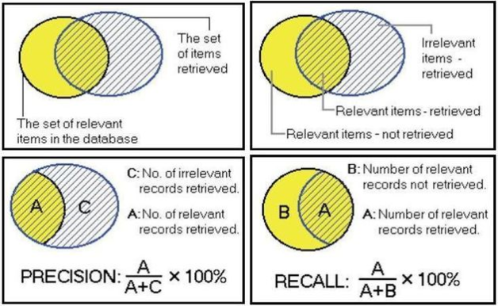
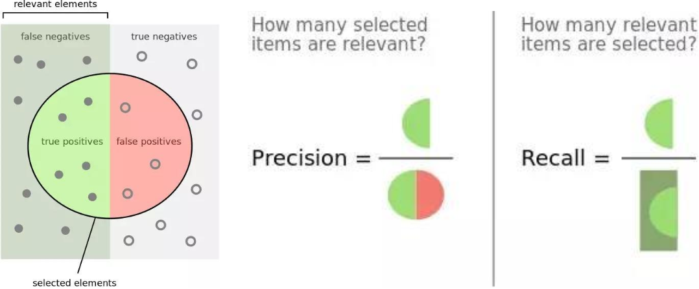
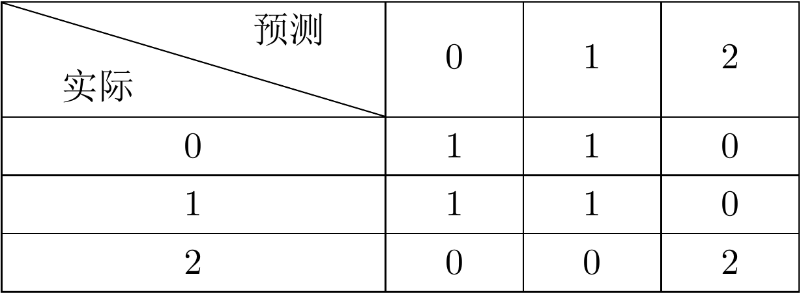
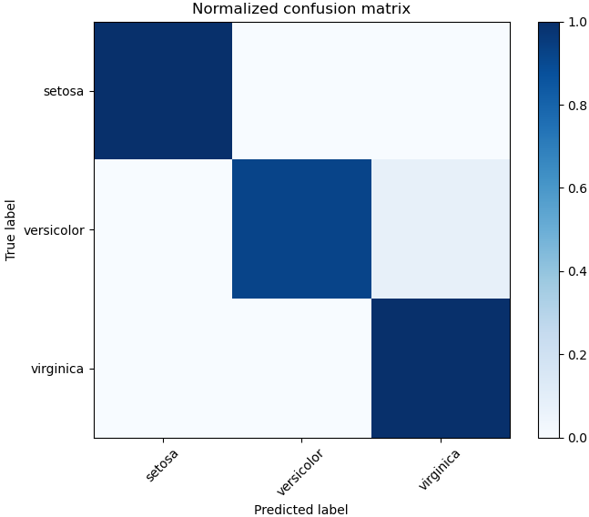

&emsp;&emsp;`所有模型都是坏的，但有些模型是有用的`。建立模型之后，接下来就要去评估模型，以确定此模型是否`有用`。`sklearn`库的`metrics`模块提供各种评估方法，包括分类评估、回归评估、聚类评估和交叉验证等。<!--more-->
&emsp;&emsp;评估分类用于判断预测值是否很好地与实际标记值相匹配，正确的鉴别出正样本(`True Positives`)或者负样本(`True Negatives`)都是`True`。同理，错误地判断正样本(`False Positive`，即一类错误)或者负样本(`False Negative`，即二类错误)。注意，`True`和`False`是对于评价预测结果而言，也就是评价预测结果是正确的(`True`)还是错误的(`False`)，而`Positive`和`Negative`则是样本分类的标记。
&emsp;&emsp;`metrics`模块分类度量有`6`种方法，如下表所示：

指标                    | 描述             | metrics方法
------------------------|-----------------|----------
`Accuracy`              | 准确度           | `from sklearn.metrics import accuracy_score`
`Precision`             | 查准率           | `from sklearn.metrics import precision_score`
`Recall`                | 查全率           | `from sklearn.metrics import recall_score`
`F1`                    | `F1`值           | `from sklearn.metrics import f1_score`
`Classification Report` | 分类报告         | `from sklearn.metrics import classification_report`
`Confusion Matrix`      | 混淆矩阵         | `from sklearn.metrics import confusion_matrix`
`ROC`                   | `ROC`曲线        | `from sklearn.metrics import roc_curve`
`AUC`                   | `ROC`曲线下的面积 | `from sklearn.metrics import auc`

### 准确度

&emsp;&emsp;准确度是预测正确的数(包括正样本和负样本)占所有数的比例。在对模型进行评估前，要对数据进行收集或创建、预处理、建模和预测等操作：

``` python
import numpy as np
from sklearn.preprocessing import Binarizer, LabelEncoder
from sklearn.model_selection import train_test_split
from sklearn import neighbors

# 创建数据集，其中矩阵X表示特征值，向量y表示所属类目标记值
X = np.random.random((10, 5))
y = np.array(['M', 'M', 'F', 'F', 'M', 'F', 'M', 'M', 'F', 'F'])
X[X < 0.7] = 0

binarizer = Binarizer(threshold=0.0).fit(X)  # 对矩阵X特征值进行二值化处理
binary_X = binarizer.transform(X)

enc = LabelEncoder()  # 对y标记值进行类条件编码
enc_y = enc.fit_transform(y)

# 数据切分为训练集和测试集
X_train, X_test, y_train, y_test = train_test_split(binary_X, enc_y, random_state=0)
knn = neighbors.KNeighborsClassifier(n_neighbors=5)  # 利用knn模型对数据进行拟合
knn.fit(X_train, y_train)

y_pred = knn.predict(X_test)  # 对测试集数据预测
print(y_pred)  # 结果为“[1 0 1]”
print(y_test)  # 结果为“[0 0 1]”
```

经历过以上操作后，利用`accuracy_score`函数对预测数据进行模型评估，其中第一个参数是测试标记，第二个参数是预测标记值：

``` python
from sklearn.metrics import accuracy_score
accuracy_score(y_test, y_pred)  # 结果为“0.66666666666666666”
```

由结果可知，`knn`模型预测的准确率约为`66.7%`，其中测试标记值`y_test`的结果为`array([0, 0, 1], dtype=int64)`，而`y_pred`结果为`array([1, 0, 1], dtype=int64)`，由于数据量比较小，因此准确率为`2/3`(约等于`66.7%`)。

### 查准率(Precision)和查全率(Recall)

&emsp;&emsp;查准率和查全率应用在信息处理领域的多个子领域。如下图所示，其中用`P`代表`Precision`，`R`代表`Recall`：



&emsp;&emsp;查准率和查全率用来衡量搜索引擎的性能：

``` bash
查全率 = (检索出的相关信息量/系统中的相关信息总量) * 100%
查准率 = (检索出的相关信息量/检索出的信息总量) * 100%
```

一般来说，`Precision`就是检索出来的条目中(比如文档、网页等)有多少是准确的，`Recall`就是所有准确的条目有多少被检索出来了。
&emsp;&emsp;为什么要引入这两个概念？假设有一个大小为`1000`的带布尔标签数据集，里面的`真`样本只有`100`不到，剩下都是假样本。假设训练一个模型，不管输入什么数据，它只给出`假`的预测，那么正确率依旧是`90%`以上。很明显，这个时候准确率`accuracy`就失去它的作用，因此查全率和查准率一般用在倾斜数据集的时候。查全率是衡量检索系统和检索者检出相关信息的能力，查准率是衡量检索系统和检索者拒绝非相关信息的能力。
&emsp;&emsp;实验证明，在查全率和查准率之间存在着相反的相互依赖关系：如果提高输出的查全率，就会降低其查准率，反之亦然。



&emsp;&emsp;`sklearn`的`metrics`模块分别提供了`precision_score`和`recall_score`函数用来评估分类模型的查全率和查准率：

``` python
from sklearn.metrics import precision_score, recall_score
print(precision_score(y_test, y_pred))  # 结果为“0.5”
print(recall_score(y_test, y_pred))  # 结果为“1.0”
```

由于测试集中正确的正样本只有`1`个，预测的正样本有`2`个，所以依据查准率公式得到`1/2`(即`0.5`)。而对于查全率，唯一的`1`个正确的正样本被预测样本涵盖，因此依据查全率公式得到`1/1`(即`1.0`)。

### F1值(F1-Measure)

&emsp;&emsp;`P`和`R`指标有时候是矛盾的，而`F-Measure`是综合这二个指标的评估指标，用于综合反映整体的指标。`F-Measure`是`Precision`和`Recall`加权调和平均，公式如下所示：

``` bash
F = (a^2 + 1) * P * R/(a^2 * (P + R))
```

当参数`a = 1`时，就是最常见的`F1`了，如下所示：

``` bash
F = 2 * P * R/(P + R)
```

当`F1`较高时，则说明实验方法比较理想：

``` python
from sklearn.metrics import f1_score
f1_score(y_test,y_pred)  # 结果为“0.66666666666666666”
```

### classification_report

&emsp;&emsp;该函数用于分类报告，显示主要的分类指标，返回每个类标签的精确、召回率及`F1`值。函数原型如下：

``` python
sklearn.metrics.classification_report(y_true, y_pred, labels=None, target_names=None, sample_weight=None, digits=2)
```

参数`labels`是分类报告中显示的类标签的索引列表，`target_names`是显示与`labels`对应的名称，`digits`指定输出格式的精确度。

``` python
from sklearn.metrics import classification_report

y_true = [1, 2, 3, 3, 3]
y_pred = [1, 1, 3, 3, 2]
labels = [1, 3, 2]
target_names = ['labels_1', 'labels_2', 'labels_3']
print(classification_report(y_true, y_pred, labels=labels, target_names=target_names, digits=3))
```

执行结果：

``` bash
              precision    recall  f1-score   support

    labels_1      0.500     1.000     0.667         1
    labels_2      1.000     0.667     0.800         3
    labels_3      0.000     0.000     0.000         1

    accuracy                          0.600         5
   macro avg      0.500     0.556     0.489         5
weighted avg      0.700     0.600     0.613         5
```

### 混淆矩阵

&emsp;&emsp;混淆矩阵是机器学习中总结分类模型预测结果的情形分析表，以矩阵形式将真实的类别与分类模型作出的分类这两个标准进行汇总，如下所示。其中灰色部分是真实分类和预测分类结果相一致的，蓝色部分是真实分类和预测分类不一致的，即分类错误的。


#### confusion_matrix函数

&emsp;&emsp;函数原型如下：

``` python
sklearn.metrics.confusion_matrix(y_true, y_pred, labels=None, sample_weight=None)
```

1. `y_true`是样本真实分类结果。
2. `y_pred`是样本预测分类结果。
3. `labels`是所给出的类别，通过这个参数可对类别进行选择。
4. `sample_weight`是样本权重。

``` python
from sklearn.metrics import confusion_matrix

y_true = [2, 1, 0, 1, 2, 0]
y_pred = [2, 0, 0, 1, 2, 1]
C = confusion_matrix(y_true, y_pred)
print(C)
```

执行结果：

``` python
[[1 1 0]
 [1 1 0]
 [0 0 2]]
```

对上述矩阵进行标注：



&emsp;&emsp;类别顺序可由`labels`参数控制调整，如果`labels`为`[2, 1, 0]`，则类别将以这个顺序自上向下排列。默认数字类别是从小到大排列，英文类别是按首字母顺序排列。下面是官方文档上的一个例子：

``` python
from sklearn.metrics import confusion_matrix

y_true = ["cat", "ant", "cat", "cat", "ant", "bird"]
y_pred = ["ant", "ant", "cat", "cat", "ant", "cat"]
C = confusion_matrix(y_true, y_pred, labels=["ant", "bird", "cat"])
print(C)
```

执行结果：

``` bash
[[2 0 0]
 [0 0 1]
 [1 0 2]]
```

也可以使用`matplotlib`画出混淆矩阵：

``` python
from sklearn.model_selection import train_test_split
from sklearn import svm, datasets
from sklearn.metrics import confusion_matrix, accuracy_score
import numpy as np
from matplotlib import pyplot as plt

def plot_confusion_matrix(cm, title='Confusion matrix', cmap=plt.cm.Blues):
    plt.imshow(cm, interpolation='nearest', cmap=cmap)
    plt.title(title)
    plt.colorbar()
    tick_marks = np.arange(len(iris.target_names))
    plt.xticks(tick_marks, iris.target_names, rotation=45)
    plt.yticks(tick_marks, iris.target_names)
    plt.tight_layout()
    plt.ylabel('True label')
    plt.xlabel('Predicted label')

iris = datasets.load_iris()
iris_data_train, iris_data_test, iris_target_train, iris_target_test = train_test_split(iris.data, iris.target, test_size=0.5)
iris_predict = svm.SVC().fit(iris_data_train, iris_target_train).predict(iris_data_test)
cm = confusion_matrix(iris_target_test, iris_predict)
cm_normalized = cm.astype('float') / cm.sum(axis=1)[:, np.newaxis]
print('Normalized confusion matrix')
print(cm_normalized)
plt.figure()
plot_confusion_matrix(cm_normalized, title='Normalized confusion matrix')
plt.show()
```

执行结果：

``` bash
Normalized confusion matrix
[[1. 0. 0.]
 [0. 1. 0.]
 [0. 0. 1.]]
```

