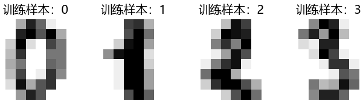
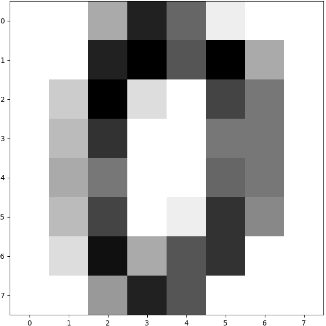
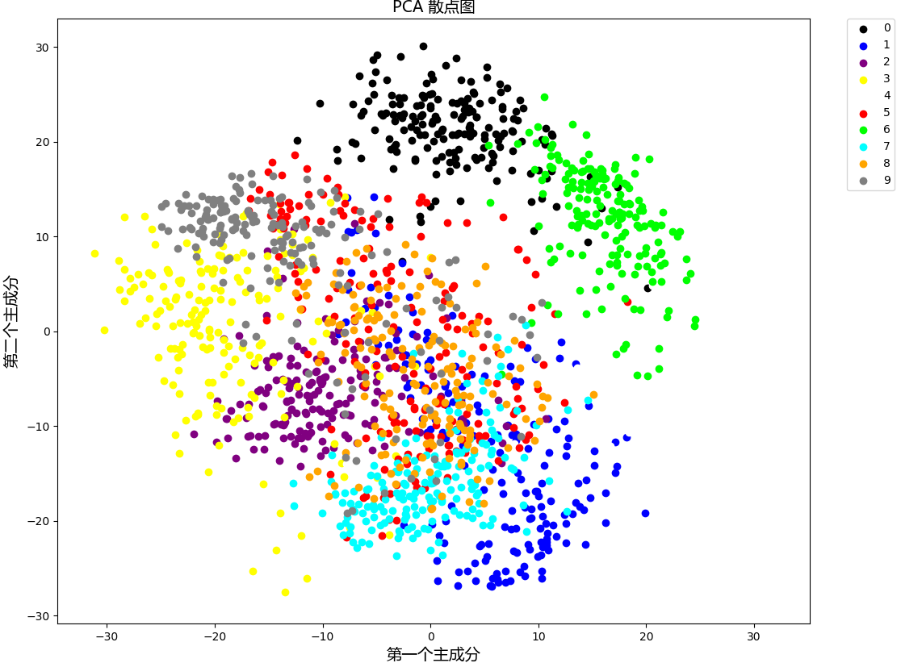
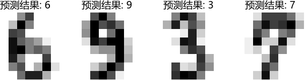
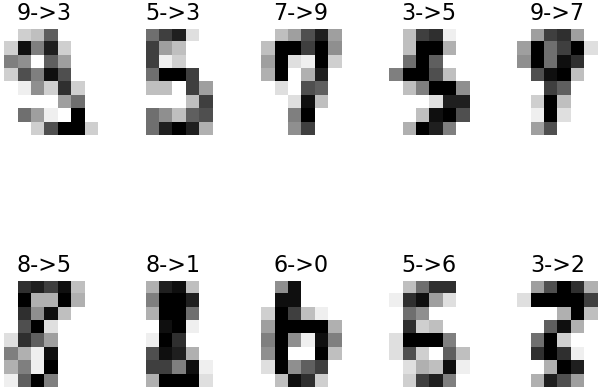

&emsp;&emsp;在`sklearn`的手写数字集中，一共有`1797`个样本数，每个样本有`64`个特征数，即`8 * 8`像素，每个像素由`0`到`16`之间的整数表示：<!--more-->

``` python
import numpy as np
from sklearn import datasets

digits = datasets.load_digits()
print(digits.data.shape)  # 输出数据集的样本数与特征数
print(np.unique(digits.target))  # 输出所有目标类别
print(digits.data)  # 输出数据集
```

执行结果：

``` python
(1797, 64)
[0 1 2 3 4 5 6 7 8 9]
[[ 0.  0.  5. ...  0.  0.  0.]
 [ 0.  0.  0. ... 10.  0.  0.]
 [ 0.  0.  0. ... 16.  9.  0.]
 ...
 [ 0.  0.  1. ...  6.  0.  0.]
 [ 0.  0.  2. ... 12.  0.  0.]
 [ 0.  0. 10. ... 12.  1.  0.]]
```

数据集可视化如下：

``` python
import matplotlib.pyplot as plt
import matplotlib.font_manager as fm  # 导入字体管理器，用于提供中文支持
from sklearn import datasets

digits = datasets.load_digits()
font_set = fm.FontProperties(fname='C:/Windows/Fonts/msyh.ttc', size=14)
images_and_labels = list(zip(digits.images, digits.target))  # 将图像和目标标签合并到一个列表中

plt.figure(figsize=(8, 6))

for index, (image, label) in enumerate(images_and_labels[:4]):  # 打印数据集的前4个图像
    plt.subplot(1, 4, index + 1)
    plt.axis('off')
    plt.imshow(image, cmap=plt.cm.gray_r, interpolation='nearest')
    plt.title(u'训练样本：' + str(label), fontproperties=font_set)

plt.show()
```



样本图片效果如下：

``` python
import matplotlib.pyplot as plt
from sklearn import datasets

digits = datasets.load_digits()
plt.figure(figsize=(8, 8))
plt.imshow(digits.images[0], cmap=plt.cm.gray_r, interpolation='nearest')
plt.show()
```



### 用PCA降维

&emsp;&emsp;由于该数据集有`64`个特征值，也就是说有`64`个维度，因此没办法直观地看到数据的分布及其之间的关系。但是，实际起作用的维度可能比特征值的个数要少得多，我们可以通过主成分分析来降低数据集的维度，从而观察样本点之间的关系。
&emsp;&emsp;主成分分析`PCA`：找到两个变量的线性组合，尽可能保留大部分的信息，这个新的变量(主成分)就可以替代原来的变量。也就是说，`PCA`就是通过线性变换来产生新的变量，并最大化保留了数据的差异。

``` python
from sklearn import datasets
from sklearn.decomposition import *

digits = datasets.load_digits()
pca = PCA(n_components=2)  # 创建一个PCA模型
reduced_data_pca = pca.fit_transform(digits.data)  # 将数据应用到模型上
print(reduced_data_pca.shape)  # 查看维度
```

执行结果：

``` python
(1797, 2)
```

绘制散点图：

``` python
from sklearn import datasets
import matplotlib.pyplot as plt
import matplotlib.font_manager as fm
from sklearn.decomposition import *

font_set = fm.FontProperties(fname='C:/Windows/Fonts/msyh.ttc', size=14)

digits = datasets.load_digits()
pca = PCA(n_components=2)  # 创建一个PCA模型
reduced_data_pca = pca.fit_transform(digits.data)
colors = ['black', 'blue', 'purple', 'yellow', 'white', \
          'red', 'lime', 'cyan', 'orange', 'gray']
plt.figure(figsize=(8, 6))

for i in range(len(colors)):
    x = reduced_data_pca[:, 0][digits.target == i]
    y = reduced_data_pca[:, 1][digits.target == i]
    plt.scatter(x, y, c=colors[i])

plt.legend(digits.target_names, bbox_to_anchor=(1.05, 1), loc=2, borderaxespad=0.)
plt.xlabel(u'第一个主成分', fontproperties=font_set)
plt.ylabel(u'第二个主成分', fontproperties=font_set)
plt.title(u"PCA 散点图", fontproperties=font_set)
plt.show()
```



### 数据归一化

&emsp;&emsp;代码如下：

``` python
from sklearn import datasets
from sklearn.preprocessing import scale

digits = datasets.load_digits()
data = scale(digits.data)
print(data)
```

执行结果：

``` python
[[ 0.         -0.33501649 -0.04308102 ... -1.14664746 -0.5056698 -0.19600752]
 [ 0.         -0.33501649 -1.09493684 ...  0.54856067 -0.5056698 -0.19600752]
 [ 0.         -0.33501649 -1.09493684 ...  1.56568555  1.6951369 -0.19600752]
 ...
 [ 0.         -0.33501649 -0.88456568 ... -0.12952258 -0.5056698 -0.19600752]
 [ 0.         -0.33501649 -0.67419451 ...  0.8876023  -0.5056698 -0.19600752]
 [ 0.         -0.33501649  1.00877481 ...  0.8876023  -0.2611357 -0.19600752]]
```

将数据集拆分成训练集和测试集：

``` python
from sklearn import datasets
from sklearn.cross_validation import train_test_split
from sklearn.preprocessing import scale

digits = datasets.load_digits()
data = scale(digits.data)
X_train, X_test, y_train, y_test, images_train, images_test = \
    train_test_split(data, digits.target, digits.images, test_size=0.25, random_state=42)

print("训练集", X_train.shape)
print("测试集", X_test.shape)
```

执行结果：

``` python
训练集 (1347, 64)
测试集 (450, 64)
```

### 使用SVM分类器

&emsp;&emsp;代码如下：

``` python
from sklearn import datasets
from sklearn.cross_validation import train_test_split
from sklearn.preprocessing import scale
from sklearn import svm

digits = datasets.load_digits()
data = scale(digits.data)

X_train, X_test, y_train, y_test, images_train, images_test = \
    train_test_split(data, digits.target, digits.images, test_size=0.25, random_state=42)
svc_model = svm.SVC(gamma=0.001, C=100, kernel='linear')  # 创建SVC模型
svc_model.fit(X_train, y_train)  # 将训练集应用到SVC模型上
print(svc_model.score(X_test, y_test))  # 评估模型的预测效果
```

### 预测结果

&emsp;&emsp;代码如下：

``` python
from sklearn import datasets
from sklearn.cross_validation import train_test_split
from sklearn.preprocessing import scale
from sklearn import svm
import matplotlib.font_manager as fm
import matplotlib.pyplot as plt

font_set = fm.FontProperties(fname='C:/Windows/Fonts/msyh.ttc', size=14)
digits = datasets.load_digits()
data = scale(digits.data)

X_train, X_test, y_train, y_test, images_train, images_test = \
    train_test_split(data, digits.target, digits.images, test_size=0.25, random_state=42)
svc_model = svm.SVC(gamma=0.001, C=100, kernel='linear')  # 创建SVC模型
svc_model.fit(X_train, y_train)  # 将训练集应用到SVC模型上
predicted = svc_model.predict(X_test)  # 使用创建的SVC模型对测试集进行预测
# 将测试集的图像与预测的标签合并到一个列表中
images_and_predictions = list(zip(images_test, predicted))

plt.figure(figsize=(8, 2))

for index, (image, prediction) in enumerate(images_and_predictions[:4]):
    plt.subplot(1, 4, index + 1)
    plt.axis('off')
    plt.imshow(image, cmap=plt.cm.gray_r, interpolation='nearest')
    plt.title(u'预测结果: ' + str(prediction), fontproperties=font_set)

plt.show()
```



### 分析结果的准确性

&emsp;&emsp;代码如下：

``` python
from sklearn import datasets
from sklearn.cross_validation import train_test_split
from sklearn.preprocessing import scale
from sklearn import svm
import numpy as np

digits = datasets.load_digits()
data = scale(digits.data)

X_train, X_test, y_train, y_test, images_train, images_test = \
    train_test_split(data, digits.target, digits.images, test_size=0.25, random_state=42)

svc_model = svm.SVC(gamma=0.001, C=100, kernel='linear')  # 创建SVC模型
svc_model.fit(X_train, y_train)  # 将训练集应用到SVC模型上
predicted = svc_model.predict(X_test)  # 使用创建的SVC模型对测试集进行预测

X = np.arange(len(y_test))
# 生成比较列表，如果预测的结果正确，则对应位置为0，错误则为1
comp = [0 if y1 == y2 else 1 for y1, y2 in zip(y_test, predicted)]

print("测试集数量：", len(y_test))
print("错误识别数：", sum(comp))
print("识别准确率：", 1 - float(sum(comp)) / len(y_test))
```

执行结果：

``` python
测试集数量：450
错误识别数：10
识别准确率：0.9777777777777777
```

### 错误识别样本分析

&emsp;&emsp;代码如下：

``` python
from sklearn import datasets
from sklearn.cross_validation import train_test_split
from sklearn.preprocessing import scale
from sklearn import svm
import matplotlib.font_manager as fm
import matplotlib.pyplot as plt
import numpy as np

font_set = fm.FontProperties(fname='C:/Windows/Fonts/msyh.ttc', size=14)
digits = datasets.load_digits()
data = scale(digits.data)

X_train, X_test, y_train, y_test, images_train, images_test = \
    train_test_split(data, digits.target, digits.images, test_size=0.25, random_state=42)

svc_model = svm.SVC(gamma=0.001, C=100, kernel='linear')  # 创建SVC模型
svc_model.fit(X_train, y_train)  # 将训练集应用到SVC模型上
predicted = svc_model.predict(X_test)  # 使用创建的SVC模型对测试集进行预测

X = np.arange(len(y_test))
# 生成比较列表，如果预测的结果正确，则对应位置为0，错误则为1
comp = [0 if y1 == y2 else 1 for y1, y2 in zip(y_test, predicted)]

wrong_index = []

for i, value in enumerate(comp):
    if value:
        wrong_index.append(i)

plt.figure(figsize=(8, 6))

for plot_index, image_index in enumerate(wrong_index):  # 输出错误识别的样本图像
    image = images_test[image_index]
    plt.subplot(2, 5, plot_index + 1)
    plt.axis('off')
    plt.imshow(image, cmap=plt.cm.gray_r, interpolation='nearest')
    # “8->9”表示正确值为8，被错误地识别成了9
    info = "{right}->{wrong}".format(right=y_test[image_index], wrong=predicted[image_index])
    plt.title(info, fontsize=16)

plt.show()
```

