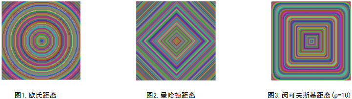
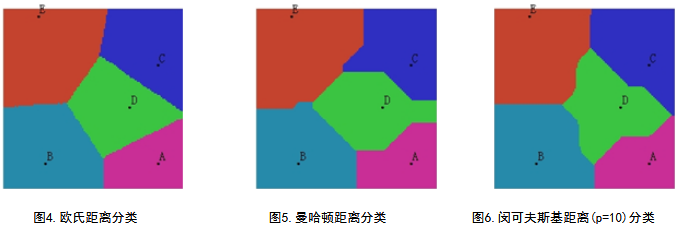

&emsp;&emsp;最小距离分类法是分类器里面最基本的一种分类方法，它是通过求出未知类别向量`X`到事先已知的各类别(如`A`、`B`、`C`等)中心向量的距离`D`，然后将待分类的向量`X`归结为这些距离中最小的那一类的分类方法。<!--more-->
&emsp;&emsp;基本原理：在一个$n$维空间中，最小距离分类法首先计算每一个已知类别(用向量表示是$< X_{A1}, X_{A2}, X_{A3}, ..., X_{An} >$)的各个维度的均值，形成一个均值$\mu_A$，用向量表示$< \mu_{A1}, \mu_{A2}, \mu_{A3}, ..., \mu_{An} >$。$A$为类别的名称，$X_A$是类别$A$的样本特征集合，$X_{A1}$是类别$A$的第`1`维特征集合，$\mu_{A1}$是第一维特征集合的均值，$n$为总的特征维数。同理，计算另一个类别$X_B$(用向量表示是$< X_{B1}, X_{B2}, X_{B3}, ..., X_{Bn} >$)的均值$\mu_B$，用向量表示是$< \mu_{B1}, \mu_{B2}, \mu_{B3}, ..., \mu_{Bn} >$，那么对于一个待分类的样本特征向量$x$(用向量表示是$< x_1, x_2, x_3, ..., x_n >$)，怎么判断它是属于类别$X_A$，还是$X_B$呢？我们只需要分别计算到$X_A$和$X_B$的距离$d(x, \mu_A)$和$d(x, \mu_B)$。以欧式距离为例，距离的计算公式如下：

\begin{aligned}
d(x, \mu_{i}) &= |x - \mu_{i}|^2 \\
              &= (x - \mu_{i})^T(x - \mu_{i}) \\
              &= x^Tx - x^T\mu_{i} - \mu_{i}^Tx +  \mu_{i}^T \mu_{i} \\
              &= x^Tx - ( x^T\mu_{i} + \mu_{i}^Tx - \mu_{i}^T \mu_{i}) \notag
\end{aligned}

然后找$d(x, \mu_A)$和$d(x, \mu_B)$中的最小值，如果前者最小，那么$X$属于$A$类，如果后者小，那么$X$属于$B$类。 
&emsp;&emsp;目前有多种不同的计算分类距离的方法，例如如欧氏距离、曼哈顿距离、闵可夫斯基距离、切比雪夫距离、标准化欧式距离等。

### 欧氏距离(EuclideanDistance)

&emsp;&emsp;欧氏距离是最易于理解的一种距离计算方法，源自欧氏空间中两点间的距离公式。
&emsp;&emsp;二维平面上两点$a(x_1, y_1)$与$b(x_2, y_2)$间的欧氏距离：

$$
d_{12} = \sqrt{(x_1 - x_2)^2 + (y_1 - y_2)^2}
$$

&emsp;&emsp;三维空间两点$a(x_1, y_1, z_1)$与$b(x_2, y_2, z_2)$间的欧氏距离：

$$
d_{12} = \sqrt{(x_1 - x_2)^2 + (y_1 - y_2)^2 + (z_1 - z_2)^2}
$$

&emsp;&emsp;两个$n$维向量$a(x_{11}, x_{12}, ..., x_{1n})$与$b(x_{21}, x_{22}, ..., x_{2n})$间的欧氏距离：

$$
d_{12} = \sqrt{\sum_{k = 1}^{n}(x_{1k} - x_{2k})^2}
$$

### 曼哈顿距离(ManhattanDistance)

&emsp;&emsp;从名字就可以猜出这种距离的计算方法了。想象你在曼哈顿要从一个十字路口开车到另外一个十字路口，驾驶距离是两点间的直线距离吗？显然不是，除非你能穿越大楼。实际驾驶距离就是这个`曼哈顿距离`，而这也是曼哈顿距离名称的来源，曼哈顿距离也称为`城市街区距离`(`City Blockdistance`)。
&emsp;&emsp;二维平面两点$a(x_1, y_1)$与$b(x_2, y_2)$间的曼哈顿距离：

$$
d_{12} = |x_1 - x_2| + |y_1 - y_2|
$$

&emsp;&emsp;两个$n$维向量$a(x_{11}, x_{12}, ..., x_{1n})$与$b(x_{21}, x_{22}, ..., x_{2n})$间的曼哈顿距离：

$$
d_{12} = \sum_{k = 1}^{n} |x_{1k} - x_{2k}|
$$

### 闵可夫斯基距离(MinkowskiDistance)

&emsp;&emsp;闵氏距离不是一种距离，而是一组距离的定义。两个$n$维变量$a(x_{11}, x_{12}, ..., x_{1n})$与$b(x_{21}, x_{22}, ..., x_{2n})$间的闵可夫斯基距离定义为：

$$
d_{12} = \sqrt[p]{\sum_{k=1}^{n}|x_{1k} - x_{2k}|^p}
$$

其中$p$是一个变参数。当$p = 1$时，就是曼哈顿距离；当$p = 2$时，就是欧氏距离；当$p \rightarrow ∞$时，就是切比雪夫距离。$p$取不同的值，公式也不一样，所以随着参数$p$的不同，闵氏距离可以表示一类的距离。 
&emsp;&emsp;为了更一步理解这些距离的差别，我们做下面一个实验：选取一个点作为中心点，用上述的三个距离公式分别计算周围的每一个点到这个中心点的距离$d_{xy}$，将距离相同的点用同一种颜色表示，那么得到下面的三个图：

从三个图中可以看出，三个不同的距离公式，对中心的逼近方式也不一样：欧式距离是以同心圆的方式向中心靠近；曼哈顿距离是以倾斜`45`度角的正方形的方式向中心靠近；闵可夫斯基距离(`p = 10`)则是以四个角度光滑的四边形的方式向中心靠近。
&emsp;&emsp;现在我们继续做下面一个分类实验：在维数为`2`维的平面空间中(只有横轴方向`x`和纵轴方向`y`两维空间)，有一块`128*128`的区域，在这个区域中有已知的`A(110, 18)`、`B(30, 18)`、`C(110, 88)`、`D(90, 58)`和`E(25, 123)`五个点，以这五个点为`5`个类别的中心，我们剩下要做的事是，将这个`128*128`的区域里面的所有的点用上面的三个不同的距离计算方法，对它们进行最小距离分类，最后得到的分类结果图如下：

&emsp;&emsp;上图中，每一个类别中心在图中以字母标示出了，不同的颜色表示的是不同的类别。同一种类别在一起组成一个多边形，多边形内的点是到其类别中心距离最近的点，多边形边界上的点是临界点，它们到相邻的两个类别中心的距离相等。图`4`的中的多边形其实就是我们通常所说的泰森多边形。从三个图中可以看出来，对于不同距离算法，类别中心对周围点的作用域是不相同的。
&emsp;&emsp;下面我们来谈谈最小距离分类法的一般步骤，说是最小距离分类器的步骤，其实是做监督分类基本的几个步骤：

1. 确定类别`m`，并提取每一类所对应的已知的样本。
2. 从样本中提取出一些可以作为区分不同类别的特性，也就是我们通常所说的特征提取。如果提取出了`n`个不同的特性，那么我们就叫它`n`维空间，特征提取对分类的精度有重大的影响。
3. 分别计算每一个类别的样本所对应的特征，每一类的每一维都有特征集合，通过集合可以计算出一个均值，也就是特征中心。
4. 通常为了消除不同特征因为量纲不同的影响，我们对每一维的特征需要做一个归一化，或者是放缩到`(-1, 1)`等区间，使其去量纲化。
5. 利用选取的距离准则，对待分类的本进行判定。

&emsp;&emsp;最小距离分类器的优点和缺点：最小距离分类法原理简单，容易理解，计算速度快，但是因为其只考虑每一类样本的均值，而不用管类别内部的方差(每一类样本的分布)，也不用考虑类别之间的协方差(类别和类别之间的相关关系)，所以分类精度不高，因此一般不用它作为我们分类对精度有高要求的分类，但它可以在快速浏览分类概况中使用。