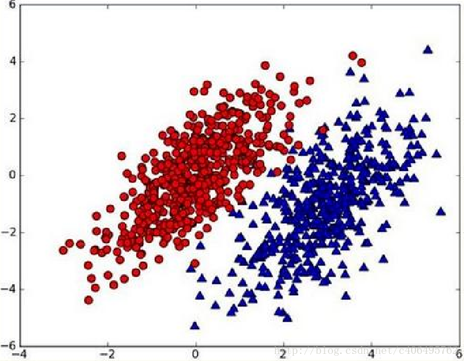
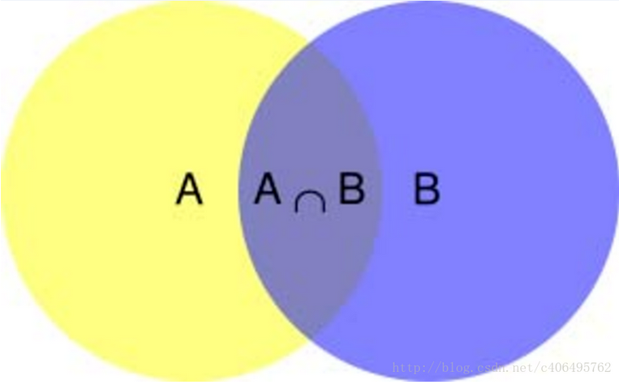
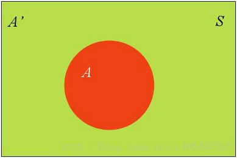
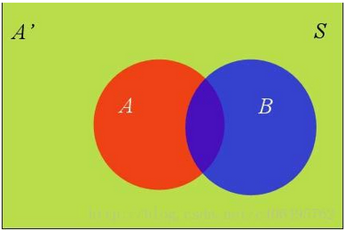
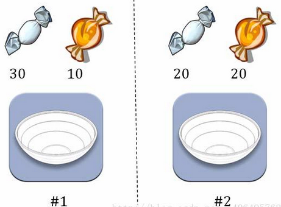
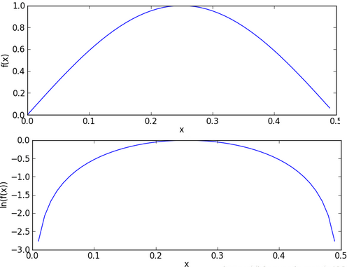

&emsp;&emsp;朴素贝叶斯算法是有监督的学习算法，解决的是分类问题，例如客户是否流失、是否值得投资、信用等级评定等多分类问题。该算法的优点在于简单易懂、学习效率高，在某些领域的分类问题中能够与决策树、神经网络相媲美。但由于该算法以自变量之间的独立(条件特征独立)性和连续变量的正态性假设为前提，就会导致算法精度在某种程度上受影响。<!--more-->

### 朴素贝叶斯理论

&emsp;&emsp;朴素贝叶斯是贝叶斯决策理论的一部分，所以在讲述朴素贝叶斯之前有必要快速了解一下贝叶斯决策理论。

#### 贝叶斯决策理论

&emsp;&emsp;假设现在我们有一个数据集，它由两类数据组成，数据分布如下图：



&emsp;&emsp;我们现在用$p1(x, y)$表示数据点$(x, y)$属于类别`1`(图中红色圆点表示的类别)的概率，用$p2(x, y)$表示数据点$(x, y)$属于类别`2`(图中蓝色三角形表示的类别)的概率，那么对于一个新数据点$(x, y)$，可以用下面的规则来判断它的类别：

- 如果$p1(x, y) > p2(x, y)$，那么类别为`1`。
- 如果$p1(x, y) < p2(x, y)$，那么类别为`2`。

也就是说，我们会选择高概率对应的类别。这就是贝叶斯决策理论的核心思想，即选择具有最高概率的决策。已经了解了贝叶斯决策理论的核心思想，那么接下来就是学习如何计算$p1$和$p2$概率。

#### 条件概率

&emsp;&emsp;在学习计算$p1$和$p2$概率之前，我们需要了解什么是条件概率(`Condittional probability`)。条件概率就是指在事件`B`发生的情况下，事件`A`发生的概率，用$P(A|B)$来表示：



根据文氏图，可以很清楚地看到在事件`B`发生的情况下，事件`A`发生的概率就是$P(A \cap B)$除以$P(B)$：

$$ P(A|B) = \frac{P(A \cap B)}{P(B)}   $$
$$ P(A \cap B) = P(A | B)P(B)          $$
$$ P(A \cap B) = P(B | A)P(A)          $$
$$ P(A|B) = \frac{P(B | A) P(A)}{P(B)} $$

#### 全概率公式

&emsp;&emsp;除了条件概率以外，在计算$p1$和$p2$的时候，还要用到全概率公式，因此这里继续推导全概率公式。假定样本空间$S$是两个事件$A$与$A'$的和：



红色部分是事件$A$，绿色部分是事件$A'$，它们共同构成了样本空间$S$。在这种情况下，事件`B`可以划分成`2`个部分：



于是得到：

$$
P(B) = P(B \cap A) + P(B \cap {A}')
$$

根据条件概率公式，可以得到：

$$
P(B) = P(B | A)P(A) + P(B | {A}')P({A}')
$$

这就是全概率公式。它的含义是：如果$A$和$A'$构成样本空间的一个划分，那么事件$B$的概率就等于$A$和$A'$的概率分别乘以`B`对这两个事件的条件概率之和。
&emsp;&emsp;将这个公式代入上一节的条件概率公式，就得到了条件概率的另一种写法：

$$
P(A | B) = \frac{P(B | A)P(A)}{P(B | A)P(A) + P(B | {A}')P({A}')}
$$

#### 贝叶斯推断

&emsp;&emsp;对条件概率公式进行变形，可以得到如下形式：

$$
P(A | B) = P(A)\frac{P(B | A)}{P(B)}
$$

我们把$P(A)$称为`先验概率`(`Prior probability`)，即在`B`事件发生之前，我们对`A`事件概率的一个判断。$P(A|B)$称为`后验概率`(`Posterior probability`)，即在`B`事件发生之后，我们对`A`事件概率的重新评估。$P(B|A)/P(B)$称为`可能性函数`(`Likelyhood`)，这是一个调整因子，使得预估概率更接近真实概率。所以条件概率可以理解成下面的式子：

``` cpp
后验概率 = 先验概率 * 调整因子
```

这就是贝叶斯推断的含义。我们先预估一个先验概率，然后加入实验结果，看这个实验到底是增强还是削弱了先验概率，由此得到更接近事实的后验概率。如果可能性函数$P(B|A)/P(B) > 1$，意味着先验概率被增强，事件`A`的发生的可能性变大；如果可能性函数是`1`，意味着`B`事件无助于判断事件`A`的可能性；如果可能性函数小于`1`，意味着先验概率被削弱，事件`A`的可能性变小。
&emsp;&emsp;为了加深对贝叶斯推断的理解，我们举一个例子：



&emsp;&emsp;两个一模一样的碗，一号碗有`30`颗水果糖和`10`颗巧克力糖，二号碗有水果糖和巧克力糖各`20`颗。现在随机选择一个碗，从中摸出一颗糖，发现是水果糖。请问这颗水果糖来自一号碗的概率有多大？
&emsp;&emsp;我们假定，$H_1$表示一号碗，$H_2$表示二号碗。由于这两个碗是一样的，所以$P(H_1) = P(H_2)$，也就是说，在取出水果糖之前，这两个碗被选中的概率相同。因此$P(H_1) = 0.5$，我们把这个概率就叫做`先验概率`，即没有做实验之前，来自一号碗的概率是`0.5`。
&emsp;&emsp;再假定，`E`表示水果糖，所以问题就变成了在已知`E`的情况下，来自一号碗的概率有多大，即求$P(H_1|E)$。我们把这个概率叫做`后验概率`，即在`E`事件发生之后，对$P(H_1)$的修正。<br>
&emsp;&emsp;根据条件概率公式，得到：

$$
P(H_{1} | E) = P(H_{1})\frac{P(E | H_{1})}{P(E)}
$$

已知$P(H_1)$等于`0.5`，$P(E|H_1)$为一号碗中取出水果糖的概率，等于$30/(30 + 10) = 0.75$，那么求出$P(E)$就可以得到答案。根据全概率公式：

$$
P(E) = P(E | H_{1})P(H_{1}) + P(E | H_{2})P(H_{2})
$$

于是得到：

$$ P(E) = 0.75 \ast 0.5 + 0.5 \ast 0.5 = 0.625      $$
$$ P(H_{1} | E) = 0.5 \ast \frac{0.75}{0.625} = 0.6 $$

这表明来自一号碗的概率是`0.6`。也就是说，取出水果糖之后，$H_1$事件的可能性得到了增强。<br>
&emsp;&emsp;同时再思考一个问题：在使用该算法的时候，如果不需要知道具体的类别概率，即上面$P(H_1|E) = 0.6$，只需要知道所属类别，即来自一号碗，我们有必要计算$P(E)$这个全概率吗？要知道我们只需要比较$P(H_1|E)$和$P(H_2|E)$的大小，找到那个最大的概率就可以。既然如此，两者的分母都是相同的，那么只需要比较分子即可，即比较$P(E|H_1)P(H_1)$和$P(E|H_2)P(H_2)$的大小，所以为了减少计算量，全概率公式在实际编程中可以不使用。

#### 朴素贝叶斯推断

&emsp;&emsp;理解了贝叶斯推断，那么让我们继续看看朴素贝叶斯。贝叶斯和朴素贝叶斯的概念是不同的，区别就在于`朴素`二字，朴素贝叶斯对条件个概率分布做了条件独立性的假设。比如下面的公式，假设有`n`个特征：

$$
P(a | X) = p(X | a)p(a) = p(x_{1}, x_{2}, x_{3}, \cdots, x_{n} | a)p(a)
$$

由于每个特征都是独立的，我们可以进一步拆分公式：

$$
p(a | X) = p(X | a)p(a) = {p(x_{1} | a) \ast p(x_{2} | a) \ast p(x_{3} | a) * \cdots \ast p(x_{n} | a)}p(a)
$$

这样我们就可以进行计算了。假设某个医院早上来了六个门诊的病人，他们的情况如下表：

症状  | 职业      | 疾病
------|----------|-----
打喷嚏 | 护士     | 感冒
打喷嚏 | 农夫     | 过敏
头痛   | 建筑工人 | 脑震荡
头痛   | 建筑工人 | 感冒
打喷嚏 | 教师     | 感冒
头痛   | 教师     | 脑震荡

现在又来了第七个病人，是一个打喷嚏的建筑工人，请问他患上感冒的概率有多大？根据贝叶斯定理可得：

$$
P(感冒 | 打喷嚏\&建筑工人) = \frac{P(打喷嚏\&建筑工人 | 感冒) * P(感冒)}{P(打喷嚏\&建筑工人)}
$$

根据朴素贝叶斯条件独立性的假设可知，`打喷嚏`和`建筑工人`这两个特征是独立的，因此上面的等式就变成了：

$$
P(感冒 | 打喷嚏\&建筑工人) = \frac{P(打喷嚏 | 感冒) * P(建筑工人 | 感冒) * P(感冒)}{P(打喷嚏) * P(建筑工人)}
$$

这里可以计算：

$$
P(感冒 | 打喷嚏\&建筑工人) = \frac{0.66 * 0.33 * 0.5}{0.5 * 0.33} = 0.66
$$

因此，这个打喷嚏的建筑工人有`66%`的概率是得了感冒。同理，可以计算这个病人患上过敏或脑震荡的概率。比较这几个概率，就可以知道他最可能得什么病。这就是贝叶斯分类器的基本方法：在统计资料的基础上，依据某些特征，计算各个类别的概率，从而实现分类。
&emsp;&emsp;同样，在编程时，如果不需要求出所属类别的具体概率，$P(打喷嚏) = 0.5$和$P(建筑工人) = 0.33$的概率是可以不用求的。

### 动手实战

&emsp;&emsp;以在线社区留言为例。为了不影响社区的发展，我们要屏蔽侮辱性的言论，所以要构建一个快速过滤器，如果某条留言使用了负面或者侮辱性的语言，那么就将该留言标志为内容不当。过滤这类内容是一个很常见的需求。对此问题建立两个类型：侮辱类和非侮辱类，使用`1`和`0`分别表示。
&emsp;&emsp;我们把文本看成单词向量或者词条向量，也就是说将句子转换为向量。考虑出现所有文档中的单词，再决定将哪些单词纳入词汇表或者说所要的词汇集合，然后必须要将每一篇文档转换为词汇表上的向量。简单起见，我们先假设已经将本文切分完毕，存放到列表中，并对词汇向量进行分类标注。编写代码如下：

``` python
def loadDataSet():
    postingList = [  # 切分的词条
        ['my', 'dog', 'has', 'flea', 'problems', 'help', 'please'],
        ['maybe', 'not', 'take', 'him', 'to', 'dog', 'park', 'stupid'],
        ['my', 'dalmation', 'is', 'so', 'cute', 'I', 'love', 'him'],
        ['stop', 'posting', 'stupid', 'worthless', 'garbage'],
        ['mr', 'licks', 'ate', 'my', 'steak', 'how', 'to', 'stop', 'him'],
        ['quit', 'buying', 'worthless', 'dog', 'food', 'stupid']]
    classVec = [0, 1, 0, 1, 0, 1]  # 类别标签向量，“1”代表侮辱性词汇，“0”代表不是
    return postingList, classVec

if __name__ == '__main__':
    postingLIst, classVec = loadDataSet()

    for each in postingLIst:
        print(each)

    print(classVec)
```

我们已经将`postingList`是存放词条列表中，`classVec`是存放每个词条的所属类别。前面已经说过要先创建一个词汇表，并将切分好的词条转换为词条向量：

``` python
def loadDataSet():
    postingList = [
        ['my', 'dog', 'has', 'flea', 'problems', 'help', 'please'],  # 切分的词条
        ['maybe', 'not', 'take', 'him', 'to', 'dog', 'park', 'stupid'],
        ['my', 'dalmation', 'is', 'so', 'cute', 'I', 'love', 'him'],
        ['stop', 'posting', 'stupid', 'worthless', 'garbage'],
        ['mr', 'licks', 'ate', 'my', 'steak', 'how', 'to', 'stop', 'him'],
        ['quit', 'buying', 'worthless', 'dog', 'food', 'stupid']]
    classVec = [0, 1, 0, 1, 0, 1]  # 类别标签向量，“1”代表侮辱性词汇，“0”代表不是
    return postingList, classVec

"""
根据vocabList词汇表，将inputSet向量化，向量的每个元素为1或0。
参数vocabList是createVocabList返回的列表，
inputSet是切分的词条列表。返回值returnVec是文档向量(词集模型)
"""
def setOfWords2Vec(vocabList, inputSet):
    returnVec = [0] * len(vocabList)  # 创建一个其中所含元素都为0的向量

    for word in inputSet:  # 遍历每个词条
        if word in vocabList:  # 如果词条存在于词汇表中，则置1
            returnVec[vocabList.index(word)] = 1
        else:
            print("the word: %s is not in my Vocabulary!" % word)

    return returnVec  # 返回文档向量

"""
将切分的实验样本词条整理成不重复的词条列表，也就是词汇表。参数dataSet
是整理的样本数据集。返回值vocabSet返回不重复的词条列表，也就是词汇表
"""
def createVocabList(dataSet):
    vocabSet = set([])  # 创建一个空的不重复列表

    for document in dataSet:
        vocabSet = vocabSet | set(document)  # 取并集

    return list(vocabSet)

if __name__ == '__main__':
    postingList, classVec = loadDataSet()
    print('postingList:\n', postingList)
    myVocabList = createVocabList(postingList)
    print('myVocabList:\n', myVocabList)
    trainMat = []

    for postinDoc in postingList:
        trainMat.append(setOfWords2Vec(myVocabList, postinDoc))

    print('trainMat:\n', trainMat)
```

执行结果：

``` python
postingList:
 [['my', 'dog', 'has', 'flea', 'problems', 'help', 'please'],
  ['maybe', 'not', 'take', 'him', 'to', 'dog', 'park', 'stupid'],
  ['my', 'dalmation', 'is', 'so', 'cute', 'I', 'love', 'him'],
  ['stop', 'posting', 'stupid', 'worthless', 'garbage'],
  ['mr', 'licks', 'ate', 'my', 'steak', 'how', 'to', 'stop', 'him'],
  ['quit', 'buying', 'worthless', 'dog', 'food', 'stupid']]
myVocabList:
 ['park', 'licks', 'buying', 'take', 'is', 'problems', 'maybe',
  'dog', 'love', 'so', 'stop', 'food', 'steak', 'not', 'cute',
  'to', 'ate', 'please', 'has', 'how', 'dalmation', 'posting',
  'garbage', 'my', 'mr', 'quit', 'I', 'flea', 'help', 'stupid', 'worthless', 'him']
trainMat:
 [[0, 0, 0, 0, 0, 1, 0, 1, 0, 0, 0, 0, 0, 0, 0, 0, 0, 1, 1, 0, 0, 0, 0, 1, 0, 0, 0, 1, 1, 0, 0, 0],
  [1, 0, 0, 1, 0, 0, 1, 1, 0, 0, 0, 0, 0, 1, 0, 1, 0, 0, 0, 0, 0, 0, 0, 0, 0, 0, 0, 0, 0, 1, 0, 1],
  [0, 0, 0, 0, 1, 0, 0, 0, 1, 1, 0, 0, 0, 0, 1, 0, 0, 0, 0, 0, 1, 0, 0, 1, 0, 0, 1, 0, 0, 0, 0, 1],
  [0, 0, 0, 0, 0, 0, 0, 0, 0, 0, 1, 0, 0, 0, 0, 0, 0, 0, 0, 0, 0, 1, 1, 0, 0, 0, 0, 0, 0, 1, 1, 0],
  [0, 1, 0, 0, 0, 0, 0, 0, 0, 0, 1, 0, 1, 0, 0, 1, 1, 0, 0, 1, 0, 0, 0, 1, 1, 0, 0, 0, 0, 0, 0, 1],
  [0, 0, 1, 0, 0, 0, 0, 1, 0, 0, 0, 1, 0, 0, 0, 0, 0, 0, 0, 0, 0, 0, 0, 0, 0, 1, 0, 0, 0, 1, 1, 0]]
```

我们已经得到了词条向量，接下来就可以通过词条向量训练朴素贝叶斯分类器：

``` python
import numpy as np

def loadDataSet():
    postingList = [  # 切分的词条
        ['my', 'dog', 'has', 'flea', 'problems', 'help', 'please'],
        ['maybe', 'not', 'take', 'him', 'to', 'dog', 'park', 'stupid'],
        ['my', 'dalmation', 'is', 'so', 'cute', 'I', 'love', 'him'],
        ['stop', 'posting', 'stupid', 'worthless', 'garbage'],
        ['mr', 'licks', 'ate', 'my', 'steak', 'how', 'to', 'stop', 'him'],
        ['quit', 'buying', 'worthless', 'dog', 'food', 'stupid']]
    classVec = [0, 1, 0, 1, 0, 1]  # 类别标签向量，“1”代表侮辱性词汇，“0”代表不是
    return postingList, classVec

def setOfWords2Vec(vocabList, inputSet):
    returnVec = [0] * len(vocabList)  # 创建一个其中所含元素都为0的向量

    for word in inputSet:  # 遍历每个词条
        if word in vocabList:  # 如果词条存在于词汇表中，则置1
            returnVec[vocabList.index(word)] = 1
        else:
            print("the word: %s is not in my Vocabulary!" % word)

    return returnVec  # 返回文档向量

def createVocabList(dataSet):
    vocabSet = set([])  # 创建一个空的不重复列表

    for document in dataSet:
        vocabSet = vocabSet | set(document)  # 取并集

    return list(vocabSet)

"""
朴素贝叶斯分类器训练函数。参数trainMatrix是训练文档矩阵，即setOfWords2Vec返回的
returnVec构成的矩阵；trainCategory是训练类别标签向量，即loadDataSet返回的classVec。
返回值p0Vect是侮辱类的条件概率数组，p1Vect是非侮辱类的条件概率数组，pAbusive是文档属于侮辱类的概率
"""
def trainNB0(trainMatrix, trainCategory):
    numTrainDocs = len(trainMatrix)  # 计算训练的文档数目
    numWords = len(trainMatrix[0])  # 计算每篇文档的词条数
    pAbusive = sum(trainCategory) / float(numTrainDocs)  # 文档属于侮辱类的概率
    p0Num = np.zeros(numWords)
    p1Num = np.zeros(numWords)  # 创建numpy.zeros数组，词条出现数初始化为0
    p0Denom = 0.0
    p1Denom = 0.0  # 分母初始化为0

    for i in range(numTrainDocs):
        if trainCategory[i] == 1:  # 统计属于侮辱类的条件概率所需的数据，即P(w0|1)、P(w1|1)、P(w2|1)...
            p1Num += trainMatrix[i]
            p1Denom += sum(trainMatrix[i])
        else:  # 统计属于非侮辱类的条件概率所需的数据，即P(w0|0)、P(w1|0)、P(w2|0)...
            p0Num += trainMatrix[i]
            p0Denom += sum(trainMatrix[i])

    p1Vect = p1Num / p1Denom
    p0Vect = p0Num / p0Denom
    # 返回属于侮辱类的条件概率数组，属于非侮辱类的条件概率数组，文档属于侮辱类的概率
    return p0Vect, p1Vect, pAbusive

if __name__ == '__main__':
    postingList, classVec = loadDataSet()
    myVocabList = createVocabList(postingList)
    print('myVocabList:\n', myVocabList)
    trainMat = []

    for postinDoc in postingList:
        trainMat.append(setOfWords2Vec(myVocabList, postinDoc))

    p0V, p1V, pAb = trainNB0(trainMat, classVec)
    print('p0V:\n', p0V)
    print('p1V:\n', p1V)
    print('classVec:\n', classVec)
    print('pAb:\n', pAb)
```

执行结果：

``` python
myVocabList:
 ['maybe', 'please', 'buying', 'stupid', 'love', 'food',
  'how', 'has', 'dalmation', 'stop', 'mr', 'steak',
  'I', 'him', 'dog', 'cute', 'posting', 'park',
  'ate', 'problems', 'worthless', 'not', 'is', 'my',
  'flea', 'help', 'so', 'quit', 'garbage', 'to',
  'licks', 'take']
p0V:
 [0.         0.04166667 0.         0.         0.04166667 0.
  0.04166667 0.04166667 0.04166667 0.04166667 0.04166667 0.04166667
  0.04166667 0.08333333 0.04166667 0.04166667 0.         0.
  0.04166667 0.04166667 0.         0.         0.04166667 0.125
  0.04166667 0.04166667 0.04166667 0.         0.         0.04166667
  0.04166667 0.        ]
p1V:
 [0.05263158 0.         0.05263158 0.15789474 0.         0.05263158
  0.         0.         0.         0.05263158 0.         0.
  0.         0.05263158 0.10526316 0.         0.05263158 0.05263158
  0.         0.         0.10526316 0.05263158 0.         0.
  0.         0.         0.         0.05263158 0.05263158 0.05263158
  0.         0.05263158]
classVec:
 [0, 1, 0, 1, 0, 1]
pAb:
 0.5
```

&emsp;&emsp;$p0V$存放的是每个单词属于类别`0`，也就是非侮辱类词汇的概率。比如$p0V$的第`4`个概率，就是`stupid`这个单词属于非侮辱类的概率为`0`；同理，$p1V$的第`4`个概率，就是`stupid`这个单词属于侮辱类的概率为`0.15789474`，也就是约等于`15.79%`的概率。$pAb$是所有侮辱类的样本占所有样本的概率，从`classVec`中可以看出，一用有`3`个侮辱类，`3`个非侮辱类，所以侮辱类的概率是`0.5`。因此$p0V$存放的就是$P(him|非侮辱类) = 0.0833$、$P(is|非侮辱类) = 0.0417$、$P(dog|非侮辱类) = 0.0417$这些单词的条件概率。同理，$p1V$存放的就是各个单词属于侮辱类的条件概率。$pAb$就是先验概率。<br>
&emsp;&emsp;已经训练好分类器，接下来使用分类器进行分类：

``` python
import numpy as np
from functools import reduce

def loadDataSet():
    postingList = [  # 切分的词条
        ['my', 'dog', 'has', 'flea', 'problems', 'help', 'please'],
        ['maybe', 'not', 'take', 'him', 'to', 'dog', 'park', 'stupid'],
        ['my', 'dalmation', 'is', 'so', 'cute', 'I', 'love', 'him'],
        ['stop', 'posting', 'stupid', 'worthless', 'garbage'],
        ['mr', 'licks', 'ate', 'my', 'steak', 'how', 'to', 'stop', 'him'],
        ['quit', 'buying', 'worthless', 'dog', 'food', 'stupid']]
    classVec = [0, 1, 0, 1, 0, 1]  # 类别标签向量，1代表侮辱性词汇，0代表不是
    return postingList, classVec  # 返回实验样本切分的词条和类别标签向量

def createVocabList(dataSet):
    vocabSet = set([])  # 创建一个空的不重复列表

    for document in dataSet:
        vocabSet = vocabSet | set(document)  # 取并集

    return list(vocabSet)

def setOfWords2Vec(vocabList, inputSet):
    returnVec = [0] * len(vocabList)  # 创建一个其中所含元素都为0的向量

    for word in inputSet:  # 遍历每个词条
        if word in vocabList:  # 如果词条存在于词汇表中，则置1
            returnVec[vocabList.index(word)] = 1
        else:
            print("the word: %s is not in my Vocabulary!" % word)

    return returnVec  # 返回文档向量

def trainNB0(trainMatrix, trainCategory):
    numTrainDocs = len(trainMatrix)  # 计算训练的文档数目
    numWords = len(trainMatrix[0])  # 计算每篇文档的词条数
    pAbusive = sum(trainCategory) / float(numTrainDocs)  # 文档属于侮辱类的概率
    p0Num = np.zeros(numWords)
    p1Num = np.zeros(numWords)  # 创建numpy.zeros数组,
    p0Denom = 0.0
    p1Denom = 0.0  # 分母初始化为0.0

    for i in range(numTrainDocs):
        if trainCategory[i] == 1:  # 统计属于侮辱类的条件概率所需的数据，即P(w0|1)、P(w1|1)、P(w2|1)...
            p1Num += trainMatrix[i]
            p1Denom += sum(trainMatrix[i])
        else:  # 统计属于非侮辱类的条件概率所需的数据，即P(w0|0)、P(w1|0)、P(w2|0)...
            p0Num += trainMatrix[i]
            p0Denom += sum(trainMatrix[i])

    p1Vect = p1Num / p1Denom  # 相除
    p0Vect = p0Num / p0Denom

    # 返回属于侮辱类的条件概率数组，属于非侮辱类的条件概率数组，文档属于侮辱类的概率
    return p0Vect, p1Vect, pAbusive

"""
朴素贝叶斯分类器分类函数。参数vec2Classify是待分类的词条数组，
p0Vec是侮辱类的条件概率数组，p1Vec是非侮辱类的条件概率数组，
pClass1是文档属于侮辱类的概率。返回0表示属于非侮辱类，1表示属于侮辱类
"""
def classifyNB(vec2Classify, p0Vec, p1Vec, pClass1):
    p1 = reduce(lambda x, y: x * y, vec2Classify * p1Vec) * pClass1  # 对应元素相乘
    p0 = reduce(lambda x, y: x * y, vec2Classify * p0Vec) * (1.0 - pClass1)
    print('p0:', p0)
    print('p1:', p1)

    if p1 > p0:
        return 1
    else:
        return 0

""" 测试朴素贝叶斯分类器 """
def testingNB():
    listOPosts, listClasses = loadDataSet()  # 创建实验样本
    myVocabList = createVocabList(listOPosts)  # 创建词汇表
    trainMat = []

    for postinDoc in listOPosts:
        trainMat.append(setOfWords2Vec(myVocabList, postinDoc))  # 将实验样本向量化

    p0V, p1V, pAb = trainNB0(np.array(trainMat), np.array(listClasses))  # 训练朴素贝叶斯分类器
    testEntry = ['love', 'my', 'dalmation']  # 测试样本1
    thisDoc = np.array(setOfWords2Vec(myVocabList, testEntry))  # 测试样本向量化

    if classifyNB(thisDoc, p0V, p1V, pAb):
        print(testEntry, '属于侮辱类')  # 执行分类并打印分类结果
    else:
        print(testEntry, '属于非侮辱类')  # 执行分类并打印分类结果

    testEntry = ['stupid', 'garbage']  # 测试样本2
    thisDoc = np.array(setOfWords2Vec(myVocabList, testEntry))  # 测试样本向量化

    if classifyNB(thisDoc, p0V, p1V, pAb):
        print(testEntry, '属于侮辱类')  # 执行分类并打印分类结果
    else:
        print(testEntry, '属于非侮辱类')  # 执行分类并打印分类结果

if __name__ == '__main__':
    testingNB()
```

执行结果：

``` python
p0: 0.0
p1: 0.0
['love', 'my', 'dalmation'] 属于非侮辱类
p0: 0.0
p1: 0.0
['stupid', 'garbage'] 属于非侮辱类
```

你会发现这样写的算法无法进行分类，`p0`和`p1`的计算结果都是`0`，这里显然存在问题。

### 朴素贝叶斯改进之拉普拉斯平滑

&emsp;&emsp;利用贝叶斯分类器对文档进行分类时，要计算多个概率的乘积以获得文档属于某个类别的概率，即计算$p(w0|1)p(w1|1)p(w2|1)$。如果其中有一个概率值为`0`，那么最后的成绩也为`0`。
&emsp;&emsp;如果文本中包含这种概率为`0`的分词，那么最终的文本属于某个类别的概率也就是`0`，显然这样是不合理的。为了降低这种影响，可以将所有词的出现数初始化为`1`，并将分母初始化为`2`。这种做法就叫做`拉普拉斯平滑`(`Laplace Smoothing`)，又被称为`加1平滑`，是比较常用的平滑方法，它就是为了解决`0`概率问题。
&emsp;&emsp;除此之外，另外一个遇到的问题就是`下溢出`，这是由于太多很小的数相乘造成的。学过数学的人都知道，两个小数相乘，越乘越小，这样就造成了下溢出。在程序中，在相应小数位置进行四舍五入，计算结果可能就变成`0`了。为了解决这个问题，对乘积结果取自然对数，通过求对数可以避免下溢出或者浮点数舍入导致的错误。同时，采用自然对数进行处理不会有任何损失。下图给出函数$f(x)$和$ln(f(x))$的曲线。



检查这两条曲线，就会发现它们在相同区域内同时增加或者减少，并且在相同点上取到极值。它们的取值虽然不同，但不影响最终结果。因此我们可以对上篇文章的`trainNB0`函数进行更改：

``` python
def trainNB0(trainMatrix, trainCategory):
    numTrainDocs = len(trainMatrix)  # 计算训练的文档数目
    numWords = len(trainMatrix[0])  # 计算每篇文档的词条数
    pAbusive = sum(trainCategory) / float(numTrainDocs)  # 文档属于侮辱类的概率
    p0Num = np.ones(numWords)
    p1Num = np.ones(numWords)  # 创建numpy.ones数组，词条出现数初始化为1，拉普拉斯平滑
    p0Denom = 2.0
    p1Denom = 2.0  # 分母初始化为2，拉普拉斯平滑

    for i in range(numTrainDocs):
        if trainCategory[i] == 1:  # 统计属于侮辱类的条件概率所需的数据，即P(w0|1)、P(w1|1)、P(w2|1)...
            p1Num += trainMatrix[i]
            p1Denom += sum(trainMatrix[i])
        else:  # 统计属于非侮辱类的条件概率所需的数据，即P(w0|0)、P(w1|0)、P(w2|0)...
            p0Num += trainMatrix[i]
            p0Denom += sum(trainMatrix[i])

    p1Vect = np.log(p1Num / p1Denom)  # 取对数，防止下溢出
    p0Vect = np.log(p0Num / p0Denom)
    # 返回属于侮辱类的条件概率数组，属于非侮辱类的条件概率数组，文档属于侮辱类的概率
    return p0Vect, p1Vect, pAbusive
```

执行结果：

``` python
myVocabList:
 ['cute', 'ate', 'is', 'please', 'dalmation', 'quit',
  'to', 'posting', 'food', 'worthless', 'him', 'flea',
  'problems', 'stop', 'steak', 'licks', 'garbage', 'my',
  'dog', 'how', 'help', 'buying', 'not', 'take',
  'maybe', 'mr', 'has', 'stupid', 'park', 'I',
  'love', 'so']
p0V:
 [-2.56494936 -2.56494936 -2.56494936 -2.56494936 -2.56494936 -3.25809654
  -2.56494936 -3.25809654 -3.25809654 -3.25809654 -2.15948425 -2.56494936
  -2.56494936 -2.56494936 -2.56494936 -2.56494936 -3.25809654 -1.87180218
  -2.56494936 -2.56494936 -2.56494936 -3.25809654 -3.25809654 -3.25809654
  -3.25809654 -2.56494936 -2.56494936 -3.25809654 -3.25809654 -2.56494936
  -2.56494936 -2.56494936]
p1V:
 [-3.04452244 -3.04452244 -3.04452244 -3.04452244 -3.04452244 -2.35137526
  -2.35137526 -2.35137526 -2.35137526 -1.94591015 -2.35137526 -3.04452244
  -3.04452244 -2.35137526 -3.04452244 -3.04452244 -2.35137526 -3.04452244
  -1.94591015 -3.04452244 -3.04452244 -2.35137526 -2.35137526 -2.35137526
  -2.35137526 -3.04452244 -3.04452244 -1.65822808 -2.35137526 -3.04452244
  -3.04452244 -3.04452244]
classVec:
 [0, 1, 0, 1, 0, 1]
pAb:
 0.5
```

这样得到的结果就没有问题，不存在`0`概率了。除此之外，我们还需要修改`classifyNB`函数：

``` python
def classifyNB(vec2Classify, p0Vec, p1Vec, pClass1):
    # 对应元素相乘。log(A * B) = logA + logB，所以这里加上log(pClass1)
    p1 = sum(vec2Classify * p1Vec) + np.log(pClass1)
    p0 = sum(vec2Classify * p0Vec) + np.log(1.0 - pClass1)

    if p1 > p0:
        return 1
    else:
        return 0
```

这样，我们的朴素贝叶斯分类器就改进完毕了。

### 朴素贝叶斯之过滤垃圾邮件

&emsp;&emsp;首先看一下使用朴素贝叶斯对电子邮件进行分类的步骤：

1. 收集数据：提供文本文件。
2. 准备数据：将文本文件解析成词条向量。
3. 分析数据：检查词条确保解析的正确性。
4. 训练算法：使用我们之前建立的`trainNB0`函数。
5. 测试算法：使用`classifyNB`，并构建一个新的测试函数来计算文档集的错误率。
6. 使用算法：构建一个完整的程序对一组文档进行分类，将错分的文档输出到屏幕上。

&emsp;&emsp;有两个文件夹`ham`和`spam`，`spam`文件下的`txt`文件为垃圾邮件。我们将数据集分为训练集和测试集，使用交叉验证的方式测试朴素贝叶斯分类器的准确性：

``` python
import numpy as np
import random
import re

def createVocabList(dataSet):
    vocabSet = set([])  # 创建一个空的不重复列表
    for document in dataSet:
        vocabSet = vocabSet | set(document)  # 取并集

    return list(vocabSet)

def setOfWords2Vec(vocabList, inputSet):
    returnVec = [0] * len(vocabList)  # 创建一个其中所含元素都为0的向量

    for word in inputSet:  # 遍历每个词条
        if word in vocabList:  # 如果词条存在于词汇表中，则置1
            returnVec[vocabList.index(word)] = 1
        else:
            print("the word: %s is not in my Vocabulary!" % word)

    return returnVec  # 返回文档向量

def trainNB0(trainMatrix, trainCategory):
    numTrainDocs = len(trainMatrix)  # 计算训练的文档数目
    numWords = len(trainMatrix[0])  # 计算每篇文档的词条数
    pAbusive = sum(trainCategory) / float(numTrainDocs)  # 文档属于侮辱类的概率
    p0Num = np.ones(numWords)
    p1Num = np.ones(numWords)  # 创建numpy.ones数组，词条出现数初始化为1，拉普拉斯平滑
    p0Denom = 2.0
    p1Denom = 2.0  # 分母初始化为2，拉普拉斯平滑

    for i in range(numTrainDocs):
        if trainCategory[i] == 1:  # 统计属于侮辱类的条件概率所需的数据，即P(w0|1)、P(w1|1)、P(w2|1)...
            p1Num += trainMatrix[i]
            p1Denom += sum(trainMatrix[i])
        else:  # 统计属于非侮辱类的条件概率所需的数据，即P(w0|0)、P(w1|0)、P(w2|0)...
            p0Num += trainMatrix[i]
            p0Denom += sum(trainMatrix[i])

    p1Vect = np.log(p1Num / p1Denom)  # 取对数，防止下溢出
    p0Vect = np.log(p0Num / p0Denom)
    # 返回属于侮辱类的条件概率数组，属于非侮辱类的条件概率数组，文档属于侮辱类的概率
    return p0Vect, p1Vect, pAbusive

def classifyNB(vec2Classify, p0Vec, p1Vec, pClass1):
    # 对应元素相乘。log(A * B) = logA + logB，所以这里加上log(pClass1)
    p1 = sum(vec2Classify * p1Vec) + np.log(pClass1)
    p0 = sum(vec2Classify * p0Vec) + np.log(1.0 - pClass1)

    if p1 > p0:
        return 1
    else:
        return 0

""" 接收一个大字符串并将其解析为字符串列表 """
def textParse(bigString):  # 将字符串转换为字符列表
    listOfTokens = re.split(r'\W+', bigString)  # 将特殊符号作为切分标志进行字符串切分，即非字母、非数字
    return [tok.lower() for tok in listOfTokens if len(tok) > 2]  # 除了单个字母，例如大写的“I”，其它单词变成小写

""" 测试朴素贝叶斯分类器 """
def spamTest():
    docList = []
    classList = []
    fullText = []

    for i in range(1, 26):  # 遍历25个txt文件
        wordList = textParse(open('email/spam/%d.txt' % i, 'r').read())  # 读取每个垃圾邮件，并字符串转换成字符串列表
        docList.append(wordList)
        fullText.append(wordList)
        classList.append(1)  # 标记垃圾邮件，“1”表示垃圾文件
        wordList = textParse(open('email/ham/%d.txt' % i, 'r').read())  # 读取每个非垃圾邮件，并字符串转换成字符串列表
        docList.append(wordList)
        fullText.append(wordList)
        classList.append(0)  # 标记非垃圾邮件，“0”表示非垃圾文件

    vocabList = createVocabList(docList)  # 创建词汇表，不重复
    trainingSet = list(range(50))
    testSet = []  # 创建存储训练集的索引值的列表和测试集的索引值的列表

    for i in range(10):  # 从50个邮件中，随机挑选出40个作为训练集，10个做测试集
        randIndex = int(random.uniform(0, len(trainingSet)))  # 随机选取索索引值
        testSet.append(trainingSet[randIndex])  # 添加测试集的索引值
        del (trainingSet[randIndex])  # 在训练集列表中删除添加到测试集的索引值

    trainMat = []
    trainClasses = []  # 创建训练集矩阵和训练集类别标签系向量

    for docIndex in trainingSet:  # 遍历训练集
        trainMat.append(setOfWords2Vec(vocabList, docList[docIndex]))  # 将生成的词集模型添加到训练矩阵中
        trainClasses.append(classList[docIndex])  # 将类别添加到训练集类别标签系向量中

    p0V, p1V, pSpam = trainNB0(np.array(trainMat), np.array(trainClasses))  # 训练朴素贝叶斯模型
    errorCount = 0  # 错误分类计数

    for docIndex in testSet:  # 遍历测试集
        wordVector = setOfWords2Vec(vocabList, docList[docIndex])  # 测试集的词集模型
        if classifyNB(np.array(wordVector), p0V, p1V, pSpam) != classList[docIndex]:  # 如果分类错误
            errorCount += 1  # 错误计数加1
            print("分类错误的测试集：", docList[docIndex])

    print('错误率：%.2f%%' % (float(errorCount) / len(testSet) * 100))

if __name__ == '__main__':
    spamTest()
```

&emsp;&emsp;函数`spamTest`会输出在`10`封随机选择的电子邮件上的分类错误概率。既然这些电子邮件是随机选择的，所以每次的输出结果可能有些差别。如果发现错误的话，函数会输出错误的文档的此表，这样就可以了解到底是哪篇文档发生了错误。如果想要更好地估计错误率，那么就应该将上述过程重复多次，比如说`10`次，然后求平均值。相比之下，将垃圾邮件误判为正常邮件要比将正常邮件归为垃圾邮件好。为了避免错误，有多种方式可以用来修正分类器，这些内容会在后续文章中进行讨论。