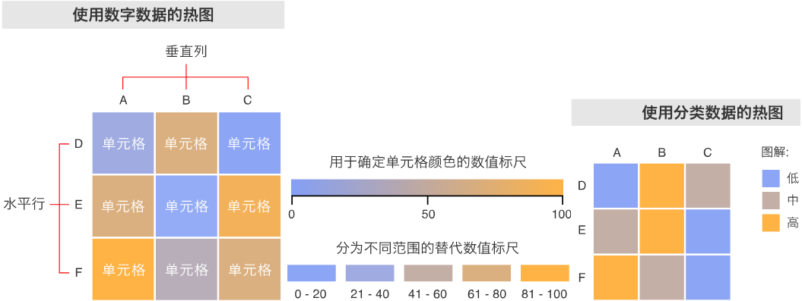

&emsp;&emsp;热图(`Heatmap`)通过色彩变化来显示数据。当应用在表格时，热图适合用来交叉检查多变量的数据，方法是把变量放置于行和列中，再将表格内的不同单元格进行着色。热图适用于显示多个变量之间的差异、显示当中任何模式、显示是否有彼此相似的变量以及检测彼此之间是否存在任何相关性。<!--more-->
&emsp;&emsp;通常所有水平行都同属一个类别(在左侧或右侧显示的标签)，而所有垂直列将被分配为另一类别(在顶部或底部显示的标签)。每行或每列会再被分成子类别，全都以矩阵形式相互匹配。表格中的单元格内有不同颜色编码的分类数据，或是基于颜色标度的数字数据。单元格内的数据是基于相连行和列中两个变量之间的关系。
&emsp;&emsp;我们需要图解来帮助阅读热图。分类数据采用不同颜色编码表示，而数字数据则需要一个颜色标度(从一种颜色转到另一种颜色)来帮忙表示高低值之间的差异。我们可以使用一系列的纯色来表示多个范围的数值(`0`至`10`、`11`至`20`、`21`至`30`等)，或者可以将两种或多种颜色混合在一起，使用渐变标度来表示单一范围(例如`0`至`100`)。
&emsp;&emsp;由于热图依赖颜色来表达数值，它比较适合用来显示广泛数值数据，因为要准确地指出色调之间的差异始终有难度，也较难从中提取特定数据点(除非在单元格中加入原始数据)。
&emsp;&emsp;如果将其中一行/列设为时间间隔，热图也可用于显示数据随时间的变化。其中一个例子就是使用热图来比较全年多个城市的温度变化，看看最热或最冷的地方在哪儿：我们可以把要比较的城市在水平行中列出，而垂直列则是月份，然后在单元格内填上温度值。

