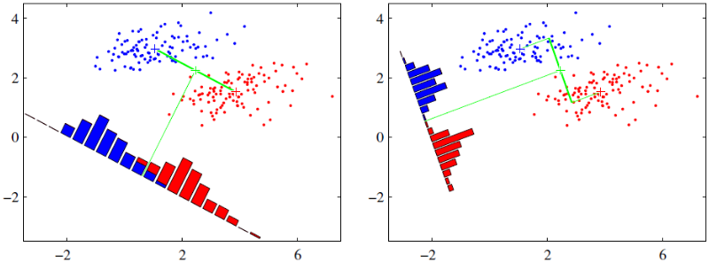
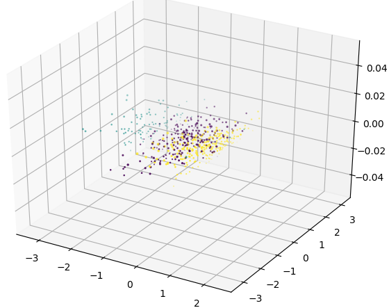
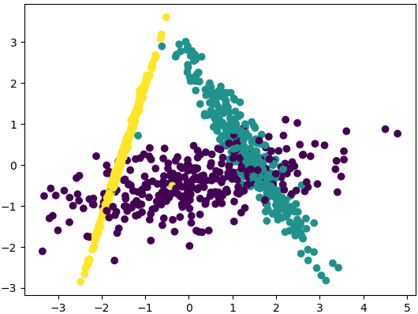

&emsp;&emsp;线性判别分析(`Linear Discriminant Analysis`，`LDA`)是一种经典的降维方法，它在模式识别领域(比如人脸识别、舰艇识别等图形图像识别领域)中有非常广泛的应用。<!--more-->
&emsp;&emsp;`LDA`是一种监督学习的降维技术，也就是说数据集的每个样本是有类别的，而`PCA`是不考虑样本类别输出的无监督降维技术。`LDA`的思想可以用一句话概括，就是`投影后类内方差最小，类间方差最大`。我们要将数据在低维度上进行投影，希望同一种类别数据的投影点尽可能得接近，而不同类别数据的类别中心之间的距离尽可能得大。
&emsp;&emsp;假设我们有两类数据，分别为红色和蓝色，如下图所示，这些数据特征是二维的。我们希望将这些数据投影到一维的一条直线，让每一种类别数据的投影点尽可能得接近，而红色和蓝色数据中心之间的距离尽可能得大：



&emsp;&emsp;上图提供了两种投影方式，哪一种能更好地满足我们的标准呢？从直观上可以看出，右图要比左图的投影效果好，因为右图的红色数据和蓝色数据投影点较为集中，且类别之间的距离明显，而左图则在边界处数据混杂。以上就是`LDA`的主要思想，当然在实际应用中，我们的数据是多个类别的，原始数据一般也是超过二维的，投影后的也一般不是直线，而是一个低维的超平面。
&emsp;&emsp;首先生成一些三维的数据：

``` python
import numpy as np
import matplotlib.pyplot as plt
from mpl_toolkits.mplot3d import Axes3D
from sklearn.datasets.samples_generator import make_classification

X, y = make_classification(
           n_samples=1000, n_features=3, n_redundant=0, n_classes=3,
           n_informative=2, n_clusters_per_class=1, class_sep=0.5, random_state=10)
fig = plt.figure()
ax = Axes3D(fig, rect=[0, 0, 1, 1], elev=30, azim=20)
plt.scatter(X[:, 0], X[:, 1], X[:, 2], marker='o', c=y)
plt.show()
```



使用`LDA`的效果如下：

``` python
import numpy as np
import matplotlib.pyplot as plt
from mpl_toolkits.mplot3d import Axes3D
from sklearn.datasets.samples_generator import make_classification
from sklearn.discriminant_analysis import LinearDiscriminantAnalysis

X, y = make_classification(
           n_samples=1000, n_features=3, n_redundant=0, n_classes=3,
           n_informative=2, n_clusters_per_class=1, class_sep=0.5, random_state=10)
lda = LinearDiscriminantAnalysis(n_components=2)
lda.fit(X, y)
X_new = lda.transform(X)
plt.scatter(X_new[:, 0], X_new[:, 1], marker='o', c=y)
plt.show()
```



可以看出降维后，样本特征和类别信息之间的关系得以保留。一般来说，如果我们的数据是有类别标签的，那么优先选择`LDA`去尝试降维；当然也可以使用`PCA`做很小幅度的降维去消去噪声，然后再使用`LDA`降维。如果没有类别标签，那么肯定`PCA`是最先考虑的一个选择了。