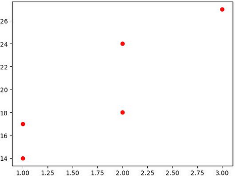
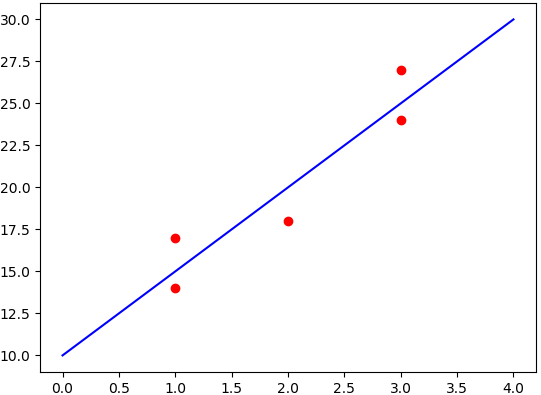

&emsp;&emsp;既然是线性问题，就可以用公式$y = ax + b$来进行表示，这个方程的图像是一条直线，我们称之为回归线。而我们要做的就是来找到合适的参数$a$和$b$来构造该线性方程。那怎么来寻找这两个参数呢？下面看一个商家打广告的数量和卖出产品数量之间的关系示例：<!--more-->

广告数量 | 卖出产品数量
--------|------------
`1`     | `14`
`2`     | `24`
`2`     | `18`
`1`     | `17`
`3`     | `27`

我们将广告数量作为变量$X$，将卖出的产品数量当做变量$Y$，在坐标轴上几个点的图形如下：



从图中可以看到，这几个点上下交错，相互连接是构不成一条直线的，该怎么构建线性模型$y = ax + b$呢？这里采用了数学上的最小二乘法，要在这些点之间找到一条直线，使这条直线和各个点之间满足下面的数学关系：

$$
min\sum(y_i - \hat{y_i})^2
$$

其中$y_i$是点`i`的真实`y`值，$\hat{y_i}$是预测得到的模型中的对应`x`预测得到的`y`值，这个公式代表每个真实值和预测值得平方和最小。这时的模型就是最优线性回归模型。那如该如何确定参数$a$和$b$呢？最小二乘法的计算公式如下：

$$
y = ax + b
$$

$$
a = \frac{\sum(x_i - \bar{x})(y_i - \bar{y})}{\sum(x_i - \bar{x})^2}
$$

$$
b = \bar{y} - a\bar{x}
$$

上面公式中的$\bar{x}$和$\bar{y}$分别代表$X$的平均值和$Y$的平均值，通过上面的公式就可以计算得到参数$a$和$b$，从而得到线性方程$y = ax + b$，之后就可以对输入的$x$值进行预测。

``` python
import numpy as np
import matplotlib.pyplot as plt

class linear:
    def __init__(self):
        self.a = 0
        self.b = 0

    def fit(self, X, Y):
        molecule = 0  # 分子
        dnominator = 0  # 分母
        x_mean = np.mean(X)  # X的平均值
        y_mean = np.mean(Y)  # Y的平均值

        for i in range(len(X)):
            molecule += (X[i] - x_mean) * (Y[i] - y_mean)
            dnominator += (X[i] - x_mean) ** 2

        self.a = molecule / float(dnominator)
        self.b = y_mean - self.a * x_mean

    def predict(self, x):
        return self.a * x + self.b

if __name__ == '__main__':
    x = np.array([1, 3, 2, 1, 3])
    y = np.array([14, 24, 18, 17, 27])
    plt.scatter(x, y, c='r', marker='o')  # 画点
    lin = linear()
    lin.fit(x, y)
    x = np.arange(0, 5, 1)  # 画线
    y = lin.predict(x)
    plt.plot(x, y, 'b')
    plt.show()
```



&emsp;&emsp;代码二如下：

``` python
import numpy as np

def fitSLR(x, y):
    n = len(x)
    dinominator = 0
    numerator = 0

    for i in range(0, n):
        numerator += (x[i] - np.mean(x)) * (y[i] - np.mean(y))
        dinominator += (x[i] - np.mean(x)) ** 2

    b1 = numerator / float(dinominator)
    b0 = np.mean(y) / float(np.mean(x))
    return b0, b1

def predict(x, b0, b1):
    return b0 + x * b1

x = [1, 3, 2, 1, 3]
y = [14, 24, 18, 17, 27]
b0, b1 = fitSLR(x, y)
print("intercept:", b0, " slope:", b1)

x_test = 6
y_test = predict(x_test, b0, b1)
print("y_test:", y_test)
```


---

### Python进行一元线性回归分析

&emsp;&emsp;通过`09`至`13`年的数值，估算出`14`年的数值，主要运用`sklearn`包中的`linear_model.LinearRegression`方法。数据内容如下：

time   | beijing
-------|-------
`2009` | `1159`
`2010` | `1298`
`2011` | `1364`
`2012` | `1794`
`2013` | `1896.3`

通过`5`年的数据构造一元线性回归分析模型，估算出`2014`年的北京数值：

``` python
from sklearn import linear_model
import pandas as pd

def get_data(file_name):
    data = pd.read_csv(file_name)
    X = []
    Y = []

    for time, city in zip(data['time'], data['beijing']):
        X.append([float(time)])
        Y.append(float(city))

    return X, Y

def linear_model_main(X_parameters, Y_parameters, predict_value):
    regr = linear_model.LinearRegression()
    regr.fit(X_parameters, Y_parameters)
    predict = regr.predict(predict_value)
    predictions = {}
    predictions['intercept'] = regr.intercept_  # 截距
    predictions['coefficient'] = regr.coef_  # 回归系数
    predictions['predicted_value'] = predict
    return predictions

X, Y = get_data("beijing.csv")
print(X)
print(Y)

predict_time = 2014
result = linear_model_main(X, Y, predict_time)
print("Intercept value ", result['intercept'])
print("coefficient", result['coefficient'])
print("Predicted value: ", result['predicted_value'])
```


---

### Python进行多元线性回归分析

&emsp;&emsp;对于多元线性回归，有如下例子：

Driving Assignment | X1 = Miles Traveled | X2 = Number of Deliveries | Y = Travel Time(Hours)
-------------------|---------------------|---------------------------|-----------------------
1                  | 100                 | 4                         | 9.3
2                  | 50                  | 3                         | 4.8
3                  | 100                 | 4                         | 8.9
4                  | 100                 | 2                         | 6.5
5                  | 50                  | 2                         | 4.2
6                  | 80                  | 2                         | 6.2
7                  | 75                  | 3                         | 7.4
8                  | 65                  | 4                         | 6.0
9                  | 90                  | 3                         | 7.6
10                 | 90                  | 2                         | 6.1

求出`X1 = 102`，`X2 = 6`时的`Y`。

``` python
from numpy import genfromtxt
from sklearn import linear_model
import numpy

dataPath = r"Delivery.csv"
deliveryData = genfromtxt(dataPath, delimiter=',')
print("data", deliveryData)

x = deliveryData[:, :-1]
y = deliveryData[:, -1]
print(x)
print(y)

lr = linear_model.LinearRegression()
lr.fit(x, y)
print(lr)
print("coefficients:", lr.coef_)
print("intercept:", lr.intercept_)

xPredict = [102, 6]
yPredict = lr.predict(numpy.array(xPredict).reshape(1, -1))
print("predict:", yPredict)
```