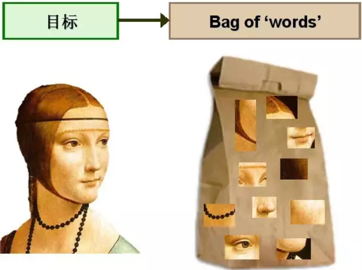
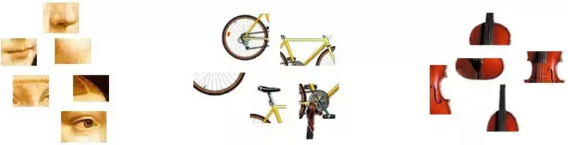
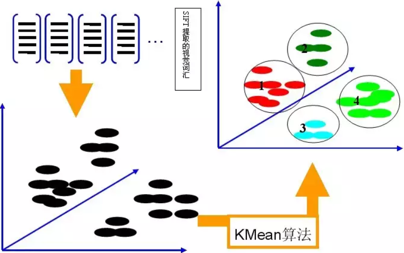
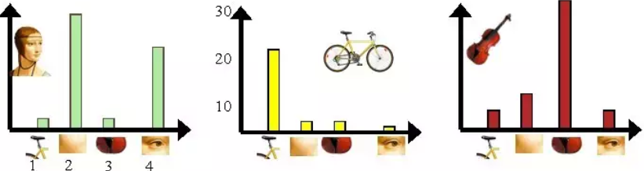

&emsp;&emsp;`BoW`(`Bag of Words`)词袋模型最初被用在文本分类中，将文档表示成特征矢量。它的基本思想是假定对于一个文本，忽略其词序和语法、句法，仅仅将其看做是一些词汇的集合，而文本中的每个词汇都是独立的。简单说就是讲每篇文档都看成一个袋子(因为里面装的都是词汇，所以称为`词袋`)，然后看这个袋子里装的都是些什么词汇，将其分类。如果文档中猪、马、牛、羊、山谷、土地、拖拉机这样的词汇多些，而银行、大厦、汽车、公园这样的词汇少些，我们就倾向于判断它是一篇描绘乡村的文档，而不是描述城镇的。<!--more-->
&emsp;&emsp;举个例子，有如下两个文档：

- 文档一：`Bob likes to play basketball, Jim likes too.`
- 文档二：`Bob also likes to play football games.`

基于这两个文本文档，构造一个词典：

``` python
Dictionary = {
    1: "Bob", 2: "like", 3: "to", 4: "play", 5: "basketball",
    6: "also", 7: "football", 8: "games", 9: "Jim", 10: "too"
}
```

这个词典一共包含`10`个不同的单词，利用词典的索引号，上面两个文档每一个都可以用一个`10`维向量表示(用整数数字`0`至`n`(`n`为正整数)表示某个单词在文档中出现的次数)：

- 文档一：`[1, 2, 1, 1, 1, 0, 0, 0, 1, 1]`
- 文档二：`[1, 1, 1, 1, 0, 1, 1, 1, 0, 0]`

向量中每个元素表示词典中相关元素在文档中出现的次数。不过，在构造文档向量的过程中可以看到，我们并没有表达单词在原来句子中出现的次序(这是词袋模型的缺点之一，不过瑕不掩瑜，甚至在此处无关紧要)。
&emsp;&emsp;`SIFT`特征虽然也能描述一幅图像，但是每个`SIFT`矢量都是`128`维的，而且一幅图像通常都包含成百上千个`SIFT`矢量。在进行相似度计算时，这个计算量是非常大的，通行的做法是用聚类算法对这些矢量数据进行聚类，然后用聚类中的一个簇代表`BoW`中的一个视觉词，将同一幅图像的`SIFT`矢量映射到视觉词序列生成码本，这样每一幅图像只用一个码本矢量来描述，这样计算相似度时效率就大大提高了。
&emsp;&emsp;现在想象在一个巨大的文档集合`D`，里面一共有`M`个文档，而文档里面的所有单词提取出来后，一起构成一个包含`N`个单词的词典。利用`BoW`模型，每个文档都可以被表示成为一个`N`维向量，计算机非常擅长于处理数值向量，这样就可以利用计算机来完成海量文档的分类过程。为了表示一幅图像，我们可以将图像看作文档，即若干个`视觉词汇`的集合，同样的，视觉词汇相互之间没有顺序。



&emsp;&emsp;由于图像中的词汇不像文本文档中的那样是现成的，我们需要先从图像中提取出相互独立的视觉词汇。这通常需要经过三个步骤：特征检测，特征表示和单词本的生成。从图像中提取出相互独立的视觉词汇：



&emsp;&emsp;通过观察会发现，同一类目标的不同实例之间虽然存在差异，但我们仍然可以找到它们之间的一些共同的地方。比如说人脸，虽然说不同人的脸差别比较大，但眼睛、嘴、鼻子等一些比较细小的部位却观察不到太大差别，我们可以把这些不同实例之间共同的部位提取出来，作为识别这一类目标的视觉词汇。而`SIFT`算法是提取图像中局部不变特征的应用最广泛的算法，因此可以用`SIFT`算法从图像中提取不变特征点，作为视觉词汇，并构造单词表，用单词表中的单词表示一幅图像。
&emsp;&emsp;接下来通过上述图像展示如何通过`BoW`模型，将图像表示成数值向量。现在有三个目标类，分别是人脸、自行车和吉他。`BoW`模型的第一步是利用`SIFT`算法，从每类图像中提取视觉词汇，将所有的视觉词汇集合在一起：


&emsp;&emsp;第二步是利用`K-Means`算法构造单词表。`K-Means`算法是一种基于样本间相似性度量的间接聚类方法，此算法以`K`为参数，把`N`个对象分为`K`个簇，以使簇内具有较高的相似度，而簇间相似度较低。`SIFT`提取的视觉词汇向量之间根据距离的远近，可以利用`K-Means`算法将词义相近的词汇合并，作为单词表中的基础词汇。假定我们将`K`设为`4`，那么单词表的构造过程如下：



&emsp;&emsp;第三步是利用单词表的中词汇表示图像。利用`SIFT`算法，可以从每幅图像中提取很多个特征点，这些特征点都可以用单词表中的单词近似代替。通过统计单词表中每个单词在图像中出现的次数，可以将图像表示成为一个`K = 4`维数值向量：



&emsp;&emsp;我们从人脸、自行车和吉他三个目标类图像中提取出的不同视觉词汇，而构造的词汇表中，会把词义相近的视觉词汇合并为同一类。经过合并，词汇表中只包含了四个视觉单词，分别按索引值标记为`1`、`2`、`3`和`4`。通过观察可以看到，它们分别属于自行车、人脸、吉他、人脸类。统计这些词汇在不同目标类中出现的次数可以得到每幅图像的直方图表示(我们假定存在误差，实际情况亦不外如此)：

- 人脸：`[3, 30, 3, 20]`
- 自行车：`[20, 3, 3, 2]`
- 吉他：`[8, 12, 32, 7]`

其实这个过程非常简单，就是针对人脸、自行车和吉他这三个文档，抽取出相似的部分(或者词义相近的视觉词汇合并为同一类)，构造一个词典，词典中包含`4`个视觉单词，即`Dictionary = {1:"自行车", 2:"人脸", 3:"吉他", 4:"人脸类"}`，最终人脸、自行车和吉他这三个文档皆可以用一个`4`维向量表示，最后根据三个文档相应部分出现的次数画成了上面对应的直方图。需要说明的是，以上过程只是针对三个目标类非常简单的一个示例，实际应用中，为了达到较好的效果，单词表中的词汇数量`K`往往非常庞大，并且目标类数目越多，对应的`K`值也越大。一般情况下，`K`的取值在几百到上千，在这里取`K = 4`仅仅是为了方便说明。