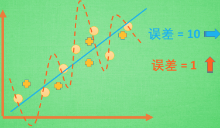
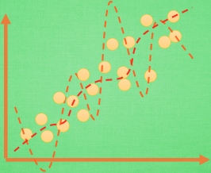
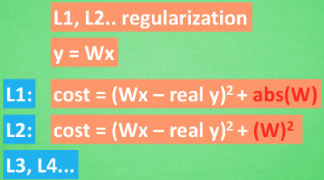

&emsp;&emsp;机器学习主要有两个主要挑战：欠拟合(`underfitting`)和过拟合(`overfitting`)。欠拟合是指模型不能在训练集上获得足够低的误差，而过拟合是指训练误差和和测试误差之间的差距太大。<!--more-->

### 过拟合

&emsp;&emsp;过拟合其实就是机器学习模型于自信，已经到了自负的阶段了。自负的坏处就是在自己的小圈子里表现非凡，不过在现实的大圈子里却经常处处碰壁。
&emsp;&emsp;机器学习模型的自负又表现在哪些方面呢？下图是一些数据，如果要你画一条线来描述这些数据，大多数人都会采用蓝线的方式，这也是我们希望机器也能学出来的一条用来总结这些数据的线。假设此时蓝线与数据的总误差可能是`10`，可有时候机器过于纠结这误差值，它想把误差减到更小，来完成它对这一批数据的学习使命。最后学习的模型(虚线)几乎经过了每一个数据点，这样的误差值会更小。可是误差越小就真的好吗？当我拿这个模型运用在现实中的时候，它的自负就体现出来。蓝线的误差基本保持不变，而虚线的误差值突然飙高。自负的虚线再也骄傲不起来，因为它不能成功地表达除了训练数据以外的其他数据。

#### 解决方法

&emsp;&emsp;方法一：增加数据量。大部分过拟合产生的原因是因为数据量太少了，如果有成千上万的数据，虚线也会慢慢被拉直，变得没那么扭曲。

&emsp;&emsp;方法二：运用正规化，例如`L1`、`L2`正规化。这些方法适用于大多数的机器学习(包括神经网络)。它们的做法大同小异，我们简化机器学习的关键公式为`y = Wx`，`W`为机器需要学习到的各种参数。在过拟合中，`W`的值往往变化得特别大或特别小，为了不让`W`变化太大，我们在计算误差上做些手脚。原始的`cost`误差计算方式为`cost = (预测值 - 真实值)^2`，如果`W`变得太大，我们就让`cost`也跟着变大，变成一种惩罚机制，如下图所示(这里的`abs`是绝对值)，这种形式的正规化叫做`L1`正规化。`L2`正规化和`L1`类似，只是绝对值换成了平方，`L3`、`L4`也都是换成了立方和`4`次方等。

&emsp;&emsp;方法三：还有一种专门用在神经网络的正规化的方法，叫作`dropout`。在训练的时候，随机忽略掉一些神经元和神经联结，使这个神经网络变得`不完整`，用一个不完整的神经网络训练一次。到第二次再随机忽略另一些，变成另一个不完整的神经网络。有了这些随机`drop`掉的规则，我们可以让每一次预测结果都不会依赖于其中某部分特定的神经元。