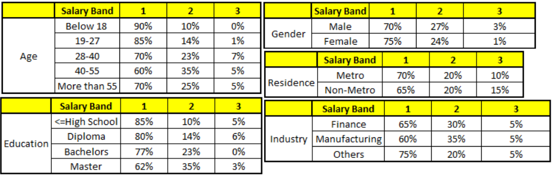

### 什么是随机森林？

&emsp;&emsp;如果读者接触过决策树(`Decision Tree`)的话，那么会很容易理解什么是随机森林。随机森林就是通过集成学习的思想将多棵树集成的一种算法，它的基本单元是决策树，而它的本质属于机器学习的一大分支：集成学习(`Ensemble Learning`)方法。随机森林的名称中有两个关键词，一个是`随机`，另一个就是`森林`。`森林`我们很好理解，一棵叫做树，那么成百上千棵就可以叫做森林了，这样的比喻还是很贴切的，其实这也是随机森林的主要思想：集成思想的体现。`随机`的含义我们会在下面部分讲到。<!--more-->
&emsp;&emsp;其实从直观角度来解释，每棵决策树都是一个分类器(假设现在针对的是分类问题)，那么对于一个输入样本，`N`棵树会有`N`个分类结果。而随机森林集成了所有的分类投票结果，将投票次数最多的类别指定为最终的输出，这就是一种最简单的`Bagging`思想。

### 随机森林的特点

&emsp;&emsp;随机森林是一种很灵活实用的方法，它有如下几个特点：

- 在当前所有算法中，具有极好的准确率(`It is unexcelled in accuracy among current algorithms`)。
- 能够有效地运行在大数据集上(`It runs efficiently on large data bases`)。
- 能够处理具有高维特征的输入样本，而且不需要降维(`It can handle thousands of input variables without variable deletion`)。
- 能够评估各个特征在分类问题上的重要性(`It gives estimates of what variables are important in the classification`)。
- 在生成过程中，能够获取到内部生成误差的一种无偏估计(`It generates an internal unbiased estimate of the generalization error as the forest building progresses`)。
- 对于缺省值问题也能够获得很好得结果(`It has an effective method for estimating missing data and maintains accuracy when a large proportion of the data are missing`)。

实际上，随机森林的特点不只有这六点，它就相当于机器学习领域的`Leatherman`(多面手)，你几乎可以把任何东西扔进去，它基本上都是可供使用的。在估计推断映射方面特别好用，以致于都不需要像`SVM`那样做很多参数的调试。

### 随机森林的相关基础知识

#### 信息、熵以及信息增益的概念

&emsp;&emsp;这三个基本概念是决策树的根本，是决策树利用特征来分类时，确定特征选取顺序的依据。理解了它们，决策树你也就了解了大概。
&emsp;&emsp;引用香农的话来说，信息是用来消除随机不确定性的东西。对于机器学习中的决策树而言，如果带分类的事物集合可以划分为多个类别当中，则某个类$x_i$的信息可以定义如下：

$$
I(X = x_i) = -logp(x_i)
$$

$I(x)$用来表示随机变量的信息，$p(x_i)$指是当$x_i$发生时的概率。熵是用来度量不确定性的，当熵越大，$X = x_i$的不确定性越大，反之越小。对于机器学习中的分类问题而言，熵越大即这个类别的不确定性更大，反之越小。<br>
&emsp;&emsp;信息增益在决策树算法中是用来选择特征的指标，信息增益越大，则这个特征的选择性越好。

#### 决策树

&emsp;&emsp;决策树是一种树形结构，其中每个内部节点表示一个属性上的测试，每个分支代表一个测试输出，每个叶节点代表一种类别。常见的决策树算法有`C4.5`、`ID3`和`CART`。

#### 集成学习

&emsp;&emsp;集成学习通过建立几个模型组合的来解决单一预测问题。它的工作原理是生成多个分类器/模型，各自独立地学习和作出预测。这些预测最后结合成单预测，因此优于任何一个单分类的做出预测。随机森林是集成学习的一个子类，它依靠于决策树的投票选择来决定最后的分类结果。

### 随机森林的生成

&emsp;&emsp;前面提到，随机森林中有许多的分类树。我们要将一个输入样本进行分类，我们需要将输入样本输入到每棵树中进行分类。打个形象的比喻：森林中召开会议，讨论某个动物到底是老鼠还是松鼠，每棵树都要独立地发表自己对这个问题的看法，也就是每棵树都要投票。该动物到底是老鼠还是松鼠，要依据投票情况来确定，获得票数最多的类别就是森林的分类结果。森林中的每棵树都是独立的，`99.9%`不相关的树做出的预测结果涵盖所有的情况，这些预测结果将会彼此抵消。少数优秀的树的预测结果将会超脱于芸芸`噪音`，做出一个好的预测。将若干个弱分类器的分类结果进行投票选择，从而组成一个强分类器，这就是随机森林`bagging`的思想(关于`bagging`，有一个必须提及的问题：`bagging`不用单棵决策树来做预测，具体哪个变量起到重要作用变得未知，所以`bagging`改进了预测准确率但损失了解释性)。下图可以形象地描述这个情况：


有了树我们就可以分类了，但是森林中的每棵树是怎么生成的呢？每棵树的按照如下规则生成：
&emsp;&emsp;1. 如果训练集大小为`N`，对于每棵树而言，随机且有放回地从训练集中的抽取`N`个训练样本(这种采样方式称为`bootstrap sample`)，作为该树的训练集。从这里我们可以知道，每棵树的训练集都是不同的，而且里面包含重复的训练样本。
&emsp;&emsp;为什么要随机抽样训练集？如果不进行随机抽样，每棵树的训练集都一样，那么最终训练出的树分类结果也是完全一样的，这样的话完全没有`bagging`的必要。
&emsp;&emsp;为什么要有放回地抽样？我理解的是这样的：如果不是有放回的抽样，那么每棵树的训练样本都是不同的，都是没有交集的，这样每棵树都是`有偏的`和`片面的`，也就是说每棵树训练出来都是有很大的差异的。而随机森林最后分类取决于多棵树(弱分类器)的投票表决，这种表决应该是`求同`，因此使用完全不同的训练集来训练每棵树这样对最终分类结果是没有帮助的，这样无异于是`盲人摸象`。
&emsp;&emsp;2. 如果每个样本的特征维度为`M`，指定一个常数`m`(`<< M`)，随机地从`M`个特征中选取`m`个特征子集，每次树进行分裂时，从这`m`个特征中选择最优的。
&emsp;&emsp;3. 每棵树都尽最大程度的生长，并且没有剪枝过程。
&emsp;&emsp;一开始我们提到的随机森林中的`随机`就是指这里的两个随机性。两个随机性的引入对随机森林的分类性能至关重要，由于它们的引入，使得随机森林不容易陷入过拟合，并且具有很好得抗噪能力(比如对缺省值不敏感)。
&emsp;&emsp;随机森林分类效果(错误率)与两个因素有关：

1. 森林中任意两棵树的相关性：相关性越大，错误率越大。
2. 森林中每棵树的分类能力：每棵树的分类能力越强，整个森林的错误率越低。

&emsp;&emsp;减小特征选择个数`m`，树的相关性和分类能力也会相应的降低；增大`m`，两者也会随之增大。所以关键问题是如何选择最优的`m`(或者是范围)，这也是随机森林唯一的一个参数。

### 袋外错误率(oob error)

&emsp;&emsp;上面我们提到，构建随机森林的关键问题就是如何选择最优的`m`，要解决这个问题主要依据计算袋外错误率`oob error`(`out-of-bag error`)。
&emsp;&emsp;随机森林有一个重要的优点，就是没有必要对它进行交叉验证或者用一个独立的测试集来获得误差的一个无偏估计。它可以在内部进行评估，也就是说在生成的过程中就可以对误差建立一个无偏估计。
&emsp;&emsp;我们知道，在构建每棵树时，我们对训练集使用了不同的`bootstrap sample`(随机且有放回地抽取)，所以对于每棵树而言(假设对于第`k`棵树)，大约有`1/3`的训练实例没有参与第`k`棵树的生成，它们称为第`k`棵树的`oob`样本。而这样的采样特点就允许我们进行`oob`估计，它的计算方式如下(以样本为单位)：

1. 对每个样本，计算它作为`oob`样本的树对它的分类情况(约`1/3`的树)。
2. 然后以简单多数投票作为该样本的分类结果。
3. 最后用误分个数占样本总数的比率作为随机森林的`oob`误分率。

`oob`误分率是随机森林泛化误差的一个无偏估计，它的结果近似于需要大量计算的`k`折交叉验证。

### 简单示例

&emsp;&emsp;根据已有的训练集已经生成了对应的随机森林，随机森林如何利用某一个人的年龄(`Age`)、性别(`Gender`)、教育情况(`Highest Educational Qualification`)、工作领域(`Industry`)以及住宅地(`Residence`)共`5`个字段来预测他的收入层次。
&emsp;&emsp;收入层次如下:

``` cpp
Band 1: Below $40,000
Band 2: $40,000 - 150,000
Band 3: More than $150,000
```

随机森林中每一棵树都可以看做是一棵`CART`(分类回归树)，这里假设森林中有`5`棵`CART`树，总特征个数`N = 5`，我们取`m = 1`(这里假设每个`CART`树对应一个不同的特征)。



我们要预测的某个人的信息如下：

``` cpp
Age: 35 years
Gender: Male
Education: Diploma holder
Residence: Metro
Industry: Manufacturing
```

根据这五棵`CART`树的分类结果，我们可以针对这个人的信息建立收入层次的分布情况：


最后我们得出结论，这个人的收入层次`70%`的可能性是`Band 1`，大约`24%`的可能性为`Band 2`，`6%`的可能性为`Band 3`，所以最终认定该人属于`Band 1`收入层次(小于`$40,000`)。

### python实现代码

&emsp;&emsp;代码如下：

``` python
from sklearn.datasets import load_iris
from sklearn.ensemble import RandomForestClassifier
import pandas as pd
import numpy as np

iris = load_iris()
df = pd.DataFrame(iris.data, columns=iris.feature_names)
df['is_train'] = np.random.uniform(0, 1, len(df)) <= .75
df['species'] = pd.Categorical.from_codes(iris.target, iris.target_names)
train, test = df[df['is_train'] == True], df[df['is_train'] == False]
features = df.columns[:4]
clf = RandomForestClassifier(n_jobs=2)
y, _ = pd.factorize(train['species'])
clf.fit(train[features], y)

preds = iris.target_names[clf.predict(test[features])]
print(pd.crosstab(test['species'], preds, rownames=['actual'], colnames=['preds']))
```

执行结果：

``` python
preds       setosa  versicolor  virginica
actual
setosa          12           0          0
versicolor       0          11          0
virginica        0           2         17
```


---

### sklearn.ensemble.RandomForestClassifier

&emsp;&emsp;A random forest classifier. The function is:

``` python
class sklearn.ensemble.RandomForestClassifier(
    n_estimators=10, criterion='gini', max_depth=None, min_samples_split=2, min_samples_leaf=1,
    min_weight_fraction_leaf=0.0, max_features='auto', max_leaf_nodes=None, min_impurity_decrease=0.0,
    min_impurity_split=None, bootstrap=True, oob_score=False, n_jobs=1,
    random_state=None, verbose=0, warm_start=False, class_weight=None);
```

&emsp;&emsp;A random forest is a meta estimator that fits a number of decision tree classifiers on various `sub-samples` of the dataset and use averaging to improve the predictive accuracy and control `over-fitting`. The `sub-sample` size is always the same as the original input sample size but the samples are drawn with replacement if `bootstrap=True` (default).

- `n_estimators`: `integer`, optional (`default=10`). The number of trees in the forest.
- `criterion`: `string`, optional (`default="gini"`). The function to measure the quality of a split. Supported criteria are `gini` for the `Gini` impurity and `entropy` for the information gain. Note: this parameter is `tree-specific`.
- `max_features`: `int`, `float`, `string` or `None`, optional (`default="auto"`): The number of features to consider when looking for the best split:

1. If `int`, then consider `max_features` features at each split.
2. If `float`, then `max_features` is a percentage and `int(max_features * n_features)` features are considered at each split.
3. If `auto`, then `max_features=sqrt(n_features)`.
4. If `sqrt`, then `max_features=sqrt(n_features)` (same as `auto`).
5. If `log2`, then `max_features=log2(n_features)`.
6. If `None`, then `max_features=n_features`.

Note: the search for a split does not stop until at least one valid partition of the node samples is found, even if it requires to effectively inspect more than `max_features` features.

- `max_depth`: `integer` or `None`, optional (`default=None`). The maximum depth of the tree. If `None`, then nodes are expanded until all leaves are pure or until all leaves contain less than `min_samples_split` samples.
- `min_samples_split`: `int`, `float`, optional (`default=2`). The minimum number of samples required to split an internal node:

1. If `int`, then consider `min_samples_split` as the minimum number.
2. If `float`, then `min_samples_split` is a percentage and `ceil(min_samples_split * n_samples)` are the minimum number of samples for each split.

Changed in version `0.18`: Added float values for percentages.

- `min_samples_leaf`: `int`, `float`, optional (`default=1`). The minimum number of samples required to be at a leaf node:

1. If `int`, then consider `min_samples_leaf` as the minimum number.
2. If `float`, then `min_samples_leaf` is a percentage and `ceil(min_samples_leaf * n_samples)` are the minimum number of samples for each node.

Changed in version `0.18`: Added float values for percentages.

- `min_weight_fraction_leaf`: `float`, optional (`default=0.`). The minimum weighted fraction of the sum total of weights (of all the input samples) required to be at a leaf node. Samples have equal weight when `sample_weight` is not provided.
- `max_leaf_nodes`: `int` or `None`, optional (`default=None`). Grow trees with `max_leaf_nodes` in `best-first` fashion. Best nodes are defined as relative reduction in impurity. If `None` then unlimited number of leaf nodes.
- `min_impurity_split`: `float`, Threshold for early stopping in tree growth. A node will split if its impurity is above the threshold, otherwise it is a leaf. Deprecated since version `0.19`: `min_impurity_split` has been deprecated in favor of `min_impurity_decrease` in `0.19` and will be removed in `0.21`. Use `min_impurity_decrease` instead.
- `min_impurity_decrease`: `float`, optional (`default=0.`). A node will be split if this split induces a decrease of the impurity greater than or equal to this value. The weighted impurity decrease equation is the following:

``` cpp
N_t / N * (impurity - N_t_R / N_t * right_impurity - N_t_L / N_t * left_impurity)
```

where `N` is the total number of samples, `N_t` is the number of samples at the current node, `N_t_L` is the number of samples in the left child, and `N_t_R` is the number of samples in the right child. `N`, `N_t`, `N_t_R` and `N_t_L` all refer to the weighted sum, if `sample_weight` is passed.

- `bootstrap`: `boolean`, optional (`default=True`). Whether `bootstrap` samples are used when building trees.
- `oob_score`: `bool` (`default=False`). Whether to use `out-of-bag` samples to estimate the generalization accuracy.
- `n_jobs`: `integer`, optional (`default=1`). The number of jobs to run in parallel for both fit and predict. If `-1`, then the number of jobs is set to the number of cores.
- `random_state`: `int`, `RandomState` instance or `None`, optional (`default=None`). If `int`, `random_state` is the seed used by the random number generator; If `RandomState` instance, `random_state` is the random number generator; If `None`, the random number generator is the `RandomState` instance used by `np.random`.
- `verbose`: `int`, optional (`default=0`). Controls the verbosity of the tree building process.
- `warm_start`: `bool`, optional (`default=False`). When set to `True`, reuse the solution of the previous call to fit and add more estimators to the ensemble, otherwise, just fit a whole new forest.
- `class_weight`: dict, list of dicts, `balanced`, `balanced_subsample` or `None`, optional (`default=None`) Weights associated with classes in the form `{class_label: weight}`. If not given, all classes are supposed to have weight one. For `multi-output` problems, a list of dicts can be provided in the same order as the columns of `y`.

&emsp;&emsp;Note that for multioutput (including multilabel) weights should be defined for each class of every column in its own dict. For example, for `four-class` multilabel classification weights should be `[{0: 1, 1: 1}, {0: 1, 1: 5}, {0: 1, 1: 1}, {0: 1, 1: 1}]` instead of `[{1:1}, {2:5}, {3:1}, {4:1}]`.
&emsp;&emsp;The `balanced` mode uses the values of `y` to automatically adjust weights inversely proportional to class frequencies in the input data as `n_samples / (n_classes * np.bincount(y))`. The `balanced_subsample` mode is the same as `balanced` except that weights are computed based on the bootstrap sample for every tree grown.
&emsp;&emsp;For `multi-output`, the weights of each column of `y` will be multiplied. Note that these weights will be multiplied with `sample_weight` (passed through the fit method) if `sample_weight` is specified.
&emsp;&emsp;Attributes:

- `estimators_`: list of `DecisionTreeClassifier`. The collection of fitted `sub-estimators`.
- `classes_`: array of `shape = [n_classes]` or a list of such arrays. The classes labels (single output problem), or a list of arrays of class labels (`multi-output` problem).
- `n_classes_`: `int` or `list`. The number of classes (single output problem), or a list containing the number of classes for each output (`multi-output` problem).
- `n_features_`: `int`. The number of features when fit is performed.
- `n_outputs_`: `int`. The number of outputs when fit is performed.
- `feature_importances_`: array of `shape = [n_features]`. The feature importances (the higher, the more important the feature).
- `oob_score_`: `float`. Score of the training dataset obtained using an `out-of-bag` estimate.
- `oob_decision_function_`: array of `shape = [n_samples, n_classes]`. Decision function computed with `out-of-bag` estimate on the training set. If `n_estimators` is small it might be possible that a data point was never left out during the bootstrap. In this case, `oob_decision_function_` might contain `NaN`.

&emsp;&emsp;**Notes**: The default values for the parameters controlling the size of the trees (e.g. `max_depth`, `min_samples_leaf`, etc.) lead to fully grown and unpruned trees which can potentially be very large on some data sets. To reduce memory consumption, the complexity and size of the trees should be controlled by setting those parameter values.
&emsp;&emsp;The features are always randomly permuted at each split. Therefore, the best found split may vary, even with the same training data, `max_features=n_features` and `bootstrap=False`, if the improvement of the criterion is identical for several splits enumerated during the search of the best split. To obtain a deterministic behaviour during fitting, `random_state` has to be fixed.

``` python
>>> from sklearn.ensemble import RandomForestClassifier
>>> from sklearn.datasets import make_classification
>>> X, y = make_classification(n_samples=1000, n_features=4, n_informative=2, n_redundant=0, random_state=0, shuffle=False)
>>> clf = RandomForestClassifier(max_depth=2, random_state=0)
>>> clf.fit(X, y)
RandomForestClassifier(bootstrap=True, class_weight=None, criterion='gini', max_depth=2, max_features='auto',
                       max_leaf_nodes=None, min_impurity_decrease=0.0, min_impurity_split=None,
                       min_samples_leaf=1, min_samples_split=2, min_weight_fraction_leaf=0.0, n_estimators=10,
                       n_jobs=1, oob_score=False, random_state=0, verbose=0, warm_start=False)
>>> print(clf.feature_importances_)
[ 0.17287856  0.80608704  0.01884792  0.00218648]
>>> print(clf.predict([[0, 0, 0, 0]]))
[1]
```

### apply(X)

&emsp;&emsp;Apply trees in the forest to `X`, return leaf indices.

- `X`: `array-like` or sparse matrix, `shape = [n_samples, n_features]`. The input samples. Internally, its dtype will be converted to `dtype=np.float32`. If a sparse matrix is provided, it will be converted into a sparse `csr_matrix`.

&emsp;&emsp;Returns `X_leaves`: `array_like`, `shape = [n_samples, n_estimators]`. For each datapoint `x` in `X` and for each tree in the forest, return the index of the leaf `x` ends up in.

### decision_path(X)

&emsp;&emsp;Return the decision path in the forest.

- `X`: `array-like` or sparse matrix, `shape = [n_samples, n_features]`. The input samples. Internally, its dtype will be converted to `dtype=np.float32`. If a sparse matrix is provided, it will be converted into a sparse `csr_matrix`.

&emsp;&emsp;Returns:

- `indicator`: sparse csr array, `shape = [n_samples, n_nodes]`. Return a node indicator matrix where non zero elements indicates that the samples goes through the nodes.
- `n_nodes_ptr`: array of size `(n_estimators + 1,)`. The columns from `indicator[n_nodes_ptr[i]:n_nodes_ptr[i+1]]` gives the indicator value for the `i-th` estimator.

### fit(X, y, sample_weight=None)

&emsp;&emsp;Build a forest of trees from the training `set (X, y)`.

- `X`: `array-like` or sparse matrix of `shape = [n_samples, n_features]`. The training input samples. Internally, its dtype will be converted to `dtype=np.float32`. If a sparse matrix is provided, it will be converted into a sparse `csc_matrix`.
- `y`: `array-like`, `shape = [n_samples]` or `[n_samples, n_outputs]`. The target values (class labels in classification, real numbers in regression).
- `sample_weight`: `array-like`, `shape = [n_samples]` or `None`. Sample weights. If `None`, then samples are equally weighted. Splits that would create child nodes with net zero or negative weight are ignored while searching for a split in each node. In the case of classification, splits are also ignored if they would result in any single class carrying a negative weight in either child node.

### get_params(deep=True)

&emsp;&emsp;Get parameters for this estimator.

- `deep`: `boolean`, optional. If `True`, will return the parameters for this estimator and contained subobjects that are estimators.

&emsp;&emsp;Returns `params`: mapping of string to any. Parameter names mapped to their values.

### predict(X)

&emsp;&emsp;Predict class for `X`. The predicted class of an input sample is a vote by the trees in the forest, weighted by their probability estimates. That is, the predicted class is the one with highest mean probability estimate across the trees.

- `X`: `array-like` or sparse matrix of `shape = [n_samples, n_features]`. The input samples. Internally, its dtype will be converted to `dtype=np.float32`. If a sparse matrix is provided, it will be converted into a sparse `csr_matrix`.

&emsp;&emsp;Returns `y`: array of `shape = [n_samples]` or `[n_samples, n_outputs]`. The predicted classes.

### predict_log_proba(X)

&emsp;&emsp;Predict class `log-probabilities` for `X`. The predicted class `log-probabilities` of an input sample is computed as the log of the mean predicted class probabilities of the trees in the forest.

- `X`: `array-like` or sparse matrix of `shape = [n_samples, n_features]`. The input samples. Internally, its dtype will be converted to `dtype=np.float32`. If a sparse matrix is provided, it will be converted into a sparse `csr_matrix`.

&emsp;&emsp;Returns `p`: array of `shape = [n_samples, n_classes]`, or a list of `n_outputs`. such arrays if `n_outputs > 1`. The class probabilities of the input samples. The order of the classes corresponds to that in the attribute `classes_`.

### predict_proba(X)

&emsp;&emsp;Predict class probabilities for `X`. The predicted class probabilities of an input sample are computed as the mean predicted class probabilities of the trees in the forest. The class probability of a single tree is the fraction of samples of the same class in a leaf.

- `X`: `array-like` or sparse matrix of `shape = [n_samples, n_features]`. The input samples. Internally, its dtype will be converted to `dtype=np.float32`. If a sparse matrix is provided, it will be converted into a sparse `csr_matrix`.

&emsp;&emsp;Returns `p`: array of `shape = [n_samples, n_classes]`, or a list of `n_outputs`. such arrays if `n_outputs > 1`. The class probabilities of the input samples. The order of the classes corresponds to that in the attribute `classes_`.

### score(X, y, sample_weight=None)

&emsp;&emsp;Returns the mean accuracy on the given test data and labels. In `multi-label` classification, this is the subset accuracy which is a harsh metric since you require for each sample that each label set be correctly predicted.

- `X`: `array-like`, `shape = (n_samples, n_features)`. Test samples.
- `y`: `array-like`, `shape = (n_samples)` or `(n_samples, n_outputs)`. `True` labels for `X`.
- `sample_weight`: `array-like`, `shape = [n_samples]`, optional. Sample weights.

&emsp;&emsp;Returns `score`: `float`. Mean accuracy of `self.predict(X)` wrt. `y`.

### set_params(**params)

&emsp;&emsp;Set the parameters of this estimator. The method works on simple estimators as well as on nested objects (such as pipelines). The latter have parameters of the form `<component>__<parameter>` so that it's possible to update each component of a nested object.