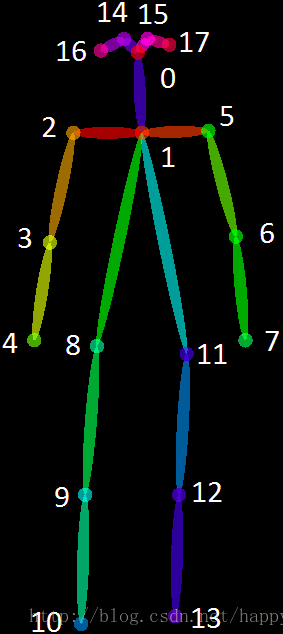

&emsp;&emsp;`COCO`的全称是`Common Objects in Context`，是微软团队提供的一个可以用来进行图像识别的数据集。`MS COCO`数据集中的图像分为训练、验证和测试集。<!--more-->
&emsp;&emsp;`COCO`数据集现在有`3`种标注类型：`object instances`(目标实例)、`object keypoints`(目标上的关键点)和`image captions`(看图说话)，使用`JSON`文件存储。比如下面就是`COCO`的`2017`年训练集中的标注文件：

- `captions_train2017.json`
- `captions_val2017.json`
- `instances_train2017.json`
- `instances_val2017.json`
- `person_keypoints_train2017.json`
- `person_keypoints_val2017.json`

可以看到其中有上面所述的三种类型，每种类型又包含了训练和验证，所以共`6`个`JSON`文件。

### 基本的JSON结构体类型

&emsp;&emsp;`object instances`、`object keypoints`、`image captions`这`3`种类型共享这些基本类型：`info`、`image`、`license`。
&emsp;&emsp;`annotation`类型则呈现出了多态：

``` json
{
    "info": info,
    "licenses": [license],
    "images": [image],
    "annotations": [annotation],
}

info {
    "year": int,
    "version": str,
    "description": str,
    "contributor": str,
    "url": str,
    "date_created": datetime,
}

license {
    "id": int,
    "name": str,
    "url": str,
}

image {
    "id": int,
    "width": int,
    "height": int,
    "file_name": str,
    "license": int,
    "flickr_url": str,
    "coco_url": str,
    "date_captured": datetime,
}
```

&emsp;&emsp;一个`info`类型的实例如下：

``` json
"info": {
    "description":"This is stable 1.0 version of the 2014 MS COCO dataset.",
    "url":"http:\\mscoco.org",
    "version":"1.0","year":2014,
    "contributor":"Microsoft COCO group",
    "date_created":"2015-01-27 09:11:52.357475"
}
```

&emsp;&emsp;`images`是包含多个`image`实例的数组，一个`image`类型的实例如下：

``` json
"image": {
    "license":3,
    "file_name":"COCO_val2014_000000391895.jpg",
    "coco_url":"http:\\mscoco.org\images\391895",
    "height":360,
    "width":640,
    "date_captured":"2013-11-14 11:18:45",
    "flickr_url":"http:\\farm9.staticflickr.com\8186\8119368305_4e622c8349_z.jpg",
    "id":391895
}
```

&emsp;&emsp;`licenses`是包含多个`license`实例的数组，一个`license`类型的实例如下：

``` json
"license": {
    "url":"http:\\creativecommons.org\licenses\by-nc-sa\2.0\",
    "id":1,
    "name":"Attribution-NonCommercial-ShareAlike License"
}
```

### Object Instance类型的标注格式

#### 整体JSON文件格式

&emsp;&emsp;比如上图中的`instances_train2017.json`、`instances_val2017.json`这两个文件就是这种格式。`Object Instance`这种格式的文件从头至尾按照顺序分为以下段落：

``` json
{
    "info": info,
    "licenses": [license],
    "images": [image],
    "annotations": [annotation],
    "categories": [category]
}
```

如果你打开这两个文件，虽然内容很多，但从文件开始到结尾按照顺序就是这`5`段。其中，`info`、`licenses`、`images`这三个类型在上一节中已经说了，在不同的`JSON`文件中这三个类型是一样的，定义是共享的。不共享的是`annotation`和`category`这两种结构体，它们在不同类型的`JSON`文件中是不一样的。`images`数组元素的数量等同于划入训练集(或者测试集)的图片的数量；`annotations`数组元素的数量等同于训练集(或者测试集)中`bounding box`的数量；`categories`数组元素的数量为`80`(`2017`年版本)：

``` python
from pycocotools.coco import COCO

dataDir = '..'
dataType = 'val2017'
annFile = '{}/annotations/instances_{}.json'.format(dataDir, dataType)
coco_train = COCO(annFile)  # initialize COCO api for instance annotations

print(len(coco_train.dataset['categories']))
print(len(coco_train.dataset['images']))
print(len(coco_train.dataset['annotations']))
```

#### annotations字段

&emsp;&emsp;`annotations`字段是包含多个`annotation`实例的一个数组，`annotation`类型本身又包含了一系列的字段，例如这个目标的`category id`和`segmentation mask`。`segmentation`格式取决于这个实例是一个单个的对象(即`iscrowd = 0`，将使用`polygons`格式)还是一组对象(即`iscrowd = 1`，将使用`RLE`格式)：

``` json
annotation {
    "id": int,
    "image_id": int,
    "category_id": int,
    "segmentation": RLE or [polygon],
    "area": float,
    "bbox": [x,y,width,height],
    "iscrowd": 0 or 1,
}
```

注意，单个的对象(`iscrowd = 0`)可能需要多个`polygon`来表示，比如这个对象在图像中被挡住了；而`iscrowd = 1`时(将标注一组对象，比如一群人)的`segmentation`使用的就是`RLE`格式。另外，每个对象(不管是`iscrowd = 0`还是`iscrowd = 1`)都会有一个矩形框`bbox`，矩形框左上角的坐标和矩形框的长宽会以数组的形式提供，数组第一个元素就是左上角的横坐标值。
&emsp;&emsp;`area`是`area of encoded masks`，即标注区域的面积。如果是矩形框，那就是高乘宽；如果是`polygon`或者`RLE`，那就稍微有点复杂点。`annotation`结构中的`categories`字段存储的是当前对象所属的`category`的`id`，以及所属的`supercategory`的`name`。
&emsp;&emsp;下面是从`instances_val2017.json`文件中摘出的一个`annotation`的实例，这里的`segmentation`就是`polygon`格式：

``` json
{
    "segmentation": [[510.66, 423.01, 511.72, 420.03, 510.45, ...]],
    "area": 702.1057499999998,
    "iscrowd": 0,
    "image_id": 289343,
    "bbox": [473.07,395.93,38.65,28.67],
    "category_id": 18,
    "id": 1768
}
```

&emsp;&emsp;`polygon`格式比较简单，这些数按照相邻的顺序两两组成一个点的`xy`坐标，如果有`n`个数(必定是偶数)，那么就是`n/2`个点坐标。下面就是一段解析`polygon`格式的`segmentation`并且显示多边形的示例代码：

``` python
import numpy as np
import matplotlib.pyplot as plt
import matplotlib
from matplotlib.patches import Polygon
from matplotlib.collections import PatchCollection

_, ax = plt.subplots()
polygons = []
gemfield_polygons = [
    [239.97, 260.24, 222.04, 270.49, 199.84, 253.41, 213.5,
     227.79, 259.62, 200.46, 274.13, 202.17, 277.55, 210.71,
     249.37, 253.41, 237.41, 264.51, 242.54, 261.95, 228.87, 271.34]
]

gemfield_polygon = gemfield_polygons[0]
max_value = max(gemfield_polygon) * 1.3
gemfield_polygon = [i * 1.0 / max_value for i in gemfield_polygon]
poly = np.array(gemfield_polygon).reshape((int(len(gemfield_polygon) / 2), 2))
polygons.append(Polygon(poly, True))
p = PatchCollection(polygons, cmap=matplotlib.cm.jet, alpha=0.4)
ax.add_collection(p)
plt.show()
```

&emsp;&emsp;如果`iscrowd = 1`，那么`segmentation`就是`RLE`格式(`segmentation`字段会含有`counts`和`size`数组)。在`json`文件中挑出一个这样的例子：

``` json
segmentation: {
    u'counts': [272, 2, 4, 4, 4, 4, 2, 9, 1, 2, 16, 43, 143, 24, ...],
    u'size': [240, 320]
}
```

`COCO`数据集的`RLE`都是`uncompressed RLE`格式(与之相对的是`compact RLE`)。`RLE`所占字节的大小和边界上的像素数量是正相关的。`RLE`格式带来的好处就是，当基于`RLE`去计算目标区域的面积以及两个目标之间的`unoin`和`intersection`时会非常有效率。上面的`segmentation`中的`counts`数组和`size`数组共同组成了这幅图片中的分割`mask`，其中`size`是这幅图片的宽高。然后在这幅图像中，每一个像素点要么在被分割(标注)的目标区域中，要么在背景中。很明显这是一个`bool`量：如果该像素在目标区域中，则为`true`；如果在背景中，就是`False`(如果该像素在目标区域中，则为`1`；如果在背景中，则为`0`)。对于一个`240 * 320`的图片来说，一共有`76800`个像素点，根据每一个像素点在不在目标区域中，我们就有了`76800`个`bit`，比如像这样：`00000111100111110...`。但是这样写很明显浪费空间，我们直接写上`0`或者`1`的个数不就可以吗(`Run-length encoding`)？于是就成了`54251...`，这就是上文中的`counts`数组。下面这个`python`代码片段直观的显示了这些`bit`：

``` python
rle = [272, 2, 4, 4, 4, 4, 2, 9, 1, 2, 16, 43, 143, 24, 5, 8, ...]
assert sum(rle) == 240 * 320
```

也可以使用下面的代码将这个`rle`数组表示的分割区域画出来：

``` python
import numpy as np
import matplotlib.pyplot as plt

rle = [
    66083, 9, 627, 14, 618, 23, 616, 25, 614,
    26, 613, 27, 612, 28, 611, 30, 610, 31, ...
]

assert sum(rle) == 640 * 480
M = np.zeros(640 * 480)
N = len(rle)
n = 0
val = 1

for pos in range(N):
    val = not val

    for c in range(rle[pos]):
        M[n] = val
        n += 1

GEMFIELD = M.reshape(([640, 480]), order='F')
plt.imshow(GEMFIELD)
plt.show()
```

#### categories字段

&emsp;&emsp;`categories`是一个包含多个`category`实例的数组，而`category`结构体描述如下：

``` json
{
    "id": int,
    "name": str,
    "supercategory": str,
}
```

从`instances_val2017.json`文件中摘出的`2`个`category`实例如下：

``` json
{
    "supercategory": "person",
    "id": 1,
    "name": "person"
},
{
    "supercategory": "vehicle",
    "id": 2,
    "name": "bicycle"
}
```

### Object Keypoint类型的标注格式

#### 整体JSON文件格式

&emsp;&emsp;比如上图中的`person_keypoints_train2017.json`、`person_keypoints_val2017.json`这两个文件就是这种格式。
&emsp;&emsp;`Object Keypoint`这种格式的文件从头至尾按照顺序分为以下段落，看起来和`Object Instance`一样：

``` json
{
    "info": info,
    "licenses": [license],
    "images": [image],
    "annotations": [annotation],
    "categories": [category]
}
```

`images`数组元素数量是划入训练集(测试集)的图片的数量；`annotations`是`bounding box`的数量，在这里只有人这个类别的`bounding box`；`categories`数组元素的数量为`1`，即`person`(`2017`年版本)。

#### annotations字段

&emsp;&emsp;这个类型中的`annotation`结构体包含了`Object Instance`中`annotation`结构体的所有字段，再加上`2`个额外的字段。
&emsp;&emsp;新增的`keypoints`是一个长度为`3 * k`的数组，其中`k`是`category`中`keypoints`的总数量。每一个`keypoint`是一个长度为`3`的数组，第一和第二个元素分别是`x`和`y`坐标值，第三个元素是个标志位`v`，`v`为`0`时表示这个关键点没有标注(这种情况下`x = y = v = 0`)，`v`为`1`时表示这个关键点标注了但是不可见(被遮挡了)，`v`为`2`时表示这个关键点标注了同时也可见。`num_keypoints`表示这个目标上被标注的关键点的数量(`v > 0`)，比较小的目标上可能就无法标注关键点。

``` json
annotation {
    "keypoints": [x1,y1,v1,...],
    "num_keypoints": int,
    "id": int,
    "image_id": int,
    "category_id": int,
    "segmentation": RLE or [polygon],
    "area": float,
    "bbox": [x,y,width,height],
    "iscrowd": 0 or 1,
}
```

&emsp;&emsp;从`person_keypoints_val2017.json`文件中摘出一个`annotation`实例：

``` json
{
    "segmentation": [[125.12, 539.69, 140.94, 522.43, ...]],
    "num_keypoints": 10,
    "area": 47803.27955,
    "iscrowd": 0,
    "keypoints": [0, 0, 0, 0, 0, 0, 0, 0, 0, 0, 0, 0, 0, 0, 0,
                  142, 309, 1, 177, 320, 2, 191, 398, ...],
    "image_id": 425226,
    "bbox": [73.35,206.02,300.58,372.5],
    "category_id": 1,
    "id": 183126
}
```

#### categories字段

&emsp;&emsp;对于每一个`category`结构体，相比`Object Instance`中的`category`新增了`2`个额外的字段，`keypoints`是一个长度为`k`的数组，包含了每个关键点的名字；`skeleton`定义了各个关键点之间的连接性(比如人的左手腕和左肘就是连接的，但是左手腕和右手腕就不是)。目前，`COCO`的`keypoints`只标注了`person category`(分类为人)。
&emsp;&emsp;定义如下：

``` json
{
    "id": int,
    "name": str,
    "supercategory": str,
    "keypoints": [str],
    "skeleton": [edge]
}
```

从`person_keypoints_val2017.json`文件中摘出一个`category`实例：

``` json
{
    "supercategory": "person",
    "id": 1,
    "name": "person",
    "keypoints": ["nose", "left_eye", "right_eye", "left_ear", "right_ear",
                  "left_shoulder", "right_shoulder", "left_elbow", "right_elbow",
                  "left_wrist", "right_wrist", "left_hip", "right_hip",
                  "left_knee", "right_knee", "left_ankle", "right_ankle"],
    "skeleton": [[16, 14], [14, 12], [17, 15], [15, 13], [12, 13], [6, 12], [7, 13],
                 [6, 7], [6, 8], [7, 9], [8, 10], [9, 11], [2, 3], [1, 2], [1, 3],
                 [2, 4], [3, 5], [4, 6], [5, 7]]
}
```

`OpenPose`的姿态识别用了`COCO`数据库，`COCO`有`17`个`keypoint`，`OpenPose`增加了一个，就是编号为`1`的人体中心点：



### Image Caption的标注格式

#### 整体JSON文件格式

&emsp;&emsp;比如上图中的`captions_train2017.json`、`captions_val2017.json`这两个文件就是这种格式。
&emsp;&emsp;`Image Caption`这种格式的文件从头至尾按照顺序分为以下段落，看起来和`Object Instance`一样，不过没有最后的`categories`字段：

``` json
{
    "info": info,
    "licenses": [license],
    "images": [image],
    "annotations": [annotation]
}
```

`images`数组的元素数量等于划入训练集(或者测试集)的图片的数量；`annotations`的数量要多于图片的数量，这是因为一个图片可以有多个场景描述。

#### annotations字段

&emsp;&emsp;这个类型中的`annotation`用来存储描述图片的语句。每个语句描述了对应图片的内容，而每个图片至少有`5`个描述语句(有的图片更多)。`annotation`定义如下：

``` json
annotation {
    "id": int,
    "image_id": int,
    "caption": str
}
```

从`captions_val2017.json`中摘取一个`annotation`实例：

``` json
{
    "image_id": 179765,
    "id": 38,
    "caption": "A black Honda motorcycle parked in front of a garage."
}
```