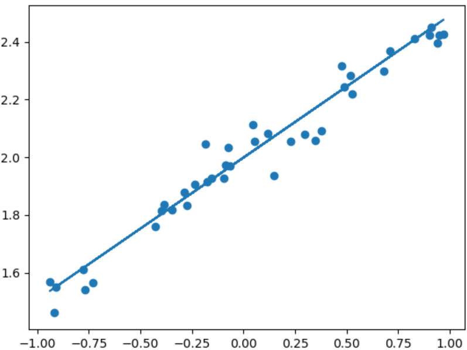

&emsp;&emsp;神经网络可以用来模拟回归问题(`regression`)，例如给一组数据，用一条线来对数据进行拟合，并可以预测新输入`x`的输出值。<!--more-->

### 导入模块并创建数据

&emsp;&emsp;`models.Sequential`用来一层一层地去建立神经层，`layers.Dense`意思是这个神经层是全连接层：

``` python
import numpy as np
from keras.models import Sequential
from keras.layers import Dense
import matplotlib.pyplot as plt  # 可视化模块

np.random.seed(1337)  # for reproducibility

# create some data
X = np.linspace(-1, 1, 200)
np.random.shuffle(X)  # randomize the data
Y = 0.5 * X + 2 + np.random.normal(0, 0.05, (200,))
# plot data
plt.scatter(X, Y)
plt.show()

X_train, Y_train = X[:160], Y[:160]  # train前160个“data points”
X_test, Y_test = X[160:], Y[160:]  # test后40个“data points”
```

### 建立模型

&emsp;&emsp;使用`Sequential`建立`model`，再用`model.add`添加神经层，第二行添加的是`Dense`全连接神经层。`Dense`的参数有两个，分别是输入数据和输出数据的维度，本例中的`x`和`y`是一维的。
&emsp;&emsp;如果需要添加下一个神经层，则不用再定义输入的维度，因为它默认就把前一层的输出作为当前层的输入。在这个例子里，只需要一层就够了：

``` python
model = Sequential()
model.add(Dense(output_dim=1, input_dim=1))
```

### 激活模型

&emsp;&emsp;接下来要激活神经网络，上一步只是定义模型。在`compile`的参数中，误差函数用的是`mse`均方误差；优化器用的是`sgd`随机梯度下降法：

``` python
# choose loss function and optimizing method
model.compile(loss='mse', optimizer='sgd')
```

于是就构建好了一个神经网络，它比`Tensorflow`要少了很多代码。

### 训练模型

&emsp;&emsp;训练的时候用`model.train_on_batch`一批一批地训练`X_train`、`Y_train`。默认的返回值是`cost`，每`100`步输出一下结果：

``` python
# training
print('Training -----------')

for step in range(301):
    cost = model.train_on_batch(X_train, Y_train)

    if step % 100 == 0:
        print('train cost: ', cost)
```

### 检验模型

&emsp;&emsp;检验用到的函数是`model.evaluate`，输入测试集的`x`和`y`，输出`cost`、`weights`和`biases`，其中`weights`和`biases`是取在模型的第一层`model.layers[0]`学习到的参数。从学习到的结果可以看到，`weights`比较接近`0.5`，`bias`接近`2`：

``` python
# test
print('\nTesting ------------')
cost = model.evaluate(X_test, Y_test, batch_size=40)
print('test cost:', cost)
W, b = model.layers[0].get_weights()
print('Weights=', W, '\nbiases=', b)
```

### 可视化结果

&emsp;&emsp;最后可以画出预测结果，与测试集的值进行对比：

``` python
# plotting the prediction
Y_pred = model.predict(X_test)
plt.scatter(X_test, Y_test)
plt.plot(X_test, Y_pred)
plt.show()
```

