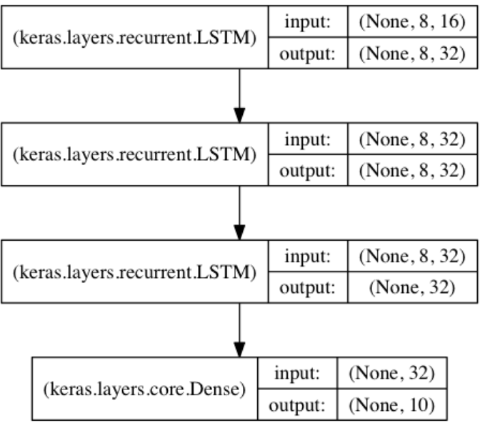

&emsp;&emsp;顺序模型是多个网络层的线性堆叠，也就是`一条路走到黑`。你可以通过将层的列表传递给`Sequential`的构造函数，来创建一个`Sequential`模型：<!--more-->

``` python
from keras.models import Sequential
from keras.layers import Dense, Activation

model = Sequential([
    Dense(32, input_shape=(784,)),
    Activation('relu'),
    Dense(10),
    Activation('softmax'),
])
```

也可以使用`add`函数将各层添加到模型中：

``` python
model = Sequential()
model.add(Dense(32, input_dim=784))
model.add(Activation('relu'))
```

### 指定输入数据的尺寸

&emsp;&emsp;模型需要知道它所期望的输入的尺寸。出于这个原因，顺序模型中的第一层(只有第一层，因为下面的层可以自动地推断尺寸)需要接收关于其输入尺寸的信息。有几种方法来做到这一点：

- 传递一个`input_shape`参数给第一层。它是一个表示尺寸的元组(一个整数或`None`的元组，其中`None`表示可能为任何正整数)。在`input_shape`中不包含数据的`batch`大小。
- 某些`2D`层(例如`Dense`)支持通过参数`input_dim`指定输入尺寸；某些`3D`时序层支持`input_dim`和`input_length`参数。
- 如果你需要为输入指定一个固定的`batch`大小(这对`stateful RNNs`很有用)，可以传递一个`batch_size`参数给一个层。如果你同时将`batch_size = 32`和`input_shape = (6, 8)`传递给一个层，那么每一批输入的尺寸就为`(32, 6, 8)`。

因此下面的代码片段是等价的：

``` python
model = Sequential()
model.add(Dense(32, input_shape=(784,)))
# ------------------
model = Sequential()
model.add(Dense(32, input_dim=784))
```

### 编译

&emsp;&emsp;在训练模型之前，您需要配置学习过程，这是通过`compile`方法完成的，它接收三个参数：

- 优化器`optimizer`：它可以是现有优化器的字符串标识符，例如`rmsprop`或`adagrad`，也可以是`Optimizer`类的实例。
- 损失函数`loss`：该参数为模型试图最小化的目标函数。它可以是现有损失函数的字符串标识符，例如`categorical_crossentropy`或`mse`，也可以是一个目标函数。
- 评估标准`metrics`：对于任何分类问题，你都希望将其设置为`metrics = ['accuracy']`。评估标准可以是现有的标准的字符串标识符，也可以是自定义的评估标准函数。评估标准应该返回单个张量，或一个完成`metric_name -> metric_value`映射的字典。

``` python
# 多分类问题
model.compile(optimizer='rmsprop', loss='categorical_crossentropy', metrics=['accuracy'])
# 二分类问题
model.compile(optimizer='rmsprop', loss='binary_crossentropy', metrics=['accuracy'])
# 均方误差回归问题
model.compile(optimizer='rmsprop', loss='mse')
# 自定义评估标准函数
import keras.backend as K

def mean_pred(y_true, y_pred):
    return K.mean(y_pred)

model.compile(optimizer='rmsprop', loss='binary_crossentropy', metrics=['accuracy', mean_pred])
```

### 训练

&emsp;&emsp;`Keras`模型在输入数据和标签的`Numpy`矩阵上进行训练。为了训练一个模型，你通常会使用`fit`函数：

``` python
# 二分类的单输入模型：
model = Sequential()
model.add(Dense(32, activation='relu', input_dim=100))
model.add(Dense(1, activation='sigmoid'))
model.compile(optimizer='rmsprop', loss='binary_crossentropy', metrics=['accuracy'])

import numpy as np
data = np.random.random((1000, 100))
labels = np.random.randint(2, size=(1000, 1))

model.fit(data, labels, epochs=10, batch_size=32)  # 训练模型，以32个样本为一个batch进行迭代
# -----------------------------------------
# 10分类的单输入模型：
model = Sequential()
model.add(Dense(32, activation='relu', input_dim=100))
model.add(Dense(10, activation='softmax'))
model.compile(optimizer='rmsprop', loss='categorical_crossentropy', metrics=['accuracy'])

import numpy as np
data = np.random.random((1000, 100))
labels = np.random.randint(10, size=(1000, 1))

one_hot_labels = keras.utils.to_categorical(labels, num_classes=10)  # 将标签转换为分类的one-hot编码
model.fit(data, one_hot_labels, epochs=10, batch_size=32)
```

### 例子

&emsp;&emsp;这里有几个可以帮助你开始的例子。在`examples`目录中，你可以找到真实数据集的示例模型：

- `CIFAR10`：小图片分类，具有实时数据增强的卷积神经网络(`CNN`)。
- `IMDB`：电影评论情感分类(基于词序列的`LSTM`)。
- `Reuters`：新闻主题分类(多层感知器`MLP`)。
- `MNIST`：手写数字分类(`MLP`和`CNN`)。

&emsp;&emsp;基于多层感知器`MLP`的`softmax`多分类：

``` python
import keras
from keras.models import Sequential
from keras.layers import Dense, Dropout, Activation
from keras.optimizers import SGD
import numpy as np

x_train = np.random.random((1000, 20))
y_train = keras.utils.to_categorical(np.random.randint(10, size=(1000, 1)), num_classes=10)
x_test = np.random.random((100, 20))
y_test = keras.utils.to_categorical(np.random.randint(10, size=(100, 1)), num_classes=10)

model = Sequential()
# Dense(64)是一个具有64个隐藏神经元的全连接层。在第一层必须指定所期望的输入数据尺寸，这里是一个20维的向量
model.add(Dense(64, activation='relu', input_dim=20))
model.add(Dropout(0.5))
model.add(Dense(64, activation='relu'))
model.add(Dropout(0.5))
model.add(Dense(10, activation='softmax'))

sgd = SGD(lr=0.01, decay=1e-6, momentum=0.9, nesterov=True)
model.compile(loss='categorical_crossentropy', optimizer=sgd, metrics=['accuracy'])
model.fit(x_train, y_train, epochs=20, batch_size=128)
score = model.evaluate(x_test, y_test, batch_size=128)
```

&emsp;&emsp;基于多层感知器的二分类：

``` python
import numpy as np
from keras.models import Sequential
from keras.layers import Dense, Dropout

x_train = np.random.random((1000, 20))
y_train = np.random.randint(2, size=(1000, 1))
x_test = np.random.random((100, 20))
y_test = np.random.randint(2, size=(100, 1))

model = Sequential()
model.add(Dense(64, input_dim=20, activation='relu'))
model.add(Dropout(0.5))
model.add(Dense(64, activation='relu'))
model.add(Dropout(0.5))
model.add(Dense(1, activation='sigmoid'))

model.compile(loss='binary_crossentropy', optimizer='rmsprop', metrics=['accuracy'])
model.fit(x_train, y_train, epochs=20, batch_size=128)
score = model.evaluate(x_test, y_test, batch_size=128)
```

&emsp;&emsp;类似`VGG`的卷积神经网络：

``` python
import numpy as np
import keras
from keras.models import Sequential
from keras.layers import Dense, Dropout, Flatten
from keras.layers import Conv2D, MaxPooling2D
from keras.optimizers import SGD

x_train = np.random.random((100, 100, 100, 3))
y_train = keras.utils.to_categorical(np.random.randint(10, size=(100, 1)), num_classes=10)
x_test = np.random.random((20, 100, 100, 3))
y_test = keras.utils.to_categorical(np.random.randint(10, size=(20, 1)), num_classes=10)

model = Sequential()
# 输入是3通道“100*100”像素图像 -> (100, 100, 3)张量。使用32个大小为“3 * 3”的卷积滤波器
model.add(Conv2D(32, (3, 3), activation='relu', input_shape=(100, 100, 3)))
model.add(Conv2D(32, (3, 3), activation='relu'))
model.add(MaxPooling2D(pool_size=(2, 2)))
model.add(Dropout(0.25))

model.add(Conv2D(64, (3, 3), activation='relu'))
model.add(Conv2D(64, (3, 3), activation='relu'))
model.add(MaxPooling2D(pool_size=(2, 2)))
model.add(Dropout(0.25))

model.add(Flatten())
model.add(Dense(256, activation='relu'))
model.add(Dropout(0.5))
model.add(Dense(10, activation='softmax'))

sgd = SGD(lr=0.01, decay=1e-6, momentum=0.9, nesterov=True)
model.compile(loss='categorical_crossentropy', optimizer=sgd)

model.fit(x_train, y_train, batch_size=32, epochs=10)
score = model.evaluate(x_test, y_test, batch_size=32)
```

&emsp;&emsp;基于`1D`卷积的序列分类：

``` python
from keras.models import Sequential
from keras.layers import Dense, Dropout
from keras.layers import Embedding
from keras.layers import Conv1D, GlobalAveragePooling1D, MaxPooling1D

model = Sequential()
model.add(Conv1D(64, 3, activation='relu', input_shape=(seq_length, 100)))
model.add(Conv1D(64, 3, activation='relu'))
model.add(MaxPooling1D(3))
model.add(Conv1D(128, 3, activation='relu'))
model.add(Conv1D(128, 3, activation='relu'))
model.add(GlobalAveragePooling1D())
model.add(Dropout(0.5))
model.add(Dense(1, activation='sigmoid'))

model.compile(loss='binary_crossentropy', optimizer='rmsprop', metrics=['accuracy'])
model.fit(x_train, y_train, batch_size=16, epochs=10)
score = model.evaluate(x_test, y_test, batch_size=16)
```

### 基于栈式LSTM的序列分类

&emsp;&emsp;在这个模型中，我们将`3`个`LSTM`层叠在一起，使该模型能够学习更高层次的时域特征表示。前两个`LSTM`返回完整的输出序列，但最后一个只返回输出序列的最后一步，从而降低了时间维度(也就是将输入序列转换成单个向量)。



``` python
from keras.models import Sequential
from keras.layers import LSTM, Dense
import numpy as np

data_dim = 16
timesteps = 8
num_classes = 10

# 期望输入数据尺寸：(batch_size, timesteps, data_dim)
model = Sequential()
# 返回维度为32的向量序列
model.add(LSTM(32, return_sequences=True, input_shape=(timesteps, data_dim)))
model.add(LSTM(32, return_sequences=True))  # 返回维度为32的向量序列
model.add(LSTM(32))  # 返回维度为32的单个向量
model.add(Dense(10, activation='softmax'))

model.compile(loss='categorical_crossentropy', optimizer='rmsprop', metrics=['accuracy'])

# 生成模拟训练数据
x_train = np.random.random((1000, timesteps, data_dim))
y_train = np.random.random((1000, num_classes))
# 生成模拟验证数据
x_val = np.random.random((100, timesteps, data_dim))
y_val = np.random.random((100, num_classes))

model.fit(x_train, y_train, batch_size=64, epochs=5, validation_data=(x_val, y_val))
```

### 带有状态(stateful)的相同的栈式LSTM模型

&emsp;&emsp;有状态的循环神经网络模型(`stateful LSTM`)中，在一个`batch`的样本处理完成后，其内部状态(`记忆`)会被记录并作为下一个`batch`的样本的初始状态。这允许处理更长的序列，同时保持计算复杂度的可控性：

``` python
from keras.models import Sequential
from keras.layers import LSTM, Dense
import numpy as np

data_dim = 16
timesteps = 8
num_classes = 10
batch_size = 32

# 期望输入数据尺寸: (batch_size, timesteps, data_dim)。请注意，我们必须提供完整的batch_input_shape，因为网络是有状态的
# 第k批数据的第i个样本是第“k - 1”批数据的第i个样本的后续
model = Sequential()
model.add(LSTM(32, return_sequences=True, stateful=True, batch_input_shape=(batch_size, timesteps, data_dim)))
model.add(LSTM(32, return_sequences=True, stateful=True))
model.add(LSTM(32, stateful=True))
model.add(Dense(10, activation='softmax'))

model.compile(loss='categorical_crossentropy', optimizer='rmsprop', metrics=['accuracy'])

# 生成模拟训练数据
x_train = np.random.random((batch_size * 10, timesteps, data_dim))
y_train = np.random.random((batch_size * 10, num_classes))
# 生成模拟验证数据
x_val = np.random.random((batch_size * 3, timesteps, data_dim))
y_val = np.random.random((batch_size * 3, num_classes))

model.fit(x_train, y_train, batch_size=batch_size, epochs=5, shuffle=False, validation_data=(x_val, y_val))
```


---

### Sequential顺序模型API

&emsp;&emsp;常用的`Sequential`属性为`model.layers`，它是添加到模型的层的列表。

#### add

&emsp;&emsp;该函数向模型中添加一个层：

``` python
add(self, layer)  # 参数layer是Layer对象
```

#### pop

&emsp;&emsp;该函数弹出模型最后的一层，无返回值：

``` python
pop(self)
```

#### compile

&emsp;&emsp;该函数用于配置训练模型：

``` python
compile(
    self, optimizer, loss, metrics=None, sample_weight_mode=None,
    weighted_metrics=None, target_tensors=None)
```

- `optimizer`：字符串(预定义优化器名)或者优化器对象。
- `loss`：字符串(预定义损失函数名)或目标函数。如果模型具有多个输出，则可以通过传递损失函数的字典或列表，在每个输出上使用不同的损失。模型将最小化的损失值将是所有单个损失的总和。
- `metrics`：在训练和测试期间的模型评估标准，通常你会使用`metrics = ['accuracy']`。要为多输出模型的不同输出指定不同的评估标准，还可以传递一个字典，如`metrics = {'output_a'：'accuracy'}`。
- `sample_weight_mode`：如果你需要执行按时间步采样权重(`2D`权重)，请将其设置为`temporal`。默认为`None`，为采样权重(`1D`)。如果模型有多个输出，则可以通过传递`mode`的字典或列表，以在每个输出上使用不同的`sample_weight_mode`。
- `weighted_metrics`：在训练和测试期间，由`sample_weight`或`class_weight`评估和加权的度量标准列表。
- `target_tensors`: 默认情况下，`Keras`将为模型的目标创建一个占位符，该占位符在训练过程中将被目标数据代替。相反，如果你想使用自己的目标张量(反过来说，`Keras`在训练期间不会载入这些目标张量的外部`Numpy`数据)，您可以通过`target_tensors`参数指定它们。目标张量可以是一个单独的张量(对应于单输出模型)，也可以是一个张量列表，或者一个`name -> tensor`的张量字典。

``` python
model = Sequential()
model.add(Dense(32, input_shape=(500,)))
model.add(Dense(10, activation='softmax'))
model.compile(optimizer='rmsprop', loss='categorical_crossentropy', metrics=['accuracy'])
```

#### fit

&emsp;&emsp;该函数的作用是以固定数量的轮次(数据集上的迭代)训练模型：

``` python
fit(
    self, x=None, y=None, batch_size=None, epochs=1, verbose=1,
    callbacks=None, validation_split=0.0, validation_data=None,
    shuffle=True, class_weight=None, sample_weight=None, initial_epoch=0)
```

- `x`：训练数据的`Numpy`数组。如果模型中的输入层被命名，你也可以传递一个字典，将输入层名称映射到`Numpy`数组。如果从本地框架张量馈送(例如`TensorFlow`数据张量)数据，`x`可以是`None`。
- `y`：目标(`标签`)数据的`Numpy`数组。如果模型中的输出层被命名，你也可以传递一个字典，将输出层名称映射到`Numpy`数组。如果从本地框架张量馈送(例如`TensorFlow`数据张量)数据，`y`可以是`None`。
- `batch_size`：整数或`None`，指定进行梯度下降时每个`batch`包含的样本数。训练时，一个`batch`的样本会被计算一次梯度下降，使目标函数优化一步。
- `epochs`：整数，训练模型迭代轮次。一个轮次是在整个`x`或`y`上的一轮迭代。请注意，与`initial_epoch`一起，`epochs`被理解为`最终轮次`。模型并不是训练了`epochs`轮，而是到第`epochs`轮停止训练。
- `verbose`：日志显示模式，`0`为不在标准输出流输出日志信息，`1`为输出进度条记录，`2`为每个`epoch`输出一行记录。
- `callbacks`：`list`，其中的元素是`keras.callbacks.Callback`的对象。这个`list`中的回调函数将会在训练过程中的适当时机被调用。
- `validation_split`：`0`和`1`之间的浮点数，用来指定训练集的一定比例数据作为验证集。验证集将不参与训练，并在每个`epoch`结束后测试的模型的指标，如损失函数、精确度等。注意，`validation_split`的划分在`shuffle`之前，因此如果你的数据本身是有序的，需要先手工打乱再指定`validation_split`，否则可能会出现验证集样本不均匀。
- `validation_data`：元组`(x_val, y_val)`或元组`(x_val, y_val, val_sample_weights)`，是指定的验证集。这个参数会覆盖`validation_split`。
- `shuffle`：布尔值(是否在每轮迭代之前混洗数据)或者字符串(`batch`)。一般为布尔值，表示是否在训练过程中随机打乱输入样本的顺序。若为字符串`batch`，则是用来处理`HDF5`数据的特殊情况，它将在`batch`内部将数据打乱。
- `class_weight`：字典，将不同的类别映射为不同的权值，该参数用来在训练过程中调整损失函数(只能用于训练)。
- `sample_weight`：权值的`numpy array`，用于在训练时调整损失函数(仅用于训练)。可以传递一个`1D`的与样本等长的向量用于对样本进行`1`对`1`的加权，或者在面对时序数据时，传递一个的形式为`(samples, sequence_length)`的矩阵来为每个时间步上的样本赋不同的权。这种情况下请确定在编译模型时添加了`sample_weight_mode='temporal'`。
- `initial_epoch`：从该参数指定的`epoch`开始训练，有助于恢复之前的训练。
- `fit`函数返回一个`History`的对象，其`History.history`属性记录了损失函数和其他指标的数值随`epoch`变化的情况，如果有验证集的话，也包含了验证集的这些指标变化情况。

#### evaluate

&emsp;&emsp;本函数按`batch`计算在某些输入数据上模型的误差：

``` python
evaluate(self, x=None, y=None, batch_size=None, verbose=1, sample_weight=None)
```

- `x`：输入数据，`Numpy`数组或列表(如果模型有多输入)。如果从本地框架张量馈送(例如`TensorFlow`数据张量)数据，`x`可以是`None`。
- `y`：标签，`Numpy`数组。如果从本地框架张量馈送(例如`TensorFlow`数据张量)数据，`y`可以是`None`。
- `batch_size`：整数，每次梯度更新的样本数。
- `verbose`：日志显示模式，`0`或`1`。
- `sample_weight`：样本权重，`Numpy`数组。

本函数返回一个测试误差的标量值(如果模型没有其他评价指标)，或一个标量的`list`(如果模型还有其他的评价指标)。`model.metrics_names`将给出`list`中各个值的含义。

#### predict

&emsp;&emsp;该函数的作用是为输入样本生成输出预测：

``` python
predict(self, x, batch_size=None, verbose=0)
```

该函数返回预测的`Numpy`数组。

#### train_on_batch

&emsp;&emsp;该函数在一个`batch`的数据上进行一次参数更新：

``` python
train_on_batch(self, x, y, class_weight=None, sample_weight=None)
```

该函数返回标量训练误差(如果模型没有评估指标)或标量列表(如果模型计算其他指标)。属性`model.metrics_names`将提供标量输出的显示标签。

#### test_on_batch

&emsp;&emsp;该函数本函数在一个`batch`的样本上对模型进行评估：

``` python
test_on_batch(self, x, y, sample_weight=None)
```

该函数返回标量测试误差(如果模型没有评估指标)或标量列表(如果模型计算其他指标)。属性`model.metrics_names`将提供标量输出的显示标签。

#### predict_on_batch

&emsp;&emsp;该函数的作用是返回一个`batch`样本上的模型预测值：

``` python
predict_on_batch(self, x)
```

参数`x`是输入数据，`Numpy`数组或列表(如果模型有多输入)。该函数返回预测值的`Numpy`数组。

#### fit_generator

&emsp;&emsp;该函数利用`Python`的生成器，逐个生成数据的`batch`并进行训练：

``` python
fit_generator(
    self, generator, steps_per_epoch=None, epochs=1, verbose=1, callbacks=None,
    validation_data=None, validation_steps=None, class_weight=None, max_queue_size=10,
    workers=1, use_multiprocessing=False, shuffle=True, initial_epoch=0)
```

生成器与模型并行运行，以提高效率。例如，该函数允许我们在`CPU`上进行实时的数据提升，同时在`GPU`上进行模型训练。该函数返回一个`History`对象。

- `generator`：一个生成器。生成器的输出应该为以下之一：

1. 一个`(inputs, targets)`元组。
2. 一个`(inputs, targets, sample_weights)`元组。所有的数组都必须包含同样数量的样本。生成器将无限地在数据集上循环。当运行到第`steps_per_epoch`时，记一个`epoch`结束。

- `steps_per_epoch`：在声明一个`epoch`完成并开始下一个`epoch`之前从`generator`产生的总步数(批次样本)。它通常应该等于你的数据集的样本数量除以批量大小。可选参数`Sequence`：如果未指定，将使用`len(generator)`作为步数。
- `epochs`：整数，数据的迭代总轮数。请注意，与`initial_epoch`一起，参数`epochs`应被理解为`最终轮数`。模型并不是训练了`epochs`轮，而是到第`epochs`轮停止训练。
- `verbose`：日志显示模式，`0`为不在标准输出流输出日志信息，`1`为输出进度条记录，`2`为每个`epoch`输出一行记录。
- `callbacks`：在训练时调用的一系列回调函数。
- `validation_data`：它可以是以下之一：

1. 验证数据的生成器。
2. 一个`(inputs, targets)`元组。
3. 一个`(inputs, targets, sample_weights)`元组。

- `validation_steps`：当`validation_data`为生成器时，本参数指定验证集的生成器返回次数。它通常应该等于你的数据集的样本数量除以批量大小。可选参数`Sequence`：如果未指定，将使用`len(generator)`作为步数。
- `class_weight`：将类别映射为权重的字典。
- `max_queue_size`：生成器队列的最大尺寸。
- `workers`：使用的最大进程数量。
- `use_multiprocessing`：如果`True`，则使用基于进程的多线程。请注意，因为此实现依赖于多进程，所以不应将不可传递的参数传递给生成器，因为它们不能被轻易地传递给子进程。
- `shuffle`：是否在每轮迭代之前打乱`batch`的顺序，只能与`Sequence(keras.utils.Sequence)`实例同用。
- `initial_epoch`：从该参数指定的`epoch`开始训练，有助于恢复之前的训练。

``` python
def generate_arrays_from_file(path):
    while 1:
        f = open(path)
        # create Numpy arrays of input data and labels, from each line in the file
        for line in f:
            x, y = process_line(line)
            yield (x, y)

        f.close()

model.fit_generator(generate_arrays_from_file('/my_file.txt'), steps_per_epoch=1000, epochs=10)
```

#### evaluate_generator

&emsp;&emsp;该函数的作用是在数据生成器上评估模型：

``` python
evaluate_generator(
    self, generator, steps=None, max_queue_size=10,
    workers=1, use_multiprocessing=False)
```

这个生成器应返回与`test_on_batch`的输入数据相同类型的数据。

- `generator`：生成器，生成`(inputs, targets)`或`(inputs, targets, sample_weights)`。
- `steps`：在停止之前，来自`generator`的总步数(样本批次数)。
- `max_queue_size`：生成器队列的最大尺寸。
- `workers`：使用的最大进程数量。
- `use_multiprocessing`：如果为`True`，则使用基于进程的多线程。请注意，因为此实现依赖于多进程，所以不应将不可传递的参数传递给生成器，因为它们不能被轻易地传递给子进程。

该函数返回标量测试误差(如果模型没有评估指标)或标量列表(如果模型计算其他指标)。属性`model.metrics_names`将提供标量输出的显示标签。

#### predict_generator

&emsp;&emsp;该函数的作用是为来自数据生成器的输入样本生成预测：

``` python
predict_generator(
    self, generator, steps=None, max_queue_size=10,
    workers=1, use_multiprocessing=False, verbose=0)
```

这个生成器应返回与`predict_on_batch`的输入数据相同类型的数据。该函数返回预测值的`Numpy`数组。

#### get_layer

&emsp;&emsp;该函数的作用是提取模型的某一层：

``` python
get_layer(self, name=None, index=None)
```

根据网络层的名称或其索引返回该层。索引是基于水平图遍历的顺序(自下而上)。参数`name`是字符串，即层的名字；`index`是整数，即层的索引。该函数返回一个层实例。