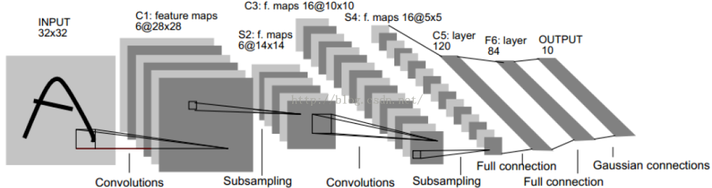

&emsp;&emsp;`Lenet-5`是卷积神经网络中很适合入门的网络结构，它在`1998`年由`Yann LeCuu`等人在论文`Gradient-Based Learning Applied to Document Recognition`中提出，用于解决`mnist`数据集的字符识别问题。网络结构如下：<!--more-->



&emsp;&emsp;`Lenet-5`除了输入层外，由`7`层网络构成：

- 卷积层`Conv1`：接受`32 * 32 * 1`的图像输入，本层包含`6`个大小为`5 * 5`，步长为`1 * 1`的卷积核。`padding`类型为`valid`(即没有`padding`)，输出神经元为`28 * 28 * 6`。
- 池化层`pooling`：对上一层的输出做`2 * 2`的`max pooling`，输出神经元形状为`14 * 14 * 6`。
- 卷积层`Conv2`：接受`14 * 14 * 6`的输入，本层有`16`个大小为`5 * 5`，步长为`1 * 1`的卷积核，同第一个卷积层。本层的`padding`类型为`valid`，输出神经元为`10 * 10 * 16`。
- 池化层：对上层输出做`2 * 2`的`max pooling`，输出神经元形状为`5 * 5 * 16`。
- 全连接层`fc1`：本层将上层的`5 * 5 * 16`神经元展开作为输入，本层包含`120`个神经元。
- 全连接层`fc2`：本层包含`84`个神经元。
- 输出层：本层包含`10`个神经元，分别代表数字`0`到`9`。

前`7`层采用论文中使用的`tanh`激活函数，输出层论文采用的是`Guassian Connection`，以下代码采用的是`softmax`函数。
&emsp;&emsp;数据集来源于`kaggle`中的`Digit Recognizer`数字识别数据集：

``` python
import numpy as np
from keras.layers import Input, Add, Conv2D, Dense, ZeroPadding2D, Activation, MaxPooling2D, Flatten
from keras.models import Model
from keras.utils import to_categorical

train = np.loadtxt('train.csv', delimiter=',', skiprows=1)
data_train = train[:40000]
data_val = train[40000:]
data_test = np.loadtxt('test.csv', delimiter=',', skiprows=1)

print(train.shape)
print(data_train.shape)
print(data_val.shape)
print(data_test.shape)
```

执行结果：

``` python
(42000, 785)
(40000, 785)
(2000, 785)
(28000, 784)
```

定义模型，并进行训练：

``` python
def lenet_5(input_shape=(32, 32, 1)):
    X_input = Input(input_shape)
    X = ZeroPadding2D((1, 1))(X_input)
    X = Conv2D(6, (5, 5), strides=(1, 1), padding='valid', name='conv1')(X)
    X = Activation('tanh')(X)
    X = MaxPooling2D((2, 2), strides=(2, 2))(X)
    X = Conv2D(6, (5, 5), strides=(1, 1), padding='valid', name='conv2')(X)
    X = Activation('tanh')(X)
    X = MaxPooling2D((2, 2), strides=(2, 2))(X)
    X = Flatten()(X)
    X = Dense(120, activation='tanh', name='fc1')(X)
    X = Dense(84, activation='tanh', name='fc2')(X)
    X = Dense(10, activation='softmax')(X)
    model = Model(inputs=X_input, outputs=X, name='lenet_5')
    return model

model = lenet_5(input_shape=(28, 28, 1))
model.compile(optimizer='sgd', loss='categorical_crossentropy', metrics=['accuracy'])

X_train = data_train[:, 1:].reshape((data_train.shape[0], 28, 28, 1))
Y_train = to_categorical(data_train[:, 0])
model.fit(X_train, Y_train, epochs=10, batch_size=16)

X_val = data_val[:, 1:].reshape((data_val.shape[0], 28, 28, 1))
Y_val = to_categorical(data_val[:, 0])
preds = model.evaluate(X_val, Y_val)
print("Validation loss=" + str(preds[0]))
print("Validation accuracy=" + str(preds[1]))
```