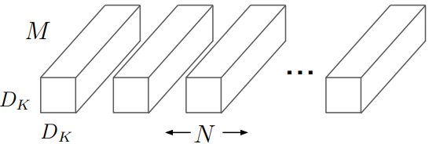
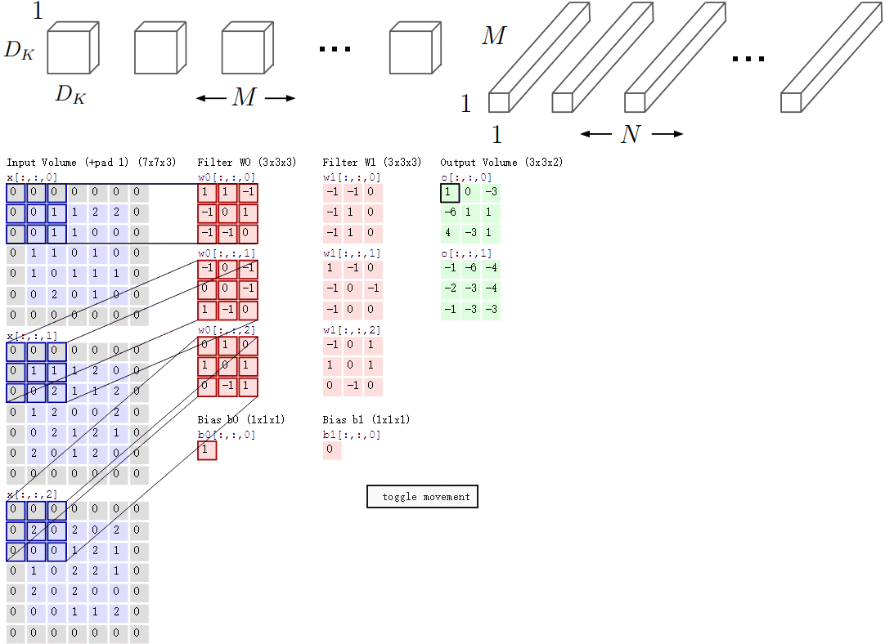
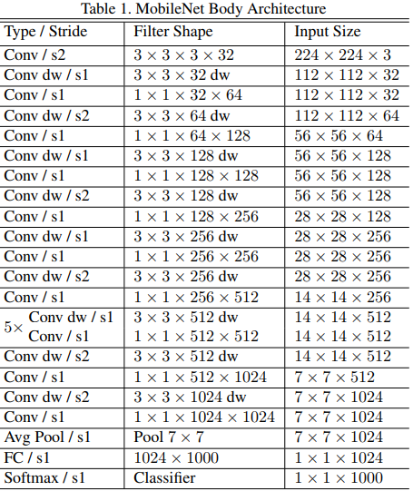
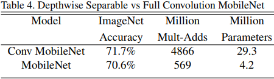
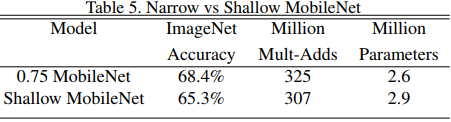

&emsp;&emsp;`MobileNet`是谷歌出品的一个轻量级的神经网络结构，经过一年的发展逐渐成为类似`GoogleNet`、`ResNet`一样的基础性网络结构。它的出发点是想构造精简、轻量级的神经网络，可以在性能有限的移动端上运行。可以认为它是一种网络压缩的方法，但是不同于其他压缩模型的方法的是，它不是在一个大的网络上进行剪枝、量化、分解等操作，而是给出了一个新的网络构造。<!--more-->
&emsp;&emsp;对于正常的卷积，假设输入`M`个`feature map`，输出`N`个`feature map`，卷积核的数量为`M * N`。假设每个卷积核大小为`3 * 3`，`M`个卷积核与`M`个输入`map`对应卷积并累加得到一个输出`map`，再用新的一组`M`个卷积核与输入`map`卷积得到下一个输出`map`。卷积过程可以看成两个步骤，一是卷积核在输入图片上提取特征，二是将提取的特征通过相加的方式融合成新的特征。
&emsp;&emsp;假如输入图片维度是`11 * 11 * 3`，标准卷积为`3 * 3 * 3 * 16`(假设`stride`为`2`，`padding`为`1`)，那么可以得到输出为`6 * 6 * 16`的输出结果。

图1 传统卷积

&emsp;&emsp;而`mobilenet`将传统卷积分解成了两个步骤，第一个步骤是深度可分离卷积`Depthwise Convolution`，它只有`M`个`3 * 3`的卷积核，`M`个卷积核与`M`个输入`map`，卷积得到`M`个`map`，它起到了提取特征的作用；第二个步骤是逐点卷积`Pointwise Convolution`，实际上就是传统的卷积，只是所有的卷积核都是`1 * 1`，一共有`M * N`个`1 * 1`，起到了融合已提取特征的作用。
&emsp;&emsp;现在输入图片不变，先通过一个维度是`3 * 3 * 1 * 3`的深度卷积(输入是`3`通道，这里有`3`个卷积核)，得到`6 * 6 * 3`的中间输出，然后再通过一个维度是`1 * 1 * 3 * 16`的`1 * 1`卷积，同样得到输出为`6 * 6 * 16`。

图2 深度可分离卷积和逐点卷积

&emsp;&emsp;这个过程中减少的计算量是什么？实际上就是提取特征的`filter`个数变少了。所以在论文中，传统卷积和两步卷积对应的计算量对比如下，分母是传统卷积的计算量，分子是两步卷积的计算量：

$$
\begin{align}
\frac{D_K * D_K * M * D_F * D_F + M * N * D_F * D_F}{D_K * D_K * M * N * D_F * D_F} = \frac{1}{N} + \frac{1}{D^2_K} \notag
\end{align}
$$

&emsp;&emsp;`MobileNet`结构建立在上述深度可分解卷积中(只有第一层是标准卷积)，其具体架构在下表说明。该网络允许我们探索网络拓扑，找到一个适合的良好网络。除了最后的全连接层，所有层后面跟了`BatchNorm`和`ReLU`，最终输入到`softmax`进行分类。按照作者的计算方法，`MobileNet`总共`28`层(`1 + 2 * 13 + 1 = 28`)。

图4 MobileNet整体网络结构

&emsp;&emsp;此外，文章还定义了两个超参数，第一个超参数是宽度乘子`α`，通过它可以进一步减少计算量，它是一个缩放系数，原来卷积的输入输出`channel`乘以这个系数就是新的`channel`数量；第二个超参数是分辨率乘子`ρ`，它也是缩放系数，对象是特征图的大小，特征图尺寸乘以这个系数就是新的特征图尺寸。
&emsp;&emsp;实验结果上来看，文章在`ImageNet`数据集上的分类任务中对比了`28`层的传统卷积与`MobileNet`，在最终准确率降低较少的情况下，正常卷积的计算量和参数量分别是`MobileNet`的`8.55`倍、`6.98`倍。

图4 对比传统卷积与MobileNet

&emsp;&emsp;有意思的是文章对比了图`5`中窄的网络和浅的网络，从结果上来看，在两者计算量一致的情况下，窄的网络比浅的网络性能更好。

图5 对比浅形网络和窄形网络

&emsp;&emsp;另外一个有意思的结论是文章统计了`ImageNet`分类准确率跟计算量和参数量之间的关系，最终发现与计算量、参数两者都呈现了类似`log`函数的形式。
&emsp;&emsp;文章还在多种任务上都进行了对比测试，大部分的结果都表明了`MobileNet`能够在保证一定准确率的情况下极大的减少计算量。