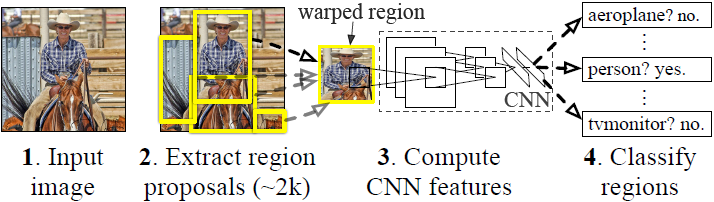
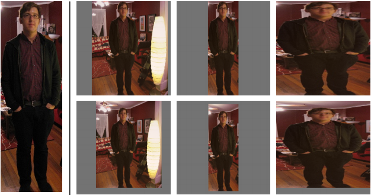
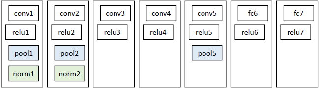

&emsp;&emsp;`Region CNN`(`RCNN`)可以说是利用深度学习进行目标检测的开山之作，主要解决目标检测中的速度和训练集这两个关键问题。<!--more-->

- 速度：经典的目标检测算法使用滑动窗法依次判断所有可能的区域。本文则预先提取一系列较可能是物体的候选区域，之后仅在这些候选区域上提取特征，进行判断。
- 训练集：经典的目标检测算法在区域中提取人工设定的特征(`Haar`、`HOG`等)。`RCNN`则需要训练深度网络进行特征提取。可供使用的有两个数据库：

1. 较大的识别库(`ImageNet ILSVC 2012`)：标定每张图片中物体的类别，一千万张图像，共`1000`类。
2. 较小的检测库(`PASCAL VOC 2007`)：标定每张图片中，物体的类别和位置，一万张图像，共`20`类。

`RCNN`使用识别库进行预训练，而后用检测库调优参数，最后在检测库上评测。

### 流程

&emsp;&emsp;`RCNN`算法分为如下几个步骤：

1. 输入一张多目标图像，采用`selective search`算法提取约`2000`个候选框。
2. 先在每个候选框周围加上`16`个像素值为候选框像素平均值的边框，再直接变形为`227 * 227`的大小。
3. 先将所有候选框像素减去该候选框像素平均值(预处理操作)，再依次将每个`227 * 227`的候选框输入`AlexNet`网络获取`4096`维的特征(比以前的人工经验特征低两个数量级)，`2000`个候选框的`CNN`特征组合成`2000 * 4096`维矩阵。
4. 将`2000 * 4096`维特征与`20`个`SVM`组成的权值矩阵`4096 * 20`相乘(`20`种分类，因为`SVM`是二分类器，则有`20`个`SVM`)，获得`2000 * 20`维矩阵(表示每个建议框是某个物体类别的得分)。
5. 分别对上述`2000 * 20`维矩阵中每一列(即每一类)进行非极大值抑制(剔除重叠候选框)，得到该列(即该类)得分最高的一些候选框。
6. 分别用`20`个回归器对上述`20`个类别中剩余的候选框进行回归操作，最终得到每个类别的修正后的得分最高的`bounding box`。

&emsp;&emsp;使用了`Selective Search`方法从一张图像生成约`2000`至`3000`个候选区域。基本思路如下：使用一种过分割手段，将图像分割成小区域；查看现有小区域，合并可能性最高的两个区域，重复直到整张图像合并成一个区域位置；输出所有曾经存在过的区域，即所谓的候选区域。候选区域生成和后续步骤相对独立，实际可以使用任意算法进行。
&emsp;&emsp;优先合并以下四种区域：颜色(颜色直方图)相近的；纹理(梯度直方图)相近的；合并后总面积小的；合并后的总面积在其`BBOX`中所占比例大的。第三条保证合并操作的尺度较为均匀，避免一个大区域陆续`吃掉`其他小区域。假设有区域`a-b-c-d-e-f-g-h`，较好的合并方式是：`ab-cd-ef-gh -> abcd-efgh -> abcdefgh`；不好的合并方法是`ab-c-d-e-f-g-h -> abcd-e-f-g-h -> abcdef-gh -> abcdefgh`。第四条保证合并后形状规则，例如左图适于合并，右图不适于合并：

&emsp;&emsp;上述四条规则只涉及区域的颜色直方图、纹理直方图、面积和位置。合并后的区域特征可以直接由子区域特征计算而来，速度较快。为了尽可能不遗漏候选区域，上述操作在多个颜色空间中同时进行(`RGB`、`HSV`或`Lab`等)。在一个颜色空间中，使用上述四条规则的不同组合进行合并。所有颜色空间与所有规则的全部结果，在去除重复后，都作为候选区域输出。

### 候选框搜索

&emsp;&emsp;从上面的流程图可以看到，搜索的候选框是矩形的，而且是大小各不相同。然而`CNN`要求输入图片的大小是固定的，如果把搜索的矩形选框不做处理就扔进`CNN`中，肯定是不行的。因此对于每个输入的候选框都需要缩放到固定的大小。下面讲解要怎么进行缩放处理，为了简单起见，假设下一阶段`CNN`所需要的输入图片大小是正方形(`227 * 227`)。`RCNN`的作者给出了四种变形方式：

- 考虑`context`(图像中的`context`指`RoI`周边像素)的各向同性变形，候选框周围像素扩充到`227 * 227`。若遇到图像边界，则用候选框像素均值填充，如下图第二列。
- 不考虑`context`的各向同性变形，直接用候选框像素均值填充至`227 * 227`，如下图第三列。
- 各向异性变形，简单粗暴地对图像缩放至`227 * 227`，如下图第四列。
- 变形前先进行边界像素填充(`padding`)处理，即向外扩展建议框边界，以上三种方法中分别采用`padding = 0`(下图第一行)和`padding = 16`(下图第二行)进行处理。

经过作者一系列实验，采用`padding = 16`的各向异性变形(下图第二行第三列)效果最好，能使`mAP`提升`3`至`5%`。

### 特征提取

&emsp;&emsp;特征提取分为有监督预训练和特定样本下的微调这两个步骤。网络结构基本借鉴`Hinton`在`ImageNet`上的分类网络：

&emsp;&emsp;有监督预训练的样本如下：

样本   | 来源
-------|-----
正样本 | `ILSVRC2012`
负样本 | `ILSVRC2012`

`ILSVRC`样本集上仅有图像类别标签，没有图像物体位置标注。采用`AlexNet`网络进行有监督预训练，学习率为`0.01`。该网络输入为`227 * 227`的`ILSVRC`训练集图像，输出最后一层为`4096维特征 -> 1000类`的映射，训练的是网络参数。
&emsp;&emsp;特定样本下的微调样本如下：

样本   | 来源
------|-----
正样本 | `Ground Truth`加上与`Ground Truth`相交`IoU > 0.5`的候选框(由于`Ground Truth`太少了)
负样本 | 与`Ground Truth`相交`IoU ≤ 0.5`的候选框

`PASCAL VOC 2007`样本集上既有图像中物体类别标签，也有图像中物体位置标签。采用训练好的`AlexNet`网络进行`PASCAL VOC 2007`样本集下的微调，学习率为`0.001`(`0.01/10`是为了在学习新东西时不至于忘记之前的记忆)。`mini-batch`为`32`个正样本和`96`个负样本(由于正样本太少)。该网络输入为候选框(由`selective search`而来)变形后的`227 * 227`的图像，修改了原来的`1000`为类别输出，改为`21`维(`20`类加上背景)输出，训练的是网络参数。

### 类别判断

&emsp;&emsp;对每一类目标，使用一个线性`SVM`二类分类器进行判别。输入为深度网络输出的`4096`维特征，输出是否属于此类。由于负样本很多，使用`hard negative mining`方法。假设要检测车辆，只有当`bounding box`把整辆车都包含在内才叫正样本；如果`bounding box`没有包含到车辆，那么就可以把它当做负样本。但问题是当检测窗口只有部分包含物体，那该怎么定义正负样本呢？作者测试了`IOU`阈值各种方案数值：`0`、`0.1`至`0.5`。最后通过训练发现，如果选择`IOU`阈值为`0.3`效果最好(选择为`0`精度下降了`4`个百分点，选择`0.5`精度下降了`5`个百分点)，即当重叠度小于`0.3`时，就把它标注为负样本。一旦`CNN`的`f7`层特征被提取出来，那么将为每个物体类训练一个`svm`分类器。使用`CNN`提取`2000`个候选框，可以得到`2000 * 4096`这样的特征向量矩阵，然后只需要把这样的一个矩阵与`svm`权值矩阵`4096 * N`点乘(`N`为分类类别数目，因为我们训练的`N`个`svm`，每个`svm`包含了`4096`个权值`w`)，就可以得到结果了。
&emsp;&emsp;将得到的特征输入到`SVM`进行分类，看看这个`feature vector`所对应的`region proposal`是需要的物体还是无关的实物(`background`)。最后使用排序、`canny`边界检测就得到了需要的`bounding box`。

### 什么叫有监督预训练？为什么要进行有监督预训练？

&emsp;&emsp;有监督预训练也称之为迁移学习，举例说明：若有大量标注信息的人脸年龄分类的正负样本图片，可以利用该样本训练了`CNN`网络，用于人脸年龄识别；现在要通过人脸进行性别识别，那么就可以去掉已经训练好的人脸年龄识别网络`CNN`的最后一层或几层，换成所需要的分类层。前面的网络参数直接使用为初始化参数，修改层的网络参数随机初始化，再利用人脸性别分类的正负样本图片进行训练，得到人脸性别识别网络，这种方法就叫做`有监督预训练`，可以很好地解决小样本数据无法训练深层`CNN`网络的问题。小样本数据训练很容易造成网络过拟合，但是在大样本训练后利用其参数初始化网络可以很好地训练小样本，这解决了小样本训练的难题。

### 可以不进行特定样本下的微调吗？可以直接采用AlexNet网络的特征进行SVM训练吗？

&emsp;&emsp;`RCNN`设计了没有进行微调的对比实验，分别对`AlexNet`网络的`pool5`、`fc6`、`fc7`层进行特征提取，输入`SVM`进行训练。这相当于把`AlexNet`网络当做特征提取器，类似于`HOG`、`SIFT`。实验结果发现`f6`层提取的特征比`f7`层的`mAP`还高，`pool5`层提取的特征与`f6`、`f7`层相比`mAP`差不多。在`PASCAL VOC 2007`数据集上采取了微调后，`fc6`、`fc7`层特征较`pool5`层特征用于`SVM`训练提升`mAP`十分明显。
&emsp;&emsp;由此作者得出结论：不针对特定任务进行微调，而将`CNN`当成特征提取器，`pool5`层得到的特征是基础特征，类似于`HOG`、`SIFT`，类似于只学习到了人脸共性特征；从`fc6`和`fc7`等全连接层中所学习到的特征，则是针对特定样本的特征，类似于学习到了分类性别分类年龄的个性特征。

### 为什么微调时和训练SVM时所采用的正负样本阈值(0.5和0.3)不一致？

&emsp;&emsp;微调阶段是由于`CNN`对小样本容易过拟合，需要大量训练数据，故对`IoU`限制宽松；`SVM`适用于小样本训练，故对样本`IoU`限制严格。

### 为什么不直接采用微调后的AlexNet网络最后一层SoftMax进行21分类？

&emsp;&emsp;因为微调时和训练`SVM`时所采用的正负样本阈值不同，微调阶段定义的正样本并不强调精准的位置，而`SVM`正样本只有`Ground Truth`；并且微调阶段的负样本是随机抽样的，而`SVM`的负样本是经过`hard negative mining`方法筛选的。采用`SoftMax`会使`PSACAL VOC 2007`测试集上`mAP`从`54.2%`降低到`50.9%`。