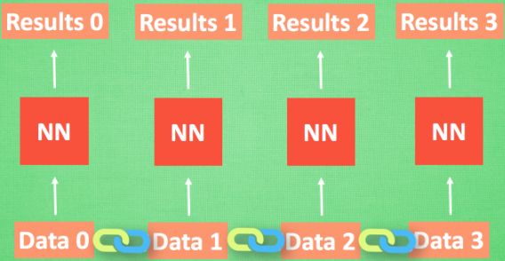
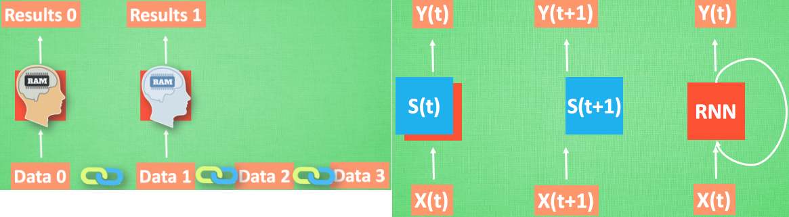
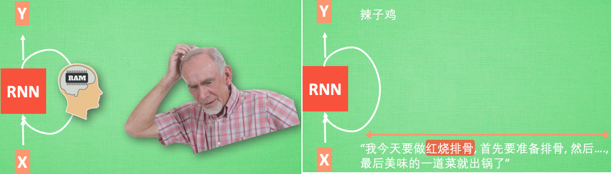
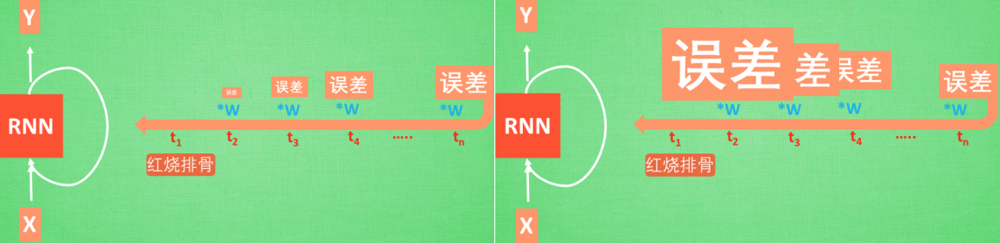
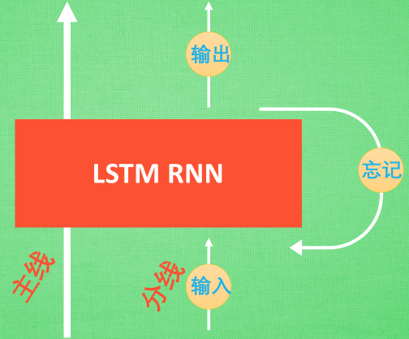

### RNN的用途

&emsp;&emsp;现在请你看着这个名字，不出意外的话，你应该可以脱口而出，因为你很可能就用了他们家的一款产品。那么现在请抛开这个产品，只想着`史蒂芬乔布斯`这个名字，请你再把它逆序念出来。有点难吧，这就说明对于预测，顺序排列是多么得重要。我们可以预测下一个按照一定顺序排列的字，但是如果打乱顺序，我们就没办法分析自己到底在说什么了。<!--more-->


### 序列数据

&emsp;&emsp;想象现在有一组序列数据`data0`、`data1`、`data2`和`data3`，当预测`result0`时，我们是基于`data0`；同样在预测其他数据的时候，我们也都只单单基于单个的数据，每次使用的神经网络都是同一个`NN`。不过某些数据是有关联顺序的，就像在厨房做菜，酱料`A`要比酱料`B`早放，不然就串味了。所以普通的神经网络结构并不能让`NN`了解这些数据之间的关联。



### 处理序列数据的神经网络

&emsp;&emsp;那我们如何让数据间的关联也被`NN`加以分析呢？想想我们人类是怎么分析各种事物的关联吧，最基本的方式就是记住之前发生的事情。那我们让神经网络也具备这种记住之前发生的事的能力，在分析`Data0`的时候，把分析结果存入记忆，然后当分析`data1`的时候，`NN`会产生新的记忆。但是新记忆和老记忆是没有联系的，我们就简单地把老记忆调用过来，一起分析。如果继续分析更多的有序数据，`RNN`就会把之前的记忆都累积起来，一起分析。



&emsp;&emsp;我们再重复一遍刚才的流程，不过这次是以加入一些数学方面的东西。每次`RNN`运算完之后都会产生一个对于当前状态的描述`state`，我们用简写`s(t)`代替，然后这个`RNN`开始分析`x(t + 1)`，它会根据`x(t + 1)`产生`s(t + 1)`，不过此时`y(t + 1)`是由`s(t)`和`s(t + 1)`共同创造的，所以我们通常看到的`RNN`也可以表达成最右边这种样子。

### RNN的弊端

&emsp;&emsp;之前我们说过，`RNN`是在有顺序的数据上进行学习的。为了记住这些数据，`RNN`会像人一样产生对先前发生事件的记忆。不过一般形式的`RNN`就像一个老爷爷，有时候比较健忘，为什么会这样呢？



&emsp;&emsp;想像现在有这样一个`RNN`，它的输入值是一句话`我今天要做红烧排骨，首先要准备排骨，然后...，最后美味的一道菜就出锅了`，现在请`RNN`来分析，我今天做的到底是什么菜呢。`RNN`可能会给出`辣子鸡`这个答案，由于判断失误，`RNN`就要开始学习这个长序列`X`和`红烧排骨`的关系，而`RNN`需要的关键信息`红烧排骨`却出现在句子开头。



&emsp;&emsp;再来看看`RNN`是怎样学习的。`红烧排骨`这个信息的记忆要进过长途跋涉才能抵达最后一个时间点，然后我们得到误差，而且在反向传递得到的误差的时候，它在每一步都会乘以一个自己的参数`W`。如果这个`W`是一个小于`1`的数(比如`0.9`)，这个`0.9`不断乘以误差，误差传到初始时间点也会是一个接近于零的数。所以对于初始时刻，误差相当于就消失了。我们把这个问题叫做`梯度消失`(`Gradient vanishing`)；反之如果`W`是一个大于`1`的数(比如`1.1`)，不断累乘，则到最后变成了无穷大的数，`RNN`被这无穷大的数撑死了，这种情况叫做`梯度爆炸`(`Gradient exploding`)。这就是普通`RNN`没有办法回忆起久远记忆的原因。

### LSTM

&emsp;&emsp;`LSTM`就是为了解决这个问题而诞生的。和普通`RNN`相比，`LSTM`多出了三个控制器，即输入控制、输出控制和忘记控制。



&emsp;&emsp;`LSTM`多了一个控制全局的记忆，这里用粗线代替。为了方便理解，我们把粗线想象成电影或游戏当中的主线剧情，而原本的`RNN`体系就是分线剧情，三个控制器都是在原始的`RNN`体系上。我们先看输入方面，如果此时的分线剧情对于剧终结果十分重要，输入控制就会将这个分线剧情按重要程度写入主线剧情进行分析；再看忘记方面，如果此时的分线剧情更改了我们对之前剧情的想法，那么忘记控制就会将之前的某些主线剧情忘记，按比例替换成现在的新剧情，所以主线剧情的更新就取决于输入和忘记控制。对于最后的输出方面，输出控制会基于目前的主线剧情和分线剧情判断要输出的到底是什么。基于这些控制机制，`LSTM`就像延缓记忆衰退的良药，可以带来更好的结果。

---

### RNN之Classifier

&emsp;&emsp;这次用循环神经网络进行分类，采用`MNIST`数据集，主要用到`SimpleRNN`层：

``` python
import numpy as np
np.random.seed(1337)  # for reproducibility

from keras.datasets import mnist
from keras.utils import np_utils
from keras.models import Sequential
from keras.layers import SimpleRNN, Activation, Dense
from keras.optimizers import Adam
```

`MNIST`的图像分辨率是`28 * 28`，为了使用`RNN`，我们将图像理解为序列化数据。每一行作为一个输入单元，所以输入数据大小`INPUT_SIZE`为`28`。先是第`1`行输入，再是第`2`行，直到第`28`行输入，一张图片也就是一个序列，所以步长`TIME_STEPS`为`28`。训练数据要进行归一化处理，因为原始数据是`8bit`灰度图像所以需要除以`255`：

``` python
TIME_STEPS = 28  # same as the height of the image
INPUT_SIZE = 28  # same as the width of the image
BATCH_SIZE = 50
BATCH_INDEX = 0
OUTPUT_SIZE = 10
CELL_SIZE = 50
LR = 0.001

# download the mnist to the path '~/.keras/datasets/' if it is the first time to be called
# X shape (60,000 28x28), y shape (10,000, )
(X_train, y_train), (X_test, y_test) = mnist.load_data()

# data pre-processing
X_train = X_train.reshape(-1, 28, 28) / 255.  # normalize
X_test = X_test.reshape(-1, 28, 28) / 255.  # normalize
y_train = np_utils.to_categorical(y_train, num_classes=10)
y_test = np_utils.to_categorical(y_test, num_classes=10)
```

&emsp;&emsp;首先添加`RNN`层，输入为训练数据，输出数据大小由`CELL_SIZE`定义：

``` python
model = Sequential()  # build RNN model

model.add(SimpleRNN(  # RNN cell
    # for batch_input_shape, if using tensorflow as the backend, we have to
    # put None for the batch_size. Otherwise, model.evaluate() will get error.
    batch_input_shape=(None, TIME_STEPS, INPUT_SIZE),  # Or: input_dim = INPUT_SIZE, input_length = TIME_STEPS
    output_dim=CELL_SIZE,
    unroll=True,
))
```

然后添加输出层，激励函数选择`softmax`：

``` python
model.add(Dense(OUTPUT_SIZE))  # output layer
model.add(Activation('softmax'))
adam = Adam(LR)  # optimizer
model.compile(optimizer=adam, loss='categorical_crossentropy', metrics=['accuracy'])
```

设置优化方法、`loss`函数和`metrics`方法之后就可以开始训练了。每次训练的时候并不是取所有的数据，只是取`BATCH_SIZE`个序列，或者称为`BATCH_SIZE`张图片，这样可以大大降低运算时间，提高训练效率：

``` python
for step in range(4001):  # training
    # data shape = (batch_num, steps, inputs/outputs)
    X_batch = X_train[BATCH_INDEX: BATCH_INDEX + BATCH_SIZE, :, :]
    Y_batch = y_train[BATCH_INDEX: BATCH_INDEX + BATCH_SIZE, :]
    cost = model.train_on_batch(X_batch, Y_batch)
    BATCH_INDEX += BATCH_SIZE
    BATCH_INDEX = 0 if BATCH_INDEX >= X_train.shape[0] else BATCH_INDEX

    if step % 500 == 0:
        cost, accuracy = model.evaluate(X_test, y_test, batch_size=y_test.shape[0], verbose=False)
        print('test cost: ', cost, 'test accuracy: ', accuracy)
```

### RNN之Regressor

&emsp;&emsp;这次使用`RNN`来求解回归问题，首先生成序列`sin(x)`，对应输出数据为`cos(x)`，设置序列步长为`20`，每次训练的`BATCH_SIZE`为`50`：

``` python
import numpy as np
np.random.seed(1337)  # for reproducibility

import matplotlib.pyplot as plt
from keras.models import Sequential
from keras.layers import LSTM, TimeDistributed, Dense
from keras.optimizers import Adam

BATCH_START = 0
TIME_STEPS = 20
BATCH_SIZE = 50
INPUT_SIZE = 1
OUTPUT_SIZE = 1
CELL_SIZE = 20
LR = 0.006

def get_batch():
    global BATCH_START, TIME_STEPS
    # xs shape (50 batch, 20 steps)
    xs = np.arange(BATCH_START, BATCH_START + TIME_STEPS * BATCH_SIZE) \
            .reshape((BATCH_SIZE, TIME_STEPS)) / (10 * np.pi)
    seq = np.sin(xs)
    res = np.cos(xs)
    BATCH_START += TIME_STEPS
    return [seq[:, :, np.newaxis], res[:, :, np.newaxis], xs]
```

&emsp;&emsp;然后添加`LSTM`层，输入为训练数据，输出数据大小由`CELL_SIZE`定义。因为每一个输入都对应一个输出，所以`return_sequences=True`。每一个点的当前输出都受前面所有输出的影响，`BATCH`之间的参数也需要记忆，故`stateful=True`：

``` python
model = Sequential()

model.add(LSTM(  # build a LSTM RNN
    # Or: input_dim=INPUT_SIZE, input_length=TIME_STEPS
    batch_input_shape=(BATCH_SIZE, TIME_STEPS, INPUT_SIZE),
    output_dim=CELL_SIZE,
    return_sequences=True,  # True: output at all steps. False: output as last step.
    stateful=True,  # True: the final state of batch1 is feed into the initial state of batch2
))
```

最后添加输出层，`LSTM`层的每一步都有输出，使用`TimeDistributed`函数：

``` python
model.add(TimeDistributed(Dense(OUTPUT_SIZE)))
adam = Adam(LR)
model.compile(optimizer=adam, loss='mse', )
```

设置优化方法、`loss`函数和`metrics`方法之后就可以开始训练了。训练`501`次，调用`matplotlib`函数采用动画的方式输出结果：

``` python
print('Training ------------')

for step in range(501):
    # data shape = (batch_num, steps, inputs/outputs)
    X_batch, Y_batch, xs = get_batch()
    cost = model.train_on_batch(X_batch, Y_batch)
    pred = model.predict(X_batch, BATCH_SIZE)
    plt.plot(xs[0, :], Y_batch[0].flatten(), 'r', xs[0, :], pred.flatten()[:TIME_STEPS], 'b--')
    plt.ylim((-1.2, 1.2))
    plt.draw()
    plt.pause(0.1)

    if step % 10 == 0:
        print('train cost: ', cost)
```