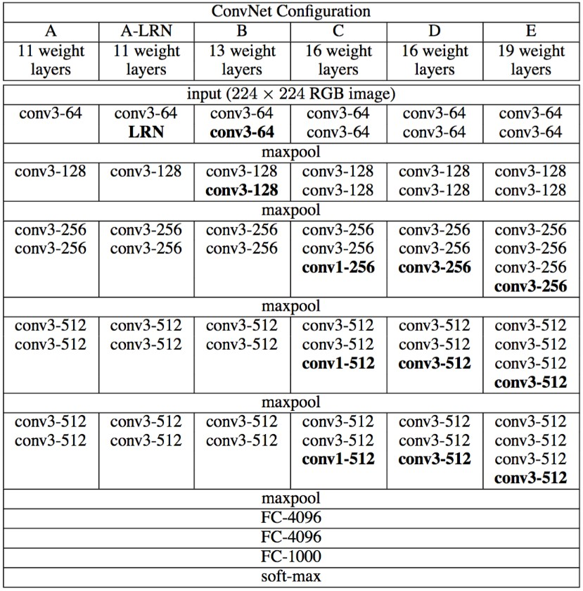
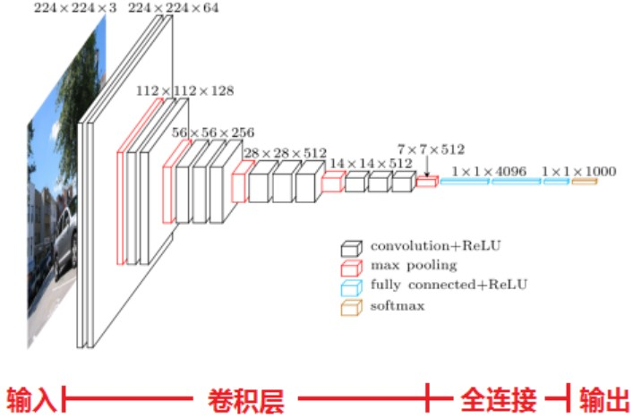
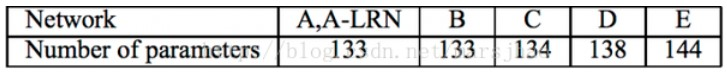
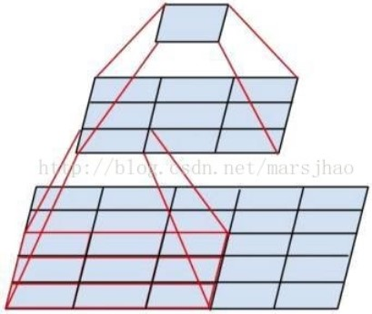
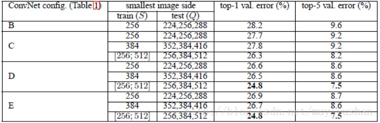

&emsp;&emsp;`VGGNet`是牛津大学计算机视觉组(`Visual Geometry Group`)和`Google DeepMind`公司的研究员一起研发的的深度卷积神经网络。`VGGNet`探索了卷积神经网络的深度与其性能之间的关系，通过反复堆叠`3*3`的小型卷积核和`2*2`的最大池化层，成功地构筑了`16`至`19`层深的卷积神经网络。`VGGNet`相比之前`state-of-the-art`的网络结构，错误率大幅下降，并取得了`ILSVRC 2014`比赛分类项目的第`2`名和定位项目的第`1`名。同时`VGGNet`的拓展性很强，迁移到其他图片数据上的泛化性非常好。`VGGNet`的结构非常简洁，整个网络都使用了同样大小的卷积核尺寸`3*3`和最大池化尺寸`2*2`。到目前为止，`VGGNet`依然经常被用来提取图像特征，其训练后的模型参数在其官方网站上开源了，可用来在特定的图像分类任务上进行再训练(相当于提供了非常好的初始化权重)，因此被用在了很多地方。<!--more-->
&emsp;&emsp;图`1`所示为`VGGNet`各级别的网络结构图，图`2`所示为每一级别的参数量，从`11`层的网络一直到`19`层的网络都有详尽的性能测试。虽然从`A`到`E`每一级网络逐渐变深，但是网络的参数量并没有增长很多，这是因为参数量主要都消耗在最后`3`个全连接层。前面的卷积部分虽然很深，但是消耗的参数量不大，不过训练比较耗时的部分依然是卷积，因其计算量比较大。这其中的`D`、`E`也就是我们常说的`VGGNet-16`和`VGGNet-19`。`C`很有意思，相比`B`多了几个`1*1`的卷积层，`1*1`卷积的意义主要在于线性变换，而输入通道数和输出通道数不变，没有发生降维。
&emsp;&emsp;训练时，输入是大小为`224*224`的`RGB`图像，预处理只有在训练集中的每个像素上减去`RGB`的均值。

图1 VGGNet各级别网络结构图

图2 VGGNet各级别网络参数量

&emsp;&emsp;`VGGNet`拥有`5`段卷积，每一段内有`2`至`3`个卷积层，同时每段尾部会连接一个最大池化层用来缩小图片尺寸。每段内的卷积核数量一样，越靠后的段的卷积核数量越多：`64 -> 128 -> 256 -> 512 -> 512`。其中经常出现多个完全一样的`3*3`的卷积层堆叠在一起的情况，这其实是非常有用的设计。如图`3`所示，两个`3*3`的卷积层串联相当于`1`个`5*5`的卷积层，即一个像素会跟周围`5*5`的像素产生关联，可以说感受野大小为`5*5`；而`3`个`3*3`的卷积层串联的效果则相当于`1`个`7*7`的卷积层。除此之外，`3`个串联的`3*3`的卷积层，拥有比`1`个`7*7`的卷积层更少的参数量，只有后者的`(3 * 3 * 3)/(7 * 7) = 55%`。最重要的是，`3`个`3*3`的卷积层拥有比`1`个`7*7`的卷积层更多的非线性变换(前者可以使用三次`ReLU`激活函数，而后者只有一次)，使得`CNN`对特征的学习能力更强。

图3 两个串联“3x3”的卷积层功能类似于一个“5x5”的卷积层

&emsp;&emsp;`VGGNet`在训练时有一个小技巧，先训练级别`A`的简单网络，再复用`A`网络的权重来初始化后面的几个复杂模型，这样训练收敛的速度更快。在预测时，`VGG`采用`Multi-Scale`的方法，将图像`scale`到一个尺寸`Q`，并将图片输入卷积网络计算。然后在最后一个卷积层使用滑窗的方式进行分类预测，将不同窗口的分类结果平均，再将不同尺寸`Q`的结果平均得到最后结果，这样可提高图片数据的利用率并提升预测准确率。在训练中，`VGGNet`还使用了`Multi-Scale`的方法做数据增强，将原始图像缩放到不同尺寸`S`，然后再随机裁切`224*224`的图片，这样能增加很多数据量，对于防止模型过拟合有很不错的效果。在实践中，作者令`S`在`[256, 512]`这个区间内取值，使用`Multi-Scale`获得多个版本的数据，并将多个版本的数据合在一起进行训练。图`4`所示为`VGGNet`使用`Multi-Scale`训练时得到的结果，可以看到`D`和`E`都可以达到`7.5%`的错误率。最终提交到`ILSVRC 2014`的版本是仅使用`Single-Scale`的`6`个不同等级的网络与`Multi-Scale`的`D`网络的融合，达到了`7.3%`的错误率。不过比赛结束后作者发现只融合`Multi-Scale`的`D`和`E`可以达到更好的效果，错误率达到`7.0%`，再使用其他优化策略，最终错误率可达到`6.8%`左右，非常接近同年的冠军`Google Inceptin Net`。同时，作者在对比各级网络时总结出了以下几个观点：

- `LRN`层作用不大(`VGGNet`不使用局部响应标准化`LRN`，这种标准化并不能在`ILSVRC`数据集上提升性能，却导致更多的内存消耗和计算时间)。
- 越深的网络效果越好。
- `1*1`的卷积也是很有效的，但是没有`3*3`的卷积好，大一些的卷积核可以学习更大的空间特征。

图4 各级别VGGNet在使用Multi-Scale训练时的top-5错误率

&emsp;&emsp;对于较浅的网络，例如网络`A`，可以直接使用随机数进行随机初始化；而对于比较深的网络，则使用前面已经训练好的较浅的网络中的参数值对其前几层的卷积层和最后的全连接层进行初始化。