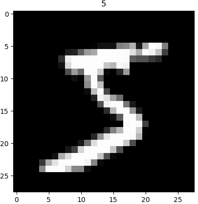

&emsp;&emsp;这是使用`MNIST`手写数据来演示`pytorch`的卷积神经网络功能。首先加载数据集：<!--more-->

``` python
import os
import torch
import torch.nn as nn
import torch.utils.data as Data
import torchvision  # 数据库模块
import matplotlib.pyplot as plt

# Hyper Parameters
EPOCH = 1
BATCH_SIZE = 50
LR = 0.001  # learning rate
DOWNLOAD_MNIST = False  # 如果你已经下载好了mnist数据，就写上False

if not (os.path.exists('./mnist/')) or not os.listdir('./mnist/'):
    # not mnist dir or mnist is empyt dir
    DOWNLOAD_MNIST = True

train_data = torchvision.datasets.MNIST(  # Mnist手写数字
    root='./mnist/',  # 保存或者提取位置
    train=True,  # this is training data
    # 转换“PIL.Image”或“numpy.ndarray”成“torch.FloatTensor(C * H * W)”，
    # 训练的时候normalize成[0.0, 1.0]区间
    transform=torchvision.transforms.ToTensor(),
    download=DOWNLOAD_MNIST,  # 没下载mnist数据集就进行下载，下载了就不用再下了
)

# plot one example
print(train_data.train_data.size())  # (60000, 28, 28)
print(train_data.train_labels.size())  # (60000)
plt.imshow(train_data.train_data[0].numpy(), cmap='gray')
plt.title('%i' % train_data.train_labels[0])
plt.show()
```



黑色的地方的值都是`0`，白色的地方值大于`0`。除了给出训练数据，还需要给一些测试数据，测试一下训练效果：

``` python
# Data Loader for easy mini-batch return in training,
# the image batch shape will be (50, 1, 28, 28)
train_loader = Data.DataLoader(dataset=train_data,
                               batch_size=BATCH_SIZE, shuffle=True)

# pick 2000 samples to speed up testing
test_data = torchvision.datasets.MNIST(root='./mnist/', train=False)
# shape from (2000, 28, 28) to (2000, 1, 28, 28), value in range(0,1)
test_x = torch.unsqueeze(test_data.test_data, dim=1).type(torch.FloatTensor)[:2000] / 255.
test_y = test_data.test_labels[:2000]
```

&emsp;&emsp;我们使用一个`class`来建立`CNN`模型，这个`CNN`整体流程是`卷积(Conv2d)`->`激励函数(ReLU)`->`池化(MaxPooling)`->`再来一遍`->`展平多维的卷积成的特征图`->`接入全连接层(Linear)`->`输出`：

``` python
class CNN(nn.Module):
    def __init__(self):
        super(CNN, self).__init__()
        self.conv1 = nn.Sequential(  # input shape (1, 28, 28)
            nn.Conv2d(
                in_channels=1,  # input height
                out_channels=16,  # n_filters
                kernel_size=5,  # filter size
                stride=1,  # filter movement/step
                # if want same width and length of this image after con2d,
                # padding = (kernel_size - 1)/2 if stride = 1
                padding=2,
            ),  # output shape (16, 28, 28)
            nn.ReLU(),  # activation
            # choose max value in 2x2 area, output shape (16, 14, 14)
            nn.MaxPool2d(kernel_size=2),
        )
        self.conv2 = nn.Sequential(  # input shape (16, 14, 14)
            nn.Conv2d(16, 32, 5, 1, 2),  # output shape (32, 14, 14)
            nn.ReLU(),  # activation
            nn.MaxPool2d(2),  # output shape (32, 7, 7)
        )
        # fully connected layer, output 10 classes
        self.out = nn.Linear(32 * 7 * 7, 10)

    def forward(self, x):
        x = self.conv1(x)
        x = self.conv2(x)
        # flatten the output of conv2 to (batch_size, 32 * 7 * 7)
        x = x.view(x.size(0), -1)
        output = self.out(x)
        return output

cnn = CNN()
print(cnn)  # net architecture
```

执行结果：

``` python
CNN(
  (conv1): Sequential(
    (0): Conv2d(1, 16, kernel_size=(5, 5), stride=(1, 1), padding=(2, 2))
    (1): ReLU()
    (2): MaxPool2d(kernel_size=2, stride=2, padding=0, dilation=1, ceil_mode=False)
  )
  (conv2): Sequential(
    (0): Conv2d(16, 32, kernel_size=(5, 5), stride=(1, 1), padding=(2, 2))
    (1): ReLU()
    (2): MaxPool2d(kernel_size=2, stride=2, padding=0, dilation=1, ceil_mode=False)
  )
  (out): Linear(in_features=1568, out_features=10, bias=True)
)
```

&emsp;&emsp;下面开始训练，将`x`、`y`都用`Variable`包起来，然后放入`cnn`中计算`output`，最后再计算误差：

``` python
optimizer = torch.optim.Adam(cnn.parameters(), lr=LR)  # optimize all cnn parameters
loss_func = nn.CrossEntropyLoss()  # the target label is not one-hotted

for epoch in range(EPOCH):
    # gives batch data, normalize x when iterate train_loader
    for step, (b_x, b_y) in enumerate(train_loader):
        output = cnn(b_x)  # cnn output
        loss = loss_func(output, b_y)  # cross entropy loss
        optimizer.zero_grad()  # clear gradients for this training step
        loss.backward()  # backpropagation, compute gradients
        optimizer.step()  # apply gradients

        if step % 50 == 0:
            test_output = cnn(test_x)
            pred_y = torch.max(test_output, 1)[1].data.squeeze().numpy()
            accuracy = float((pred_y == test_y.data.numpy()).astype(int).sum()) \
                             / float(test_y.size(0))
            print('Epoch:', epoch, '| train loss: %.4f' % loss.data.numpy(),
                  '| test accuracy: %.2f' % accuracy)
```

最后再来取`10`个数据，看看预测的值到底对不对：

``` python
test_output = cnn(test_x[:10])  # print 10 predictions from test data
pred_y = torch.max(test_output, 1)[1].data.numpy().squeeze()
print(pred_y, 'prediction number')
print(test_y[:10].numpy(), 'real number')
```


---

### “x = x.view(x.size(0), -1)”的理解

&emsp;&emsp;这句话一般出现在`model`类的`forward`函数中，具体位置基本都是在调用分类器之前。分类器是一个简单的`nn.Linear`结构，输入输出都是维度为一的值，`x = x.view(x.size(0), -1)`这句话就是为了将前面多维度的`tensor`展平成一维：

``` python
class NET(nn.Module):
    def __init__(self, batch_size):
        super(NET, self).__init__()
        self.conv = nn.Conv2d(outchannels=3, in_channels=64,
                              kernel_size=3, stride=1)
        self.fc = nn.Linear(64 * batch_size, 10)

    def forward(self, x):
        x = self.conv(x)
        x = x.view(x.size(0), -1)
        out = self.fc(x)
```

上面是个简单的网络结构，包含一个卷积层和一个线性层。在`forward`函数中，`input`首先经过卷积层，此时的输出`x`是包含`batch size`维度为`4`的`tensor`，即`(batchsize, channels, height, width)`，`x.size(0)`指的是`batch size`的值，`x = x.view(x.size(0), -1)`可以简化为`x = x.view(batchsize, -1)`。