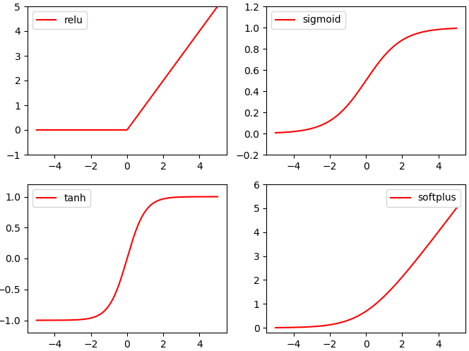
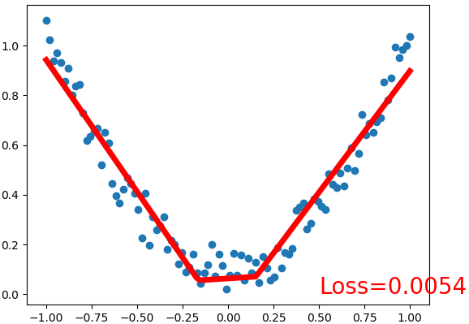
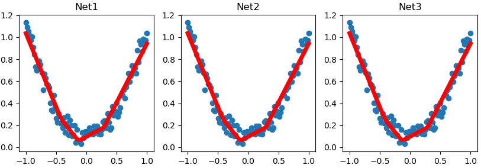
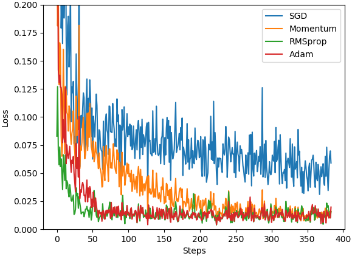
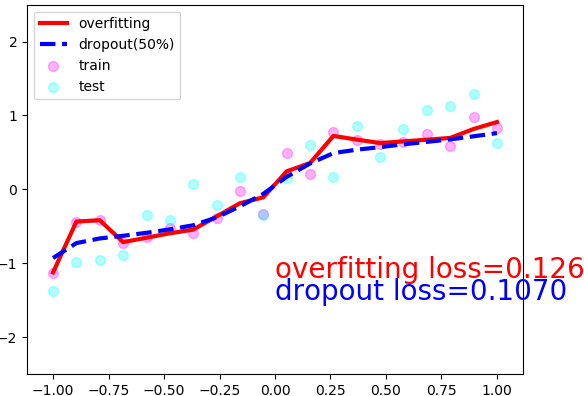

### Torch或Numpy

&emsp;&emsp;`Torch`自称为神经网络界的`Numpy`，因为它能将`torch`产生的`tensor`放在`GPU`中加速运算，就像`Numpy`会把`array`放在`CPU`中加速运算。<!--more-->

``` python
import torch
import numpy as np

np_data = np.arange(6).reshape((2, 3))
torch_data = torch.from_numpy(np_data)
tensor2array = torch_data.numpy()

print('numpy array:\n', np_data)
print('torch tensor:\n', torch_data)
print('tensor to array:\n', tensor2array)
```

执行结果：

``` python
numpy array:
 [[0 1 2]
  [3 4 5]]
torch tensor:
 tensor([[0, 1, 2],
        [3, 4, 5]], dtype=torch.int32)
tensor to array:
 [[0 1 2]
  [3 4 5]]
```

#### Torch中的数学运算

&emsp;&emsp;其实`torch`中`tensor`的运算和`numpy`中`array`如出一辙：

``` python
import torch
import numpy as np

data = [-1, -2, 1, 2]
tensor = torch.FloatTensor(data)  # 转换成32位浮点tensor
print(  # abs绝对值计算
    'abs',
    '\nnumpy:', np.abs(data),
    '\ntorch:', torch.abs(tensor)
)

print(  # sin三角函数
    '\nsin',
    '\nnumpy:', np.sin(data),
    '\ntorch:', torch.sin(tensor)
)

print(  # mean均值
    '\nmean',
    '\nnumpy:', np.mean(data),
    '\ntorch:', torch.mean(tensor)
)
```

执行结果：

``` python
abs
numpy: [1 2 1 2]
torch: tensor([1., 2., 1., 2.])

sin
numpy: [-0.84147098 -0.90929743  0.84147098  0.90929743]
torch: tensor([-0.8415, -0.9093,  0.8415,  0.9093])

mean
numpy: 0.0
torch: tensor(0.)
```

除了简单的计算，矩阵运算才是神经网络中最重要的部分，所以这里演示矩阵的乘法：

``` python
import torch
import numpy as np

# 矩阵点乘(matrix multiplication)
data = [[1, 2], [3, 4]]
tensor = torch.FloatTensor(data)  # 转换成32位浮点tensor

print(  # correct method
    'matrix multiplication (matmul)',
    '\nnumpy:\n', np.matmul(data, data),
    '\ntorch:\n', torch.mm(tensor, tensor)
)
```

执行结果：

``` python
matrix multiplication (matmul)
numpy:
 [[ 7 10]
  [15 22]]
torch:
 tensor([[ 7., 10.],
         [15., 22.]])
```

### 变量(Variable)

&emsp;&emsp;`Torch`中的`Variable`就是一个存放会变化的值的地理位置，里面的值会不停的变化，就像一个装鸡蛋的篮子，鸡蛋数会不停变动。那谁是里面的鸡蛋呢？自然就是`Torch`的`Tensor`。如果用一个`Variable`进行计算，那返回的也是一个同类型的`Variable`。
&emsp;&emsp;**补充说明**：`0.4`版本的`pytorch`已经将`Tensor`和`Variable`合并到一起，没有区别了。
&emsp;&emsp;定义一个`Variable`：

``` python
import torch
from torch.autograd import Variable

tensor = torch.FloatTensor([[1, 2], [3, 4]])
# requires_grad控制参不参与误差反向传播，要不要计算梯度
variable = Variable(tensor, requires_grad=True)

print(tensor)
print(variable)
```

执行结果：

``` python
tensor([[1., 2.],
        [3., 4.]])
tensor([[1., 2.],
        [3., 4.]], requires_grad=True)
```

#### Variable计算梯度

&emsp;&emsp;再对比一下`tensor`和`variable`的计算：

``` python
import torch
from torch.autograd import Variable

tensor = torch.FloatTensor([[1, 2], [3, 4]])
variable = Variable(tensor, requires_grad=True)

t_out = torch.mean(tensor * tensor)
v_out = torch.mean(variable * variable)
print(t_out)
print(v_out)
```

执行结果：

``` python
tensor(7.5000)
tensor(7.5000, grad_fn=<MeanBackward1>)
```

到目前为止，看不出什么不同。但是时刻记住，`Variable`在计算时，它会在默默地搭建着一个叫做`计算图`(`computational graph`)的庞大系统。这个图的作用是将所有的计算步骤(节点)都连接起来，最后进行误差反向传递时，一次性将所有`variable`里面的修改幅度(梯度)都计算出来，而`tensor`就没有这个能力。`v_out = torch.mean(variable * variable)`就是在计算图中添加的一个计算步骤：

``` python
import torch
from torch.autograd import Variable

tensor = torch.FloatTensor([[1, 2], [3, 4]])
variable = Variable(tensor, requires_grad=True)

v_out = torch.mean(variable * variable)
v_out.backward()  # 模拟v_out的误差反向传递
print(variable.grad)  # 初始Variable的梯度
```

执行结果：

``` python
tensor([[0.5000, 1.0000],
        [1.5000, 2.0000]])
```

#### 获取Variable里面的数据

&emsp;&emsp;直接`print(variable)`只会输出`Variable`形式的数据，在很多时候是用不了的(比如想要用`plt`画图)，所以需要转换成`tensor`形式：

``` python
import torch
from torch.autograd import Variable

tensor = torch.FloatTensor([[1, 2], [3, 4]])
variable = Variable(tensor, requires_grad=True)

print(variable)  # Variable形式
print(variable.data)  # tensor形式
print(variable.data.numpy())  # numpy形式
```

#### 激励函数(Activation)

&emsp;&emsp;代码如下：

``` python
import torch
import torch.nn.functional as F  # 激励函数都定义在这里
from torch.autograd import Variable
import matplotlib.pyplot as plt

x = torch.linspace(-5, 5, 200)
x = Variable(x)
x_np = x.data.numpy()  # 转换成“numpy array”，出图时使用

# 几种常用的激励函数
y_relu = F.relu(x).data.numpy()
y_sigmoid = F.sigmoid(x).data.numpy()
y_tanh = F.tanh(x).data.numpy()
y_softplus = F.softplus(x).data.numpy()
# y_softmax = F.softmax(x)  # softmax比较特殊，不能直接显示

plt.figure(1, figsize=(8, 6))
plt.subplot(221)
plt.plot(x_np, y_relu, c='red', label='relu')
plt.ylim((-1, 5))
plt.legend(loc='best')

plt.subplot(222)
plt.plot(x_np, y_sigmoid, c='red', label='sigmoid')
plt.ylim((-0.2, 1.2))
plt.legend(loc='best')

plt.subplot(223)
plt.plot(x_np, y_tanh, c='red', label='tanh')
plt.ylim((-1.2, 1.2))
plt.legend(loc='best')

plt.subplot(224)
plt.plot(x_np, y_softplus, c='red', label='softplus')
plt.ylim((-0.2, 6))
plt.legend(loc='best')

plt.show()
```



### 关系拟合(回归)

&emsp;&emsp;这次来见证神经网络是如何通过简单的形式将一群数据用一条线条来表示，或者说是如何在数据当中找到它们的关系，然后用神经网络模型来建立一个可以代表它们关系的线条。
&emsp;&emsp;创建一些假数据来模拟真实的情况，比如一个一元二次函数`y = a * x^2 + b`，给`y`数据加上一点噪声来更加真实地展示它：

``` python
import torch
import torch.nn.functional as F
import matplotlib.pyplot as plt

# x data (tensor)，shape=(100, 1)
x = torch.unsqueeze(torch.linspace(-1, 1, 100), dim=1)
# noisy y data (tensor)，shape=(100, 1)
y = x.pow(2) + 0.2 * torch.rand(x.size())
```

&emsp;&emsp;可以直接运用`torch`中的体系建立一个神经网络。先定义所有的层属性(`__init__()`)，然后再一层层搭建(`forward(x)`)层与层的关系链接。建立关系的时候，我们会用到激励函数：

``` python
class Net(torch.nn.Module):  # 继承torch的Module
    def __init__(self, n_feature, n_hidden, n_output):
        super(Net, self).__init__()  # 继承“__init__”功能
        self.hidden = torch.nn.Linear(n_feature, n_hidden)  # 隐藏层线性输出
        self.predict = torch.nn.Linear(n_hidden, n_output)  # 输出层线性输出

    def forward(self, x):  # 这同时也是Module中的forward功能
        # 正向传播输入值，神经网络分析出输出值
        x = F.relu(self.hidden(x))  # 激励函数
        x = self.predict(x)  # 输出值
        return x

net = Net(n_feature=1, n_hidden=10, n_output=1)  # define the network
print(net)  # 打印net的结构
```

执行结果：

``` python
Net(
  (hidden): Linear(in_features=1, out_features=10, bias=True)
  (predict): Linear(in_features=10, out_features=1, bias=True)
)
```

&emsp;&emsp;训练的步骤如下：

``` python
# 传入net的所有参数以及学习率
optimizer = torch.optim.SGD(net.parameters(), lr=0.2)
loss_func = torch.nn.MSELoss()  # 预测值和真实值的误差计算公式(均方差)

plt.ion()

for t in range(200):
    prediction = net(x)  # 喂给net训练数据x，输出预测值
    loss = loss_func(prediction, y)  # 计算两者的误差

    optimizer.zero_grad()  # 清空上一步的残余更新参数值
    loss.backward()  # 误差反向传播，计算参数更新值
    optimizer.step()  # 将参数更新值施加到net的parameters上

    if t % 5 == 0:
        # plot and show learning process
        plt.cla()
        plt.scatter(x.data.numpy(), y.data.numpy())
        plt.plot(x.data.numpy(), prediction.data.numpy(), 'r-', lw=5)
        plt.text(0.5, 0, 'Loss=%.4f' % loss.data.numpy(),
                 fontdict={'size': 20, 'color': 'red'})
        plt.pause(0.1)

plt.ioff()
plt.show()
```



### 区分类型(分类)

&emsp;&emsp;创建一些数据来模拟真实的情况，比如两个二次分布的数据：

``` python
import torch
import torch.nn.functional as F
import matplotlib.pyplot as plt

# make fake data
n_data = torch.ones(100, 2)  # 数据的基本形态
x0 = torch.normal(2 * n_data, 1)  # 类型0，x data (tensor)，shape=(100, 2)
y0 = torch.zeros(100)  # 类型0，y data (tensor)，shape=(100, 1)
x1 = torch.normal(-2 * n_data, 1)  # 类型1，x data (tensor)，shape=(100, 2)
y1 = torch.ones(100)  # 类型1，y data (tensor)，shape=(100, 1)

# 注意x和y的数据形式是一定要像下面一样(torch.cat是在合并数据)
# shape (200, 2) FloatTensor = 32-bit floating
x = torch.cat((x0, x1), 0).type(torch.FloatTensor)
# shape (200, 1) LongTensor = 64-bit integer
y = torch.cat((y0, y1), ).type(torch.LongTensor)
```

建立神经网络：

``` python
class Net(torch.nn.Module):
    def __init__(self, n_feature, n_hidden, n_output):
        super(Net, self).__init__()
        self.hidden = torch.nn.Linear(n_feature, n_hidden)  # hidden layer
        self.out = torch.nn.Linear(n_hidden, n_output)  # output layer

    def forward(self, x):
        x = F.relu(self.hidden(x))  # activation function for hidden layer
        x = self.out(x)  # 输出值，但是这个不是预测值，预测值还需要再另外计算
        return x

net = Net(n_feature=2, n_hidden=10, n_output=2)  # define the network
print(net)  # net architecture
```

训练步骤如下：

``` python
optimizer = torch.optim.SGD(net.parameters(), lr=0.02)
loss_func = torch.nn.CrossEntropyLoss()  # the target label is NOT an one-hotted

plt.ion()  # something about plotting

for t in range(100):
    out = net(x)  # 喂给net训练数据x，输出分析值
    # must be (1. nn output, 2. target), the target label is NOT one-hotted
    loss = loss_func(out, y)

    optimizer.zero_grad()  # clear gradients for next train
    loss.backward()  # backpropagation, compute gradients
    optimizer.step()  # apply gradients

    if t % 2 == 0:
        # plot and show learning process
        plt.cla()
        prediction = torch.max(out, 1)[1]
        pred_y = prediction.data.numpy().squeeze()
        target_y = y.data.numpy()
        plt.scatter(x.data.numpy()[:, 0], x.data.numpy()[:, 1], c=pred_y, s=100, lw=0, cmap='RdYlGn')
        accuracy = float((pred_y == target_y).astype(int).sum()) / float(target_y.size)
        plt.text(1.5, -4, 'Accuracy=%.2f' % accuracy, fontdict={'size': 20, 'color': 'red'})
        plt.pause(0.1)

plt.ioff()
plt.show()
```

### 快速搭建法

&emsp;&emsp;代码如下：

``` python
import torch
import torch.nn.functional as F

class Net(torch.nn.Module):
    def __init__(self, n_feature, n_hidden, n_output):
        super(Net, self).__init__()
        self.hidden = torch.nn.Linear(n_feature, n_hidden)  # hidden layer
        self.predict = torch.nn.Linear(n_hidden, n_output)  # output layer

    def forward(self, x):
        x = F.relu(self.hidden(x))  # activation function for hidden layer
        x = self.predict(x)  # linear output
        return x

net1 = Net(1, 10, 1)

net2 = torch.nn.Sequential(  # easy and fast way to build your network
    torch.nn.Linear(1, 10),
    torch.nn.ReLU(),
    torch.nn.Linear(10, 1)
)

print(net1)  # net1 architecture
print(net2)  # net2 architecture
```

执行结果：

``` python
Net(
  (hidden): Linear(in_features=1, out_features=10, bias=True)
  (predict): Linear(in_features=10, out_features=1, bias=True)
)
Sequential(
  (0): Linear(in_features=1, out_features=10, bias=True)
  (1): ReLU()
  (2): Linear(in_features=10, out_features=1, bias=True)
)
```

我们会发现`net2`多显示了一些内容，原来它把激励函数也一同纳入进去了。但是在`net1`中，激励函数实际上是在`forward`功能中才被调用的。这也就说明了相比于`net2`，`net1`的好处就是你可以根据个人需要，更加个性化你的前向传播过程(比如`RNN`)。

### 保存提取

&emsp;&emsp;代码如下：

``` python
import torch
import matplotlib.pyplot as plt

# fake data
x = torch.unsqueeze(torch.linspace(-1, 1, 100), dim=1)  # x data (tensor), shape=(100, 1)
y = x.pow(2) + 0.2 * torch.rand(x.size())  # noisy y data (tensor), shape=(100, 1)

def save():
    # save net1
    net1 = torch.nn.Sequential(
        torch.nn.Linear(1, 10),
        torch.nn.ReLU(),
        torch.nn.Linear(10, 1)
    )
    optimizer = torch.optim.SGD(net1.parameters(), lr=0.5)
    loss_func = torch.nn.MSELoss()

    for t in range(100):
        prediction = net1(x)
        loss = loss_func(prediction, y)
        optimizer.zero_grad()
        loss.backward()
        optimizer.step()

    # plot result
    plt.figure(1, figsize=(10, 3))
    plt.subplot(131)
    plt.title('Net1')
    plt.scatter(x.data.numpy(), y.data.numpy())
    plt.plot(x.data.numpy(), prediction.data.numpy(), 'r-', lw=5)

    # 2 ways to save the net
    torch.save(net1, 'net.pkl')  # 保存整个网络
    torch.save(net1.state_dict(), 'net_params.pkl')  # 只保存网络中的参数(速度快，占内存少)

def restore_net():
    net2 = torch.load('net.pkl')  # restore entire net1 to net2
    prediction = net2(x)

    # plot result
    plt.subplot(132)
    plt.title('Net2')
    plt.scatter(x.data.numpy(), y.data.numpy())
    plt.plot(x.data.numpy(), prediction.data.numpy(), 'r-', lw=5)

def restore_params():
    # restore only the parameters in net1 to net3
    net3 = torch.nn.Sequential(
        torch.nn.Linear(1, 10),
        torch.nn.ReLU(),
        torch.nn.Linear(10, 1)
    )
    net3.load_state_dict(torch.load('net_params.pkl'))  # copy net1's parameters into net3
    prediction = net3(x)

    # plot result
    plt.subplot(133)
    plt.title('Net3')
    plt.scatter(x.data.numpy(), y.data.numpy())
    plt.plot(x.data.numpy(), prediction.data.numpy(), 'r-', lw=5)
    plt.show()

save()  # save net1
restore_net()  # restore entire net (may slow)
restore_params()  # restore only the net parameters
```



### 批训练

&emsp;&emsp;`DataLoader`是`torch`给你用来包装数据的工具，所以你要将自己的(`numpy array`或其他)数据形式装换成`Tensor`，然后再放进这个包装器中。使用`DataLoader`的好处就是，它们可以帮你有效地迭代数据：

``` python
import torch
import torch.utils.data as Data

torch.manual_seed(1)  # reproducible

BATCH_SIZE = 5  # 批训练的数据个数

x = torch.linspace(1, 10, 10)  # this is x data (torch tensor)
y = torch.linspace(10, 1, 10)  # this is y data (torch tensor)

torch_dataset = Data.TensorDataset(x, y)  # 先转换成torch能识别的Dataset
loader = Data.DataLoader(
    dataset=torch_dataset,  # torch TensorDataset format
    batch_size=BATCH_SIZE,  # mini batch size
    shuffle=True,  # random shuffle for training
    num_workers=2,  # subprocesses for loading data
)

def show_batch():
    for epoch in range(3):  # train entire dataset 3 times
        for step, (batch_x, batch_y) in enumerate(loader):  # for each training step
            # train your data...
            print('Epoch:', epoch, '| Step:', step,
                  '| batch x:', batch_x.numpy(), '| batch y:', batch_y.numpy())

if __name__ == '__main__':
    show_batch()
```

执行结果：

``` python
Epoch: 0 | Step: 0 | batch x: [5. 7. 10. 3. 4.] | batch y: [6. 4. 1. 8. 7.]
Epoch: 0 | Step: 1 | batch x: [2. 1. 8. 9. 6.] | batch y: [9. 10. 3. 2. 5.]
Epoch: 1 | Step: 0 | batch x: [4. 6. 7. 10. 8.] | batch y: [7. 5. 4. 1. 3.]
Epoch: 1 | Step: 1 | batch x: [5. 3. 2. 1. 9.] | batch y: [6. 8. 9. 10. 2.]
Epoch: 2 | Step: 0 | batch x: [4. 2. 5. 6. 10.] | batch y: [7. 9. 6. 5. 1.]
Epoch: 2 | Step: 1 | batch x: [3. 9. 1. 8. 7.] | batch y: [8. 2. 10. 3. 4.]
```

可以看出每步都导出了`5`个数据进行学习，然后每个`epoch`的导出数据都是先打乱了以后再导出。
&emsp;&emsp;真正方便的还不只是这一点，如果将`BATCH_SIZE`改为`8`，这样我们就知道`step = 0`时会导出`8`个数据。但是`step = 1`的时候数据库中的数据不够`8`个，这该怎么办呢？在`step = 1`的时候，就只给你返回这个`epoch`中剩下的数据：

``` python
Epoch: 0 | Step: 0 | batch x: [5. 7. 10. 3. 4. 2. 1. 8.] | batch y: [6. 4. 1. 8. 7. 9. 10. 3.]
Epoch: 0 | Step: 1 | batch x: [9. 6.] | batch y: [2. 5.]
Epoch: 1 | Step: 0 | batch x: [4. 6. 7. 10. 8. 5. 3. 2.] | batch y: [7. 5. 4. 1. 3. 6. 8. 9.]
Epoch: 1 | Step: 1 | batch x: [1. 9.] | batch y: [10. 2.]
Epoch: 2 | Step: 0 | batch x: [4. 2. 5. 6. 10. 3. 9. 1.] | batch y: [7. 9. 6. 5. 1. 8. 2. 10.]
Epoch: 2 | Step: 1 | batch x: [8. 7.] | batch y: [3. 4.]
```

### Optimizer优化器

&emsp;&emsp;为了对比各种优化器的效果，需要模拟一些数据：

``` python
import torch
import torch.utils.data as Data
import torch.nn.functional as F
import matplotlib.pyplot as plt

LR = 0.01
BATCH_SIZE = 32
EPOCH = 12

# fake dataset
x = torch.unsqueeze(torch.linspace(-1, 1, 1000), dim=1)
y = x.pow(2) + 0.1 * torch.normal(torch.zeros(*x.size()))

# put dateset into torch dataset
torch_dataset = Data.TensorDataset(x, y)
loader = Data.DataLoader(dataset=torch_dataset, batch_size=BATCH_SIZE, shuffle=True, num_workers=2)
```

为了对比每一种优化器，我们给它们各自创建一个神经网络，但这个神经网络都来自同一个`Net`形式：

``` python
class Net(torch.nn.Module):  # default network
    def __init__(self):
        super(Net, self).__init__()
        self.hidden = torch.nn.Linear(1, 20)  # hidden layer
        self.predict = torch.nn.Linear(20, 1)  # output layer

    def forward(self, x):
        x = F.relu(self.hidden(x))  # activation function for hidden layer
        x = self.predict(x)  # linear output
        return x

if __name__ == '__main__':
    # 为每个优化器创建一个net
    net_SGD = Net()
    net_Momentum = Net()
    net_RMSprop = Net()
    net_Adam = Net()
    nets = [net_SGD, net_Momentum, net_RMSprop, net_Adam]

    # different optimizers
    opt_SGD = torch.optim.SGD(net_SGD.parameters(), lr=LR)
    opt_Momentum = torch.optim.SGD(net_Momentum.parameters(), lr=LR, momentum=0.8)
    opt_RMSprop = torch.optim.RMSprop(net_RMSprop.parameters(), lr=LR, alpha=0.9)
    opt_Adam = torch.optim.Adam(net_Adam.parameters(), lr=LR, betas=(0.9, 0.99))
    optimizers = [opt_SGD, opt_Momentum, opt_RMSprop, opt_Adam]

    loss_func = torch.nn.MSELoss()
    losses_his = [[], [], [], []]  # 记录training时不同神经网络的loss

    for epoch in range(EPOCH):  # training
        print('Epoch: ', epoch)

        for step, (b_x, b_y) in enumerate(loader):  # for each training step
            for net, opt, l_his in zip(nets, optimizers, losses_his):
                output = net(b_x)  # get output for every net
                loss = loss_func(output, b_y)  # compute loss for every net
                opt.zero_grad()  # clear gradients for next train
                loss.backward()  # backpropagation, compute gradients
                opt.step()  # apply gradients
                l_his.append(loss.data.numpy())  # loss recoder

    labels = ['SGD', 'Momentum', 'RMSprop', 'Adam']

    for i, l_his in enumerate(losses_his):
        plt.plot(l_his, label=labels[i])

    plt.legend(loc='best')
    plt.xlabel('Steps')
    plt.ylabel('Loss')
    plt.ylim((0, 0.2))
    plt.show()
```



`SGD`是最普通的优化器，也可以说没有加速效果；而`Momentum`是`SGD`的改良版，它加入了动量原则；后面的`RMSprop`又是`Momentum`的升级版；而`Adam`又是`RMSprop`的升级版。

### Dropout缓解过拟合

&emsp;&emsp;随机生成一些数据，用来模拟真实情况，数据少才能凸显过拟合问题：

``` python
import torch
import matplotlib.pyplot as plt

N_SAMPLES = 20
N_HIDDEN = 300

# training data
x = torch.unsqueeze(torch.linspace(-1, 1, N_SAMPLES), 1)
y = x + 0.3 * torch.normal(torch.zeros(N_SAMPLES, 1), torch.ones(N_SAMPLES, 1))

# test data
test_x = torch.unsqueeze(torch.linspace(-1, 1, N_SAMPLES), 1)
test_y = test_x + 0.3 * torch.normal(torch.zeros(N_SAMPLES, 1), torch.ones(N_SAMPLES, 1))
```

&emsp;&emsp;我们在这里搭建两个神经网络，一个没有`dropout`，一个有`dropout`。没有`dropout`的容易出现过拟合，那我们就命名为`net_overfitting`；另一个就是`net_dropped`，`torch.nn.Dropout(0.5)`中的`0.5`指的是随机丢弃`50%`的神经元：

``` python
net_overfitting = torch.nn.Sequential(
    torch.nn.Linear(1, N_HIDDEN),
    torch.nn.ReLU(),
    torch.nn.Linear(N_HIDDEN, N_HIDDEN),
    torch.nn.ReLU(),
    torch.nn.Linear(N_HIDDEN, 1),
)

net_dropped = torch.nn.Sequential(
    torch.nn.Linear(1, N_HIDDEN),
    torch.nn.Dropout(0.5),  # drop 50% of the neuron
    torch.nn.ReLU(),
    torch.nn.Linear(N_HIDDEN, N_HIDDEN),
    torch.nn.Dropout(0.5),  # drop 50% of the neuron
    torch.nn.ReLU(),
    torch.nn.Linear(N_HIDDEN, 1),
)
```

&emsp;&emsp;在训练的时候，将这两个神经网络分开训练，训练的环境都一样：

``` python
optimizer_ofit = torch.optim.Adam(net_overfitting.parameters(), lr=0.01)
optimizer_drop = torch.optim.Adam(net_dropped.parameters(), lr=0.01)
loss_func = torch.nn.MSELoss()

plt.ion()  # something about plotting

for t in range(500):
    pred_ofit = net_overfitting(x)
    pred_drop = net_dropped(x)
    loss_ofit = loss_func(pred_ofit, y)
    loss_drop = loss_func(pred_drop, y)

    optimizer_ofit.zero_grad()
    optimizer_drop.zero_grad()
    loss_ofit.backward()
    loss_drop.backward()
    optimizer_ofit.step()
    optimizer_drop.step()

    if t % 10 == 0:
        # 将神经网络转换成测试形式，画好图之后改回训练形式。因为drop网络在train的时候和test的时候参数不一样
        net_overfitting.eval()
        net_dropped.eval()

        # plotting
        plt.cla()
        test_pred_ofit = net_overfitting(test_x)
        test_pred_drop = net_dropped(test_x)
        plt.scatter(x.data.numpy(), y.data.numpy(), c='magenta', s=50, alpha=0.3, label='train')
        plt.scatter(test_x.data.numpy(), test_y.data.numpy(), c='cyan', s=50, alpha=0.3, label='test')
        plt.plot(test_x.data.numpy(), test_pred_ofit.data.numpy(), 'r-', lw=3, label='overfitting')
        plt.plot(test_x.data.numpy(), test_pred_drop.data.numpy(), 'b--', lw=3, label='dropout(50%)')
        plt.text(0, -1.2, 'overfitting loss=%.4f' % loss_func(test_pred_ofit, test_y).data.numpy(),
                 fontdict={'size': 20, 'color': 'red'})
        plt.text(0, -1.5, 'dropout loss=%.4f' % loss_func(test_pred_drop, test_y).data.numpy(),
                 fontdict={'size': 20, 'color': 'blue'})
        plt.legend(loc='upper left')
        plt.ylim((-2.5, 2.5))
        plt.pause(0.1)

        # change back to train mode
        net_overfitting.train()
        net_dropped.train()

plt.ioff()
plt.show()
```



### GPU加速运算

&emsp;&emsp;代码需要修改的地方包括将数据的形式变成`GPU`能读的形式，将`CNN`也变成`GPU`能读的形式，做法就是在后面加上`.cuda()`：

``` python
import torch
import torch.nn as nn
import torch.utils.data as Data
import torchvision

EPOCH = 1
BATCH_SIZE = 50
LR = 0.001
DOWNLOAD_MNIST = False

train_data = torchvision.datasets.MNIST(root='./mnist/', train=True, transform=torchvision.transforms.ToTensor(), download=DOWNLOAD_MNIST, )
train_loader = Data.DataLoader(dataset=train_data, batch_size=BATCH_SIZE, shuffle=True)

test_data = torchvision.datasets.MNIST(root='./mnist/', train=False)

# Change in here
test_x = torch.unsqueeze(test_data.test_data, dim=1).type(torch.FloatTensor)[:2000].cuda() / 255.  # Tensor on GPU
test_y = test_data.test_labels[:2000].cuda()

class CNN(nn.Module):
    def __init__(self):
        super(CNN, self).__init__()
        self.conv1 = nn.Sequential(
            nn.Conv2d(in_channels=1, out_channels=16, kernel_size=5, stride=1, padding=2, ),
            nn.ReLU(),
            nn.MaxPool2d(kernel_size=2),
        )
        self.conv2 = nn.Sequential(
            nn.Conv2d(16, 32, 5, 1, 2),
            nn.ReLU(),
            nn.MaxPool2d(2),
        )
        self.out = nn.Linear(32 * 7 * 7, 10)

    def forward(self, x):
        x = self.conv1(x)
        x = self.conv2(x)
        x = x.view(x.size(0), -1)
        output = self.out(x)
        return output

cnn = CNN()

# Change in here
cnn.cuda()  # Moves all model parameters and buffers to the GPU

optimizer = torch.optim.Adam(cnn.parameters(), lr=LR)
loss_func = nn.CrossEntropyLoss()

for epoch in range(EPOCH):
    for step, (x, y) in enumerate(train_loader):
        # Change in here
        b_x = x.cuda()  # Tensor on GPU
        b_y = y.cuda()  # Tensor on GPU

        output = cnn(b_x)
        loss = loss_func(output, b_y)
        optimizer.zero_grad()
        loss.backward()
        optimizer.step()

        if step % 50 == 0:
            test_output = cnn(test_x)
            # Change in here
            pred_y = torch.max(test_output, 1)[1].cuda().data.squeeze()  # move the computation in GPU
            accuracy = torch.sum(pred_y == test_y).type(torch.FloatTensor) / test_y.size(0)
            print('Epoch:', epoch, '| train loss: %.4f' % loss.data.cpu().numpy(), '| test accuracy: %.2f' % accuracy)

test_output = cnn(test_x[:10])

# Change in here
pred_y = torch.max(test_output, 1)[1].cuda().data.squeeze()  # move the computation in GPU

print(pred_y, 'prediction number')
print(test_y[:10], 'real number')
```

&emsp;&emsp;如果有些计算还是需要在`CPU`上进行(比如`matplotlib`的可视化)，只要将这些计算或者数据转移至`CPU`：

``` python
cpu_data = gpu_data.cpu()
```

&emsp;&emsp;**补充说明**：
&emsp;&emsp;1. `GPU`训练的模型文件在使用`CPU`加载后会出错，而`CPU`训练的模型文件可以被`GPU`加载。
&emsp;&emsp;2. 数据和模型的所在位置要一致，要么都在`GPU`，要么都在`CPU`。