&emsp;&emsp;神经网络大神`Jonathan Long`发表了论文`Fully Convolutional Networks for Semantic Segmentation`，使得图像语义分割成为了现实。<!--more-->
&emsp;&emsp;通常`CNN`网络在卷积层之后会接上若干个全连接层，将卷积层产生的特征图(`feature map`)映射成一个固定长度的特征向量。以`AlexNet`为代表的经典`CNN`结构适合于图像级的分类和回归任务，因为它们最后都期望得到整个输入图像的一个数值描述(概率)，比如`AlexNet`的`ImageNet`模型输出一个`1000`维的向量表示输入图像属于每一类的概率(`softmax`归一化)。
&emsp;&emsp;对于下图中的猫，使用`AlexNet`网络将得到一个长为`1000`的输出向量，表示输入图像属于每一类的概率，其中在`tabby cat`这一类统计概率最高：

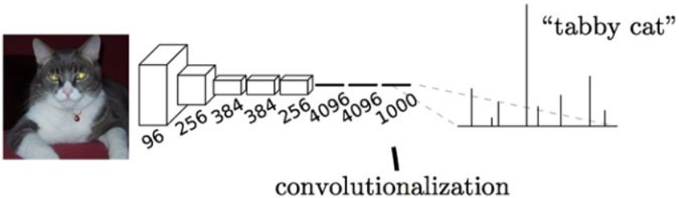

&emsp;&emsp;`FCN`对图像进行像素级的分类，从而解决了语义级别的图像分割(`semantic segmentation`)问题。与经典`CNN`在卷积层之后使用全连接层得到固定长度的特征向量进行分类(`全连接层 + softmax输出`)不同，`FCN`可以接受任意尺寸的输入图像，采用反卷积层对最后一个卷积层的`feature map`进行上采样，使它恢复到输入图像相同的尺寸，从而可以对每个像素都产生了一个预测，同时保留了原始输入图像中的空间信息，最后在上采样的特征图上进行逐像素分类。最终逐个像素计算`softmax`分类的损失，相当于每一个像素对应一个训练样本。下图是用于语义分割所采用的全卷积网络(`FCN`)的结构示意图：

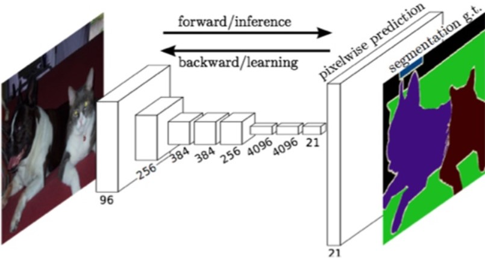

&emsp;&emsp;简单的来说，`FCN`与`CNN`的区别在于把`CNN`最后的全连接层换成卷积层，输出的是一张已经`Label`好的图片：

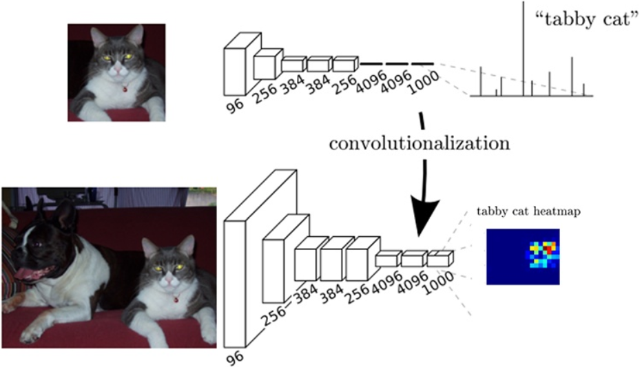

&emsp;&emsp;实际上，`CNN`的强大之处在于它的多层结构能自动学习特征，并且可以学习到多个层次的特征：较浅的卷积层感知域较小，学习到一些局部区域的特征；较深的卷积层具有较大的感知域，能够学习到更加抽象一些的特征。这些抽象特征对物体的大小、位置和方向等敏感性更低，从而有助于识别性能的提高。下图`CNN`分类网络的示意图：

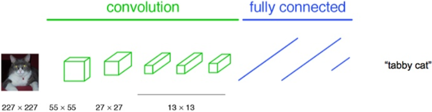

&emsp;&emsp;这些抽象的特征对分类很有帮助，可以很好地判断出一幅图像中包含什么类别的物体。但是因为丢失了一些物体的细节，不能很好地给出物体的具体轮廓、指出每个像素具体属于哪个物体，因此做到精确的分割就很有难度。
&emsp;&emsp;传统的基于`CNN`的分割方法：为了对一个像素分类，使用该像素周围的一个图像块作为`CNN`的输入用于训练和预测。这种方法有几个缺点：一是存储开销很大，例如对每个像素使用的图像块的大小为`15 * 15`，然后不断滑动窗口，每次滑动的窗口给`CNN`进行判别分类，因此则所需的存储空间根据滑动窗口的次数和大小急剧上升；二是计算效率低下，相邻的像素块基本上是重复的，针对每个像素块逐个计算卷积，这种计算也有很大程度上的重复；三是像素块大小的限制了感知区域的大小，通常像素块的大小比整幅图像的大小要小很多，只能提取一些局部的特征，从而导致分类的性能受到限制。
&emsp;&emsp;而全卷积网络则是从抽象的特征中恢复出每个像素所属的类别，即从图像级别的分类进一步延伸到像素级别的分类。全连接层和卷积层之间唯一的不同，就是卷积层中的神经元只与输入数据中的一个局部区域连接，并且在卷积列中的神经元共享参数。然而在这两类层中，神经元都是计算点积，所以它们的函数形式是一样的。因此，将此两者相互转化是可能的：对于任一个卷积层，都存在一个能实现和它一样的前向传播函数的全连接层。权重矩阵是一个巨大的矩阵，除了某些特定块，其余部分都是零。而在其中大部分块中，元素都是相等的。
&emsp;&emsp;相反，任何全连接层都可以被转化为卷积层。比如，一个`K = 4096`的全连接层，输入数据体的尺寸是`7 * 7 * 512`，这个全连接层可以被等效地看做一个`F = 7`、`P = 0`、`S = 1`以及`K = 4096`的卷积层。换句话说，就是将滤波器的尺寸设置为和输入数据体的尺寸一致了。因为只有一个单独的深度列覆盖并滑过输入数据体，所以输出将变成`1 * 1 * 4096`，这个结果就和使用初始的那个全连接层一样了。
&emsp;&emsp;在两种变换中，将全连接层转化为卷积层在实际运用中更加有用。假设一个卷积神经网络的输入是`224 * 224 * 3`的图像，一系列的卷积层和下采样层将图像数据变为尺寸为`7 * 7 * 512`的激活数据体。`AlexNet`使用了两个尺寸为`4096`的全连接层，最后一个有`1000`个神经元的全连接层用于计算分类评分。我们可以将这`3`个全连接层中的任意一个转化为卷积层：

- 针对第一个连接区域是`7 * 7 * 512`的全连接层，令其滤波器尺寸为`F = 7`，这样输出数据体就为`1 * 1 * 4096`了。
- 针对第二个全连接层，令其滤波器尺寸为`F = 1`，这样输出数据体为`1 * 1 * 4096`。
- 对最后一个全连接层也做类似的处理，令其`F = 1`，最终输出为`1 * 1 * 1000`。

&emsp;&emsp;实际操作中，每次这样的变换都需要把全连接层的权重`W`重塑成卷积层的滤波器。那么这样的转化有什么作用呢？它在下面的情况下可以更高效：让卷积网络在一张更大的输入图片上滑动，得到多个输出(可以理解为一个`label map`)，这样的转化可以让我们在单个向前传播的过程中完成上述的操作。
&emsp;&emsp;举个例子，如果我们想让`224 * 224`尺寸的浮窗，以步长为`32`在`384 * 384`的图片上滑动，把每个经停的位置都带入卷积网络，最后得到`6 * 6`个位置的类别得分。将上述的过程把全连接层转换成卷积层则会更简便，如果`224 * 224`的输入图片经过卷积层和下采样层之后得到了`7 * 7 * 512`的数组，那么`384 * 384`的大图片直接经过同样的卷积层和下采样层之后会得到`12 * 12 * 512`的数组。然后再经过上面由`3`个全连接层转化得到的`3`个卷积层，最终得到`6 * 6 * 1000`的输出(`(12 - 7) / 1 + 1 = 6`)，这个结果正是浮窗在原图经停的`6 * 6`个位置的得分！面对`384 * 384`的图像，让(含全连接层)的初始卷积神经网络以`32`像素的步长独立对图像中的`224 * 224`块进行多次评价，其效果和使用把全连接层变换为卷积层后的卷积神经网络进行一次前向传播是一样的。
&emsp;&emsp;如下图所示，`FCN`将传统`CNN`中的全连接层转化成卷积层，对应`CNN`网络`FCN`把最后三层全连接层转换成为三层卷积层。`FCN`将这`3`层表示为卷积层，卷积核的大小`(通道数, 宽, 高)`分别为`(4096, 1, 1)`、`(4096, 1, 1)`和`(1000, 1, 1)`。看上去数字上并没有什么差别，但是卷积跟全连接是不一样的概念和计算过程，使用的是之前`CNN`已经训练好的权值和偏置，但是不一样的在于权值和偏置是有自己的范围，属于自己的一个卷积核。因此`FCN`网络中所有的层都是卷积层，故称为`全卷积网络`。

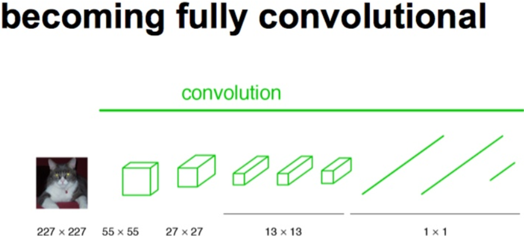

&emsp;&emsp;下图是一个全卷积层，与上图不一样的是图像对应的大小下标，`CNN`中输入的图像大小是同意固定`resize`成`227 * 227`大小的图像，第一层`pooling`后为`55 * 55`，第二层`pooling`后图像大小为`27 * 27`，第五层`pooling`后的图像大小为`13 * 13`。而`FCN`输入的图像是`H * W`大小，第一层`pooling`后变为原图大小的`1/4`，第二层变为原图大小的`1/8`，第五层变为原图大小的`1/16`，第八层变为原图大小的`1/32`(实际上代码当中第一层是`1/2`，以此类推)。

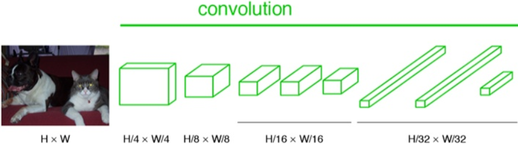

&emsp;&emsp;经过多次卷积和`pooling`以后，得到的图像越来越小，分辨率越来越低。其中图像到`H/32 * W/32`的时候图片是最小的一层时，所产生图叫做`heatmap`热图，热图就是我们最重要的高维特征图。得到高维特征的`heatmap`之后就是最重要的一步，也是最后的一步，对原图像进行`upsampling`，把图像逐渐放大，直到原图像的大小。最后的输出是`1000`张`heatmap`经过`upsampling`变为原图大小的图片：

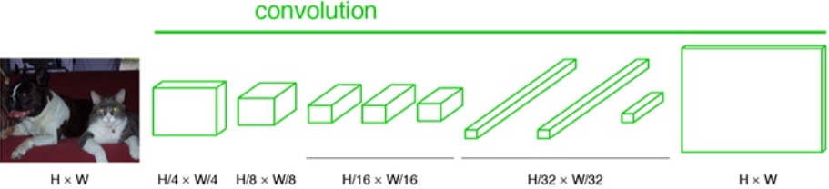

&emsp;&emsp;为了对每个像素进行分类预测，并`label`成最后已经进行语义分割的图像，这里有一个小`trick`，就是最后通过逐个像素地求其在`1000`张图像该像素位置的最大数值描述(概率)作为该像素的分类。因此产生了一张已经分类好的图片，如下图右侧有狗狗和猫猫的图：

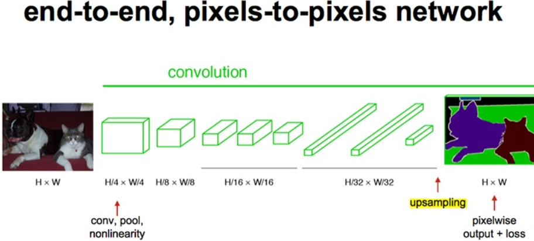

&emsp;&emsp;相较于使用被转化前的原始卷积神经网络对所有`36`个位置进行迭代计算，使用转化后的卷积神经网络进行一次前向传播计算要高效得多，因为`36`次计算都在共享计算资源。这一技巧在实践中经常使用，一次来获得更好的结果。例如通常将一张图像尺寸变得更大，然后使用变换后的卷积神经网络来对空间上很多不同位置进行评价得到分类评分，然后在求这些分值的平均值。
&emsp;&emsp;如果我们想用步长小于`32`的浮窗怎么办？用多次的向前传播就可以解决。比如我们想用步长为`16`的浮窗，那么先使用原图在转化后的卷积网络执行向前传播，然后分别沿宽度，沿高度，最后同时沿宽度和高度，把原始图片分别平移`16`个像素，然后把这些平移之后的图分别带入卷积网络。

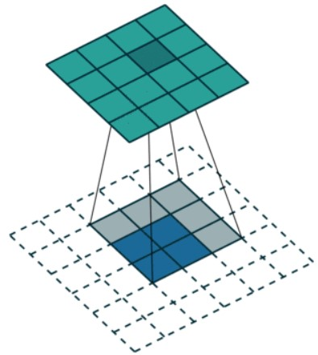

&emsp;&emsp;如下图所示，当图片在网络中经过处理后变成越小的图片，其特征也越明显，就像图像中颜色所示。当然最后一层的图片不再是一个`1`个像素的图片，而是原图像`H/32 * W/32`大小的图，这里为了简化而画成一个像素而已：

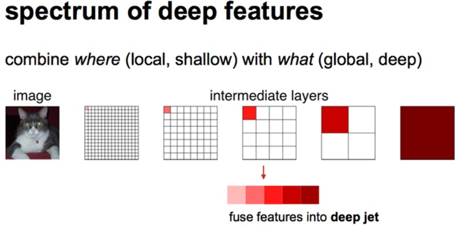

&emsp;&emsp;如下图所示，对原图像进行卷积`conv1`、`pool1`后原图像缩小为`1/2`；之后对图像进行第二次`conv2`、`pool2`后图像缩小为`1/4`；接着继续对图像进行第三次卷积操作`conv3`、`pool3`缩小为原图像的`1/8`，此时保留`pool3`的`featureMap`；接着继续对图像进行第四次卷积操作`conv4`、`pool4`，缩小为原图像的`1/16`，保留`pool4`的`featureMap`；最后对图像进行第五次卷积操作`conv5`、`pool5`，缩小为原图像的`1/32`，然后把原来`CNN`操作中的全连接变成卷积操作`conv6`、`conv7`，图像的`featureMap`数量改变但是图像大小依然为原图的`1/32`，此时图像不再叫`featureMap`而是叫`heatMap`。
&emsp;&emsp;现在我们有`1/32`尺寸的`heatMap`，`1/16`尺寸的`featureMap`和`1/8`尺寸的`featureMap`，`1/32`尺寸的`heatMap`进行`upsampling`操作之后，因为这样的操作还原的图片仅仅是`conv5`中的卷积核中的特征，限于精度问题不能够很好地还原图像当中的特征，因此在这里向前迭代。把`conv4`中的卷积核对上一次`upsampling`之后的图进行反卷积补充细节(相当于一个差值过程)，最后把`conv3`中的卷积核对刚才`upsampling`之后的图像进行再次反卷积补充细节，最后就完成了整个图像的还原。

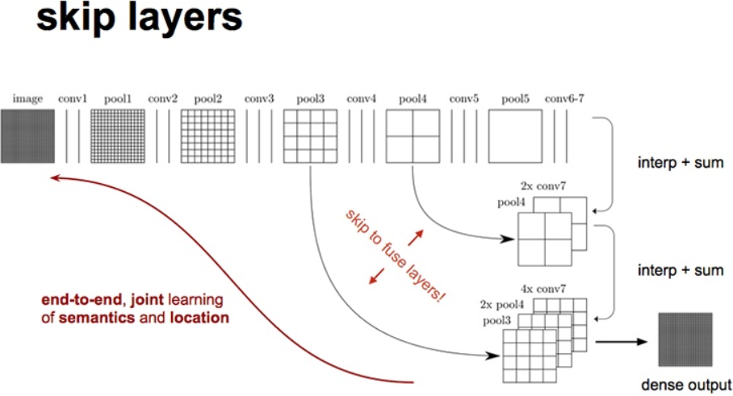