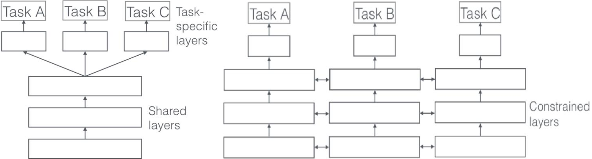

### 单任务学习和多任务学习

&emsp;&emsp;单任务学习一次只学习一个任务(`task`)，大部分的机器学习任务都属于单任务学习；多任务学习是把多个相关(`related`)的任务放在一起学习，同时学习多个任务。<!--more-->
&emsp;&emsp;对于复杂的问题，也可以分解为简单且相互独立的子问题来单独解决，然后再合并结果，得到最初复杂问题的结果。这样做看似合理，其实是不正确的，因为现实世界中很多问题不能分解为几个独立的子问题，即使可以分解，各个子问题之间也是相互关联的，通过一些共享因素或共享表示(`share representation`)联系在一起。把现实问题当做几个独立的单任务处理，忽略了问题之间所富含的丰富的关联信息。
&emsp;&emsp;多任务学习就是为了解决这个问题而诞生的，把多个相关(`related`)的任务(`task`)放在一起学习。这样做真的有效吗？答案是肯定的。多个任务之间共享一些因素，它们可以在学习过程中，共享它们所学到的信息，这是单任务学习所不具备的。相关联的多任务学习比单任务学习具有更好的泛化(`generalization`)效果。
&emsp;&emsp;单任务与多任务对比如下图所示，单任务学习时，各个任务之间的模型空间(`Trained Model`)是相互独立的；多任务学习时，多个任务之间的模型空间是共享的：

### 两种多任务学习模式

&emsp;&emsp;为了使得多任务学习的思想更加具体，如下展示了基于深度神经网络的两种多任务学习模式：隐层参数的硬共享与软共享。

- 参数的硬共享机制(左图)：参数的硬共享机制是神经网络的多任务学习中最常见的一种方式。一般来讲，它可以应用到所有任务的所有隐层上，而保留任务相关的输出层。硬共享机制降低了过拟合的风险。越多任务同时学习，模型就能捕捉到越多任务的同一个表示，从而导致在原始任务上的过拟合风险越小。
- 参数的软共享机制(右图)：每个任务都有自己的模型以及自己的参数，对模型参数的距离进行正则化来保障参数的相似。

