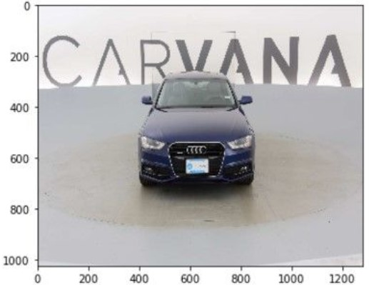
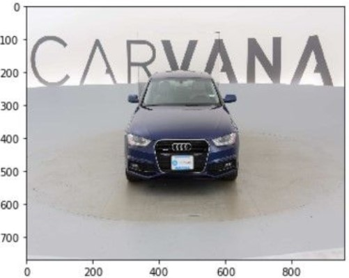
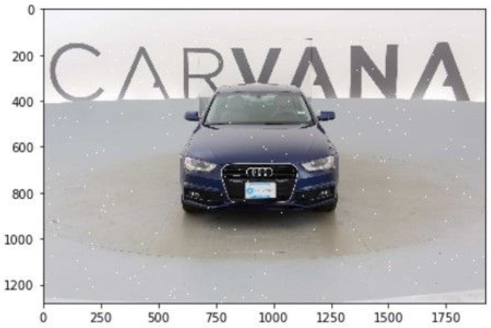
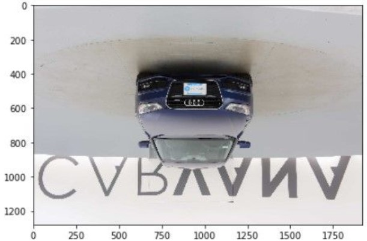
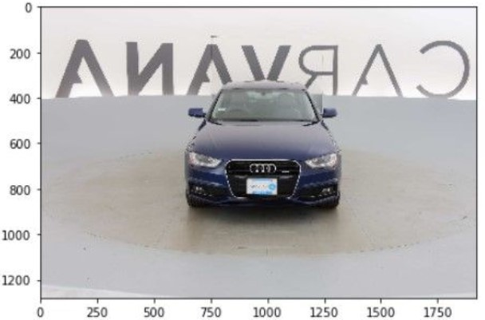
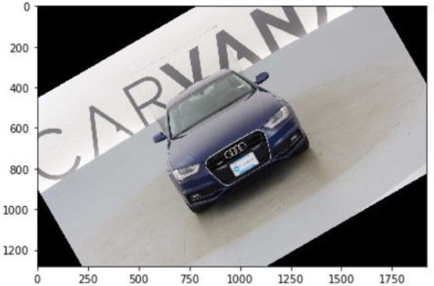
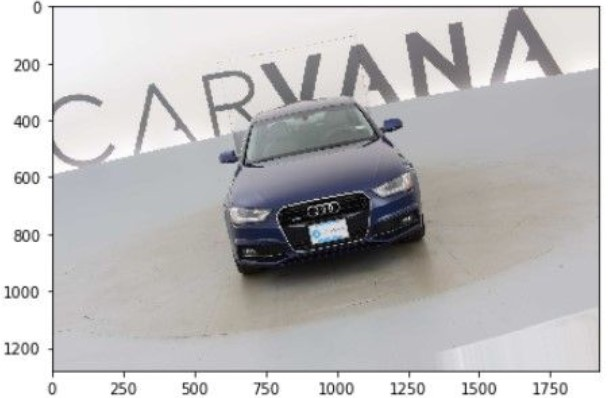
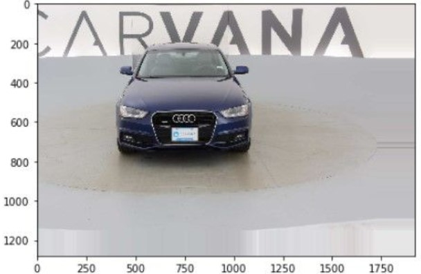
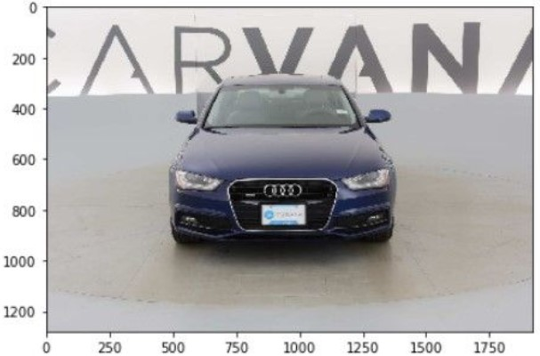
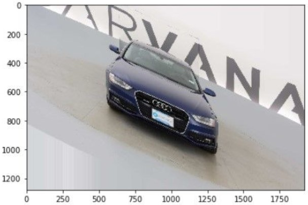

&emsp;&emsp;深度学习的训练往往需要海量的数据，而如今数据又是如此的宝贵(例如医学图像)，因此如何利用有效的数据获得更好的效果呢？数据增强(`data augmentation`)就是一种常用的方法。<!--more-->

### 修改图片尺寸(resize)

&emsp;&emsp;该函数返回`resize`之后的图片：

``` python
skimage.transform.resize(
    image, output_shape, order=1, mode=None,
    cval=0, clip=True, preserve_range=False)
```

参数`image`是需要改变尺寸的图片，`output_shape`是输出图片的尺寸`(height, weight)`。

``` python
from skimage.io import imread
from skimage.transform import resize
import matplotlib.pyplot as plt

img = imread('car.jpg')
resized_image = resize(img, (1024, 1280))
plt.imshow(resized_image)
plt.show()
```



### 按比例缩放(rescale)

&emsp;&emsp;函数原型如下：

``` python
skimage.transform.rescale(
    image, scale, order=1, mode=None, cval=0,
    clip=True, preserve_range=False, multichannel=None)
```

参数`scale`可以是单个的`float`数，表示缩放的倍数；也可以是一个`float`型的`tuple`，如`[0.6, 0.5]`，表示将`height`和`weight`分别缩放为原来的`0.6`倍和`0.5`倍。

``` python
from skimage.io import imread
from skimage.transform import rescale
import matplotlib.pyplot as plt

img = imread('car.jpg')
rescaled_img = rescale(img, [0.6, 0.5])
plt.imshow(rescaled_img)
plt.show()
```



### 加噪(noise)

&emsp;&emsp;利用`numpy.random.randint`来生成随机数噪声：

``` python
from skimage.io import imread
import matplotlib.pyplot as plt
import numpy as np

img = imread('car.jpg')
height, weight, channel = img.shape

for i in range(5000):  # 随机生成5000个椒盐噪声
    x = np.random.randint(0, height)
    y = np.random.randint(0, weight)
    img[x, y, :] = 255

plt.imshow(img)
plt.show()
```



### 翻转(flip)

&emsp;&emsp;`skimage`没有提供专门的`flip`模块，可以借助`numpy.flip`模块。
&emsp;&emsp;垂直翻转如下：

``` python
from skimage.io import imread
import matplotlib.pyplot as plt

img = imread('car.jpg')
vertical_flip = img[::-1, :, :]
plt.imshow(vertical_flip)
plt.show()
```



水平翻转如下：

``` python
from skimage.io import imread
import matplotlib.pyplot as plt

img = imread('car.jpg')
horizontal_flip = img[:, ::-1, :]
plt.imshow(horizontal_flip)
plt.show()
```



### 旋转(rotate)

&emsp;&emsp;函数原型如下：

``` python
skimage.ransform.rotate(
    image, angle, resize=False, center=None, order=1,
    mode='constant', cval=0, clip=True, preserve_range=False)
```

参数`angle`是按照逆时针方向旋转的角度；`resize`表示旋转角度时是否改变图片尺寸；`center`是旋转中心，默认中心为`center = (heighr / 2 - 0.5, weight / 2 - 0.5)`。

``` python
from skimage.io import imread
from skimage.transform import rotate
import matplotlib.pyplot as plt

img = imread('car.jpg')
rotate_img = rotate(img, 30)  # 逆时针旋转30°
plt.imshow(rotate_img)
plt.show()
```



周围有太多黑色像素点，如果这个用于我们的数据增强，效果就大打折扣了，所以可以这样：

``` python
import scipy.ndimage as ndi
from skimage.io import imread
import matplotlib.pyplot as plt
import numpy as np

def transform_matrix_offset_center(matrix, x, y):
    o_x = float(x) / 2 + 0.5
    o_y = float(y) / 2 + 0.5
    offset_matrix = np.array([[1, 0, o_x], [0, 1, o_y], [0, 0, 1]])
    reset_matrix = np.array([[1, 0, -o_x], [0, 1, -o_y], [0, 0, 1]])
    transform_matrix = np.dot(np.dot(offset_matrix, matrix), reset_matrix)
    return transform_matrix

def random_rotation(x, rg, row_index=0, col_index=1, channel_index=2,
                    fill_mode='nearest', cval=0.):
    theta = np.pi / 180 * np.random.uniform(-rg, rg)
    rotation_matrix = np.array(
        [[np.cos(theta), -np.sin(theta), 0],
         [np.sin(theta), np.cos(theta), 0],
         [0, 0, 1]])

    h, w = x.shape[row_index], x.shape[col_index]
    transform_matrix = transform_matrix_offset_center(rotation_matrix, h, w)
    x = apply_transform(x, transform_matrix, channel_index, fill_mode, cval)
    return x

def apply_transform(x, transform_matrix, channel_index=0, fill_mode='nearest', cval=0.):
    x = np.rollaxis(x, channel_index, 0)
    final_affine_matrix = transform_matrix[:2, :2]
    final_offset = transform_matrix[:2, 2]
    channel_images = [
        ndi.interpolation.affine_transform(
            x_channel, final_affine_matrix, final_offset,
            order=0, mode=fill_mode, cval=cval) for x_channel in x]
    x = np.stack(channel_images, axis=0)
    x = np.rollaxis(x, 0, channel_index + 1)
    return x

img = imread('car.jpg')
rotate_limit = 50
img_rot = random_rotation(img, rotate_limit)
plt.imshow(img_rot)
plt.show()
```



### 平移(shift)

&emsp;&emsp;代码实现如下：

``` python
import scipy.ndimage as ndi
from skimage.io import imread
import matplotlib.pyplot as plt
import numpy as np

def shift(x, wshift, hshift, row_axis=0, col_axis=1, channel_axis=2, fill_mode='nearest', cval=0.):
    h, w = x.shape[row_axis], x.shape[col_axis]  # 读取图片的高和宽
    tx = hshift * h  # 高偏移大小，若不偏移可设为0，若向上偏移设为正数
    ty = wshift * w  # 宽偏移大小，若不偏移可设为0，若向左偏移设为正数
    translation_matrix = np.array(
        [[1, 0, tx],
         [0, 1, ty],
         [0, 0, 1]])
    transform_matrix = translation_matrix  # no need to do offset
    x = apply_transform(x, transform_matrix, channel_axis, fill_mode, cval)
    return x

def apply_transform(x, transform_matrix, channel_index=0, fill_mode='nearest', cval=0.):
    x = np.rollaxis(x, channel_index, 0)
    final_affine_matrix = transform_matrix[:2, :2]
    final_offset = transform_matrix[:2, 2]
    channel_images = [
     ndi.interpolation.affine_transform(
         x_channel, final_affine_matrix, final_offset,
         order=0, mode=fill_mode, cval=cval) for x_channel in x]
    x = np.stack(channel_images, axis=0)
    x = np.rollaxis(x, 0, channel_index + 1)
    return x

img = imread('car.jpg')
w_limit = (-0.2, 0.2)
h_limit = (-0.2, 0.2)
wshift = np.random.uniform(w_limit[0], w_limit[1])
hshift = np.random.uniform(h_limit[0], h_limit[1])
# wshift = 0.1  # 自定义平移尺寸
# hshift = 0.1  # 自定义平移尺寸

img_shift = shift(img, wshift, hshift)
plt.imshow(img_shift)
plt.show()
```



### 缩放变换(zoom)

&emsp;&emsp;代码实现如下：

``` python
import scipy.ndimage as ndi
from skimage.io import imread
import matplotlib.pyplot as plt
import numpy as np

def zoom(x, zx, zy, row_axis=0, col_axis=1, channel_axis=2, fill_mode='nearest', cval=0.):
    zoom_matrix = np.array([[zx, 0, 0],
                            [0, zy, 0],
                            [0, 0, 1]])
    h, w = x.shape[row_axis], x.shape[col_axis]
    transform_matrix = transform_matrix_offset_center(zoom_matrix, h, w)  # 保持中心坐标不改变
    x = apply_transform(x, transform_matrix, channel_axis, fill_mode, cval)
    return x

def transform_matrix_offset_center(matrix, x, y):
    o_x = float(x) / 2 + 0.5
    o_y = float(y) / 2 + 0.5
    offset_matrix = np.array([[1, 0, o_x], [0, 1, o_y], [0, 0, 1]])
    reset_matrix = np.array([[1, 0, -o_x], [0, 1, -o_y], [0, 0, 1]])
    transform_matrix = np.dot(np.dot(offset_matrix, matrix), reset_matrix)
    return transform_matrix

def apply_transform(x, transform_matrix, channel_index=0, fill_mode='nearest', cval=0.):
    x = np.rollaxis(x, channel_index, 0)
    final_affine_matrix = transform_matrix[:2, :2]
    final_offset = transform_matrix[:2, 2]
    channel_images = [
        ndi.interpolation.affine_transform(
            x_channel, final_affine_matrix, final_offset,
            order=0, mode=fill_mode, cval=cval) for x_channel in x]
    x = np.stack(channel_images, axis=0)
    x = np.rollaxis(x, 0, channel_index + 1)
    return x

img = imread('car.jpg')
zoom_range = (0.7, 1)
zx, zy = np.random.uniform(zoom_range[0], zoom_range[1], 2)
# zx = 0.5, zy = 0.5  # 自定义zoom尺寸
img_zoom = zoom(img, zx, zy)
plt.imshow(img_zoom)
plt.show()
```



尽管`zoom`和`resale`都按比例对图像进行了缩放，但是当前景位于图片中央时，`zoom`可以去掉无用的背景，即保持中心不变。

### 剪切(shear)

&emsp;&emsp;代码实现如下：

``` python
import scipy.ndimage as ndi
from skimage.io import imread
import matplotlib.pyplot as plt
import numpy as np

def shear(x, shear, row_axis=0, col_axis=1, channel_axis=2, fill_mode='nearest', cval=0.):
    shear_matrix = np.array([[1, -np.sin(shear), 0],
                             [0, np.cos(shear), 0],
                             [0, 0, 1]])
    h, w = x.shape[row_axis], x.shape[col_axis]
    transform_matrix = transform_matrix_offset_center(shear_matrix, h, w)
    x = apply_transform(x, transform_matrix, channel_axis, fill_mode, cval)
    return x

def transform_matrix_offset_center(matrix, x, y):
    o_x = float(x) / 2 + 0.5
    o_y = float(y) / 2 + 0.5
    offset_matrix = np.array([[1, 0, o_x], [0, 1, o_y], [0, 0, 1]])
    reset_matrix = np.array([[1, 0, -o_x], [0, 1, -o_y], [0, 0, 1]])
    transform_matrix = np.dot(np.dot(offset_matrix, matrix), reset_matrix)
    return transform_matrix

def apply_transform(x, transform_matrix, channel_index=0, fill_mode='nearest', cval=0.):
    x = np.rollaxis(x, channel_index, 0)
    final_affine_matrix = transform_matrix[:2, :2]
    final_offset = transform_matrix[:2, 2]
    channel_images = [
        ndi.interpolation.affine_transform(
            x_channel, final_affine_matrix, final_offset,
            order=0, mode=fill_mode, cval=cval) for x_channel in x]
    x = np.stack(channel_images, axis=0)
    x = np.rollaxis(x, 0, channel_index + 1)
    return x

img = imread('car.jpg')
intensity = 0.5
sh = np.random.uniform(-intensity, intensity)  # 逆时针方向剪切强度为正
img_shear = shear(img, sh)
plt.imshow(img_shear)
plt.show()
```

