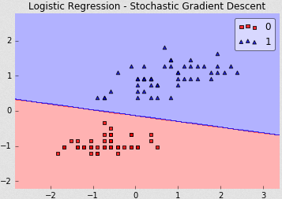
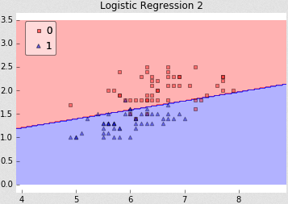
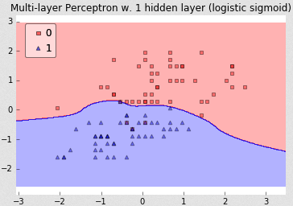
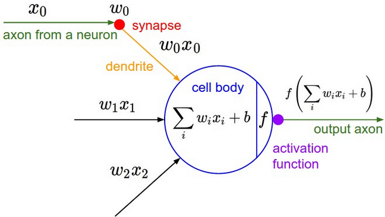
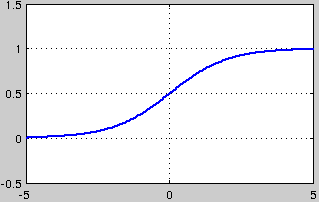
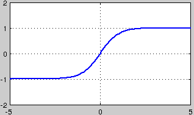
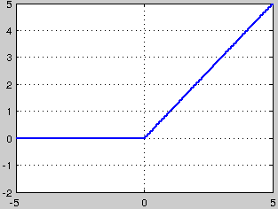
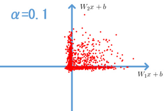
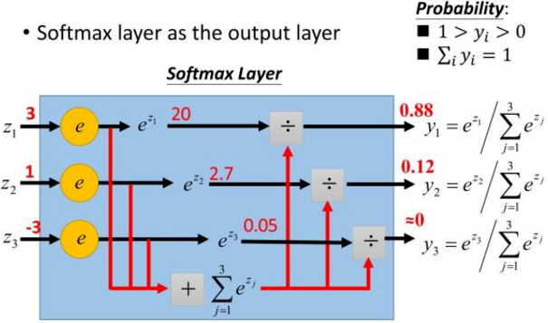

### 激活函数的作用

&emsp;&emsp;首先激活函数不是真的要去激活什么，在神经网络中，激活函数的作用是能够给神经网络加入一些非线性因素，使得神经网络可以更好地解决较为复杂的问题。比如在最简单的情况下，数据是线性可分的，只需要一条直线就已经能够对样本进行很好地分类。<!--more-->

但如果情况变得复杂了一点呢？数据就变成了线性不可分的情况。在这种情况下，简单的一条直线就已经不能够对样本进行很好地分类了。

于是我们尝试引入非线性的因素，对样本进行分类。在神经网络中也类似，我们需要引入一些非线性的因素，来更好地解决复杂的问题。而激活函数恰好就是那个能够帮助我们引入非线性因素的存在，使得神经网络能够更好地解决较为复杂的问题。

### 激活函数的定义及其相关概念

&emsp;&emsp;在`ICML2016`的一篇论文`Noisy Activation Functions`中，作者将激活函数定义为一个几乎处处可微的模型：

#### sigmod

&emsp;&emsp;`sigmoid`是使用范围最广的一类激活函数，具有指数函数形状，它在物理意义上最接近生物神经元。但是从下图可以看出，该函数有两方面的缺陷，即`软饱和性`和`非0均值`。饱和性可以分为`软饱和`、`硬饱和`，其中`软饱和`是指激活函数$h(x)$在取值趋近于无穷大时其一阶导数趋近于`0`；`硬饱和`是指当$|x| > c$时(`c`为常数)，其函数的一阶导数等于`0`。

&emsp;&emsp;`sigmoid`的软饱和性使得深度神经网络在二三十年里一直难以有效的训练，是阻碍神经网络发展的重要原因。具体来说，由于在反向传递中，`sigmoid`函数向下传递的梯度包含了一个$f'(x)$因子(`sigmoid`关于输入的导数)，因此一旦输入落入饱和区，$f'(x)$就变得接近于`0`，从而导致向底层传递的梯度也变得非常小，此时网络参数很难得到有效训练，这种现象被称为`梯度消失`。一般来说，`sigmoid`网络在`5`层之内就会产生梯度消失现象。
&emsp;&emsp;`sigmoid`的输出均大于`0`，使得输出不是`0`均值，称为`偏移现象`，这将导致后一层的神经元将上一层输出的非`0`均值的信号作为输入。关于原点对称的输入和中心对称的输出，网络会收敛地更好。

#### tanH

&emsp;&emsp;`tanh`也是一种常见的激活函数，实际上它是`sigmoid`的变形：

$$
\begin{align}
tanh(x) = 2 * sigmoid(2x) - 1 \notag
\end{align}
$$

与`sigmoid`相比，它的输出均值是`0`，使得其收敛速度要比`sigmoid`快，减少迭代次数。然而从图中可以看出，`tanh`同样具有软饱和性，从而造成梯度消失。

#### ReLU

&emsp;&emsp;`ReLU`是一种后来才出现的激活函数(目前大部分神经网络都使用该函数)，其函数原型为$f(x) = max(0, x)$。从图中可以看到，当$x < 0$时，出现硬饱和；当$x > 0$时，不存在饱和问题。因此，`ReLU`能够在$x > 0$时保持梯度不衰减，从而缓解梯度消失问题。然而，随着训练的推进，部分输入会落入硬饱和区，导致对应权重无法更新，这种现象被称为`神经元死亡`(`dying ReLU`)。与`sigmoid`类似，`ReLU`的输出均值也大于`0`，偏移现象和神经元死亡会共同影响网络的收敛性。

#### Leaky-ReLU

&emsp;&emsp;`Leaky ReLUs`就是用来解决这个`dying ReLU`问题的：

$$
f(x) = \begin{cases}
\alpha x,\quad &x \lt 0 \\
x, &x \geq 0
\end{cases}
$$

这里的`α`是一个很小的常数。这样即修正了数据分布，又保留了一些负轴的值，使得负轴信息不会全部丢失。

有些研究者的论文指出这个激活函数表现很不错，但是其效果并不是很稳定。

#### Softmax

&emsp;&emsp;`Softmax`函数常用于多分类神经网络输出：

$$
\sigma(z)_j = \frac{e^{z_j}}{\sum^K_{k=1}e^{z_k}}
$$

举个例子来看公式的意思：

就是如果某一个$z_j$大过其他`z`，那这个映射的分量就逼近于`1`，其他就逼近于`0`，主要应用就是多分类。