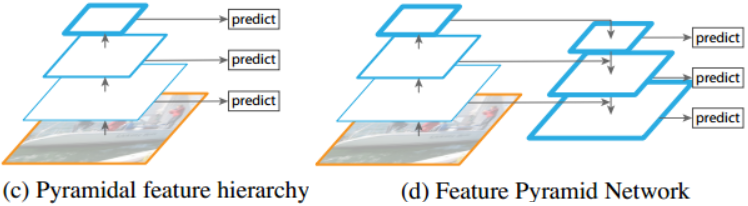

### Feature Pyramid Networks for Object Detection

&emsp;&emsp;这里介绍的文章是来自`Facebook`的特征金字塔网络`Feature Pyramid Networks`(`FPN`)。`FPN`主要解决的是物体检测中的多尺度问题，通过简单的网络连接改变，在基本不增加原有模型计算量情况下，大幅度提升了小物体检测的性能。我们将从论文背景、论文思想、结果与结论几方面探讨此论文。<!--more-->
&emsp;&emsp;在物体检测里面，有限计算量情况下，网络的深度(对应到感受野)与`stride`通常是一对矛盾的东西，常用的网络结构对应的`stride`一般会比较大(例如`32`)，而图像中的小物体甚至会小于`stride`的大小，造成的结果就是小物体的检测性能急剧下降。传统解决这个问题的思路包括：

- 多尺度训练和测试(又称图像金字塔)，如图`(a)`所示。目前几乎所有在`ImageNet`和`COCO`检测任务上取得好成绩的方法都使用了图像金字塔方法。然而这样的方法由于很高的时间及计算量消耗，难以在实际中应用。
- 特征分层，即每层分别预测对应的`scale`分辨率的检测结果，如图`(c)`所示。`SSD`检测框架采用了类似的思想。这样的方法问题在于直接强行让不同层学习同样的语义信息。而对于卷积神经网络而言，不同深度对应着不同层次的语义特征，浅层网络分辨率高，学的更多是细节特征，深层网络分辨率低，学的更多是语义特征。




因此目前多尺度的物体检测主要面临的挑战为：

- 如何学习具有强语义信息的多尺度特征表示。
- 如何设计通用的特征表示来解决物体检测中的多个子问题，例如`object proposal`、`box localization`和`instance segmentation`。
- 如何高效计算多尺度的特征表示。

&emsp;&emsp;本文针对这些问题，提出了特征金字塔网络`FPN`，如图`(d)`所示，网络直接在原来的单网络上做修改，每个分辨率的`feature map`引入后一分辨率缩放两倍的`feature map`做`element-wise`相加的操作。通过这样的连接，每一层预测所用的`feature map`都融合了不同分辨率、不同语义强度的特征，融合的不同分辨率的`feature map`分别做对应分辨率大小的物体检测。这样保证了每一层都有合适的分辨率以及强语义特征。同时，由于此方法只是在原网络基础上加上了额外的跨层连接，在实际应用中几乎不增加额外的时间和计算量。
&emsp;&emsp;有人可能会想，其实前面的网络有人也做过不同深度`layer`的`merge`啊，通过`skip connection`就可以了。作者指出，那种方法仍然是只能在最终的`single scale`的`output feature map`上做，而我们的方法是在`all level`上完成：


&emsp;&emsp;`FPN`的目标是：`ConvNet`的`pyramidal feature hierarchy`有着`low to high levels`的语义，利用这样的`hierarchy`构建一个高语义的`feature pyramid`。`ConvNets`的`forward`计算是自下而上的，特征图经过卷积核计算，会以成倍的比例缩小(`pooling layer`的原因)。但同时有许多卷积层输出的`feature map`尺寸是一样的，针对输出一样大小的`feature map`的卷积层统称为`stage`。
&emsp;&emsp;以`stage`为单位，在构建`feature pyramid`时，以每个`stage`为一个`pyramid level`，取每个`stage`最后`layer`输出的`feature map`作为`pyramid level`。至于为什么会这么取，论文说：这样取是理所当然的，因为靠后的`layer`有着更强壮的`feature`。
&emsp;&emsp;前面得到了一个高语义的`feature pyramid`，高层的`feature map`有着强语义、大感受野的的特性，底层的`feature map`有着`high-resolution`，并且保留对`small object`的语义。在构建好的`feature pyramid`上，要设法连接高层和底层，充分利用不同层`feature map`的特性。那么该怎么连接？`FPN`的做法是：将高层的`feature map`上采样得到高分辨率的`feature map`，再与其在`pyramid`内下一个`level`的`feature map`做横向连接(`lateral connections`)，这样可以让高层特征得到加强，同时保证横向连接的两层特征在空间尺寸上要相同。这样做是为了利用底层的`high-resolution`的特性。


&emsp;&emsp;代码如下：

``` python
import torch
import torch.nn as nn
import torch.nn.functional as F
from torch.autograd import Variable

class Bottleneck(nn.Module):  # ResNet的block
    expansion = 4

    def __init__(self, in_planes, planes, stride=1):
        super(Bottleneck, self).__init__()
        self.conv1 = nn.Conv2d(in_planes, planes, kernel_size=1, bias=False)
        self.bn1 = nn.BatchNorm2d(planes)
        self.conv2 = nn.Conv2d(planes, planes, kernel_size=3, stride=stride, padding=1, bias=False)
        self.bn2 = nn.BatchNorm2d(planes)
        self.conv3 = nn.Conv2d(planes, self.expansion * planes, kernel_size=1, bias=False)
        self.bn3 = nn.BatchNorm2d(self.expansion * planes)
        self.shortcut = nn.Sequential()

        if stride != 1 or in_planes != self.expansion * planes:
            self.shortcut = nn.Sequential(
                nn.Conv2d(in_planes, self.expansion * planes, kernel_size=1, stride=stride, bias=False),
                nn.BatchNorm2d(self.expansion * planes)
            )

    def forward(self, x):
        out = F.relu(self.bn1(self.conv1(x)))
        out = F.relu(self.bn2(self.conv2(out)))
        out = self.bn3(self.conv3(out))
        out += self.shortcut(x)
        out = F.relu(out)
        return out

class FPN(nn.Module):
    def __init__(self, block, num_blocks):
        super(FPN, self).__init__()
        self.in_planes = 64

        self.conv1 = nn.Conv2d(3, 64, kernel_size=7, stride=2, padding=3, bias=False)
        self.bn1 = nn.BatchNorm2d(64)

        # Bottom-up layers, backbone of the network
        self.layer1 = self._make_layer(block, 64, num_blocks[0], stride=1)
        self.layer2 = self._make_layer(block, 128, num_blocks[1], stride=2)
        self.layer3 = self._make_layer(block, 256, num_blocks[2], stride=2)
        self.layer4 = self._make_layer(block, 512, num_blocks[3], stride=2)

        # Top layer
        self.toplayer = nn.Conv2d(2048, 256, kernel_size=1, stride=1, padding=0)  # Reduce channels

        # Smooth layers
        self.smooth1 = nn.Conv2d(256, 256, kernel_size=3, stride=1, padding=1)
        self.smooth2 = nn.Conv2d(256, 256, kernel_size=3, stride=1, padding=1)
        self.smooth3 = nn.Conv2d(256, 256, kernel_size=3, stride=1, padding=1)

        # Lateral layers(为了匹配“channel dimension”引入的“1*1”卷积)
        self.latlayer1 = nn.Conv2d(1024, 256, kernel_size=1, stride=1, padding=0)
        self.latlayer2 = nn.Conv2d(512, 256, kernel_size=1, stride=1, padding=0)
        self.latlayer3 = nn.Conv2d(256, 256, kernel_size=1, stride=1, padding=0)

    def _make_layer(self, block, planes, num_blocks, stride):
        strides = [stride] + [1] * (num_blocks - 1)
        layers = []

        for stride in strides:
            layers.append(block(self.in_planes, planes, stride))
            self.in_planes = planes * block.expansion

        return nn.Sequential(*layers)

    def _upsample_add(self, x, y):  # FPN的“lateral connection”部分：upsample以后，element-wise相加
        """
        Upsample and add two feature maps.
        Args: x: (Variable) top feature map to be upsampled; y: (Variable) lateral feature map.
        Returns: (Variable) added feature map.
        Note in PyTorch, when input size is odd, the upsampled feature map with
        `F.upsample(..., scale_factor=2, mode='nearest')` maybe not equal to the lateral feature map size.
        e.g: original input size: [N,_,15,15] ->
                                  conv2d feature map size: [N,_,8,8] ->
                                  upsampled feature map size: [N,_,16,16]
        So we choose bilinear upsample which supports arbitrary output sizes.
        """
        _, _, H, W = y.size()
        return F.interpolate(x, size=(H, W), mode='bilinear', align_corners=True) + y

    def forward(self, x):
        # Bottom-up
        c1 = F.relu(self.bn1(self.conv1(x)))
        c1 = F.max_pool2d(c1, kernel_size=3, stride=2, padding=1)
        c2 = self.layer1(c1)
        c3 = self.layer2(c2)
        c4 = self.layer3(c3)
        c5 = self.layer4(c4)
        # Top-down
        p5 = self.toplayer(c5)
        p4 = self._upsample_add(p5, self.latlayer1(c4))  # P4是上一层p5加上侧边来的c4
        p3 = self._upsample_add(p4, self.latlayer2(c3))
        p2 = self._upsample_add(p3, self.latlayer3(c2))
        # Smooth
        p4 = self.smooth1(p4)
        p3 = self.smooth2(p3)
        p2 = self.smooth3(p2)
        return p2, p3, p4, p5

def FPN101():
    return FPN(Bottleneck, [2, 2, 2, 2])

def test():
    net = FPN101()
    fms = net(Variable(torch.randn(1, 3, 600, 900)))

    for fm in fms:
        print(fm.size())

test()
```

执行结果：

``` python
torch.Size([1, 256, 150, 225])
torch.Size([1, 256, 75, 113])
torch.Size([1, 256, 38, 57])
torch.Size([1, 256, 19, 29])
```