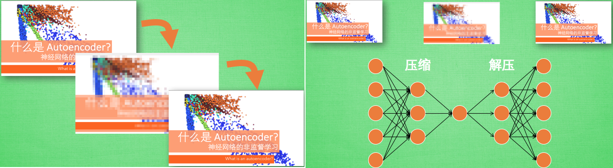
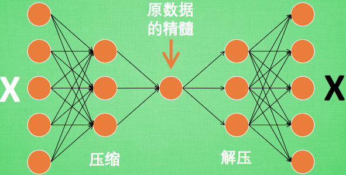
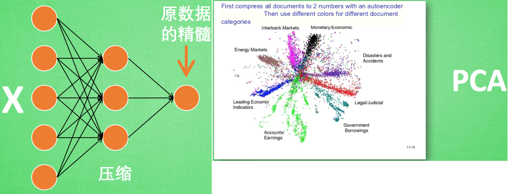
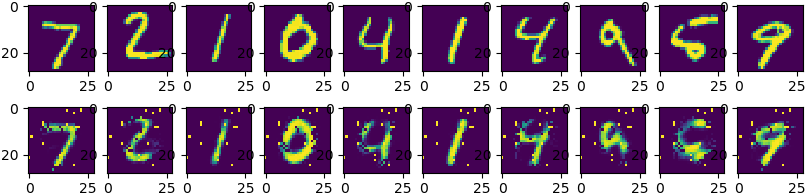

### 压缩与解压

&emsp;&emsp;有一个神经网络，它所做的事情是接收一张图片，然后给它打码，最后再从打码后的图片中还原，具体过程如下：<!--more-->



&emsp;&emsp;可以看出图片其实是经过了压缩再解压的这一道工序，当压缩的时候，原有的图片质量被缩减，解压时用信息量小却包含了所有关键信息的文件恢复出原本的图片。为什么要这样做呢？



&emsp;&emsp;原来有时神经网络要接受大量的输入信息，比如输入信息是高清图片时，输入信息量可能达到上千万，让神经网络直接从上千万个信息源中学习是一件很吃力的工作。所以需要压缩一下，提取出原图片中的最具代表性的信息，缩减输入信息量，再把缩减过后的信息放进神经网络学习，这样学习起来就简单轻松了，自编码就能在这时发挥作用。通过将原数据白色的`X`压缩并解压成黑色的`X`，然后通过对比黑白`X`，求出预测误差，进行反向传递，逐步提升自编码的准确性。训练好的自编码中间这一部分就是能总结原数据的精髓。可以看出，从头到尾我们只用到了输入数据`X`，并没有用到`X`对应的数据标签，所以也可以说自编码是一种非监督学习。到了真正使用自编码的时候，通常只会用到自编码前半部分。

### 编码器Encoder

&emsp;&emsp;这部分也叫作`encoder`编码器，编码器能得到原数据的精髓，然后我们只需要再创建一个小的神经网络学习这个精髓的数据，不仅减少了神经网络的负担，而且同样能达到很好的效果。



&emsp;&emsp;右图是一个通过自编码整理出来的数据，它能从原数据中总结出每种类型数据的特征，如果把这些特征类型都放在一张二维的图片上，每种类型都已经被很好的用原数据的精髓区分开来。如果你了解`PCA`主成分分析，在提取主要特征时，自编码和它一样，甚至超越了`PCA`。换句话说，自编码可以像`PCA`一样给特征属性降维。

---

&emsp;&emsp;今天的代码会运用两个类型：

- 通过`Feature`的压缩并解压，并将结果与原始数据进行对比，观察处理过后的数据是不是如预期跟原始数据很相像。
- 只看`encoder`压缩的过程，使用它将一个数据集压缩到只有两个`Feature`时，将数据放入一个二维坐标系内。

### Autoencoder

&emsp;&emsp;基本设置代码如下：

``` python
learning_rate = 0.01  # 学习率
training_epochs = 20  # 训练的轮数
batch_size = 256  # 每次训练的数据多少
display_step = 1  # 每隔多少轮显示一次训练结果
examples_to_show = 10  # 从测试集中中选取10张图片去验证自动编码器的结果
n_input = 784  # 输入数据的特征值个数，MNIST data input (img shape: 28 * 28)
```

- 压缩环节：我们要把这个`Features`不断压缩，经过第一个隐藏层压缩至`256`个`Features`，再经过第二个隐藏层压缩至`128`个。
- 解压环节：我们将`128`个`Features`还原至`256`个，再经过一步还原至`784`个。
- 对比环节：比较原始数据与还原后的拥有`784`个`Features`的数据进行`cost`的对比，根据`cost`来提升`Autoencoder`的准确率。

下面是两个隐藏层的`weights`和`biases`定义：

``` python
n_hidden_1 = 256  # (第一个隐藏层神经元的个数，也是特征值的个数)1st layer num features
n_hidden_2 = 128  # (第二个隐藏层神经元的个数，也是特征值的个数)2nd layer num features

# 然后定义输入数据，这里是无监督学习，所以只要输入图片数据，不需要标记数据
X = tf.placeholder("float", [None, n_input])

# 初始化每一层的权重和偏置
weights = {
    'encoder_h1': tf.Variable(tf.random_normal([n_input, n_hidden_1])),
    'encoder_h2': tf.Variable(tf.random_normal([n_hidden_1, n_hidden_2])),
    'decoder_h1': tf.Variable(tf.random_normal([n_hidden_2, n_hidden_1])),
    'decoder_h2': tf.Variable(tf.random_normal([n_hidden_1, n_input])),
}

biases = {
    'encoder_b1': tf.Variable(tf.random_normal([n_hidden_1])),
    'encoder_b2': tf.Variable(tf.random_normal([n_hidden_2])),
    'decoder_b1': tf.Variable(tf.random_normal([n_hidden_1])),
    'decoder_b2': tf.Variable(tf.random_normal([n_input])),
}
```

&emsp;&emsp;下面来定义`Encoder`和`Decoder`，使用的`Activation function`是`sigmoid`，压缩之后的值应该在`[0, 1]`这个范围内。在`decoder`过程中，通常使用对应于`encoder`的`Activation function`：

``` python
def encoder(x):  # (定义压缩函数)Building the encoder
    # Encoder Hidden layer with sigmoid activation
    layer_1 = tf.nn.sigmoid(tf.add(tf.matmul(x, weights['encoder_h1']), biases['encoder_b1']))
    # Decoder Hidden layer with sigmoid activation
    layer_2 = tf.nn.sigmoid(tf.add(tf.matmul(layer_1, weights['encoder_h2']), biases['encoder_b2']))
    return layer_2

def decoder(x):  # (定义解压缩函数)Building the decoder
    # Encoder Hidden layer with sigmoid activation
    layer_1 = tf.nn.sigmoid(tf.add(tf.matmul(x, weights['decoder_h1']), biases['decoder_b1']))
    # Decoder Hidden layer with sigmoid activation
    layer_2 = tf.nn.sigmoid(tf.add(tf.matmul(layer_1, weights['decoder_h2']), biases['decoder_b2']))
    return layer_2
```

来实现`Encoder`和`Decoder`输出的结果：

``` python
# (构建模型)Construct model
encoder_op = encoder(X)  # 128 Features
decoder_op = decoder(encoder_op)  # 784 Features

# (得出预测值)Prediction
y_pred = decoder_op  # After
# (得出真实值，即输入值)Targets (Labels) are the input data
y_true = X  # Before
```

再通过非监督学习进行对照，即对`原始的有784个Features的数据集`和`通过Prediction得出的有784个Features的数据集`进行最小二乘法的计算，并且使`cost`最小化：

``` python
# (定义损失)Define loss and optimizer, minimize the squared error
cost = tf.reduce_mean(tf.pow(y_true - y_pred, 2))
optimizer = tf.train.AdamOptimizer(learning_rate).minimize(cost)
```

最后通过`Matplotlib`的`pyplot`模块将结果显示出来，注意在输出时`MNIST`数据集经过压缩之后`x`的最大值是`1`，而非`255`：

``` python
with tf.Session() as sess:  # Launch the graph
    sess.run(tf.global_variables_initializer())
    total_batch = int(mnist.train.num_examples / batch_size)

    for epoch in range(training_epochs):  # Training cycle
        for i in range(total_batch):  # Loop over all batches
            batch_xs, batch_ys = mnist.train.next_batch(batch_size)  # max(x) = 1, min(x) = 0
            # Run optimization op (backprop) and cost op (to get loss value)
            _, c = sess.run([optimizer, cost], feed_dict={X: batch_xs})

        if epoch % display_step == 0:  # Display logs per epoch step
            print("Epoch:", '%04d' % (epoch + 1), "cost =", "{:.9f}".format(c))

    print("Optimization Finished!")
    # Applying encode and decode over test set
    encode_decode = sess.run(y_pred, feed_dict={X: mnist.test.images[:examples_to_show]})
    # Compare original images with their reconstructions
    f, a = plt.subplots(2, 10, figsize=(10, 2))

    for i in range(examples_to_show):
        a[0][i].imshow(np.reshape(mnist.test.images[i], (28, 28)))
        a[1][i].imshow(np.reshape(encode_decode[i], (28, 28)))

    plt.show()
```

通过`20`个`Epoch`的训练，结果如下，上面一行是真实数据，下面一行是经过`encoder`和`decoder`之后的数据。如果继续进行训练，效果会更好。

