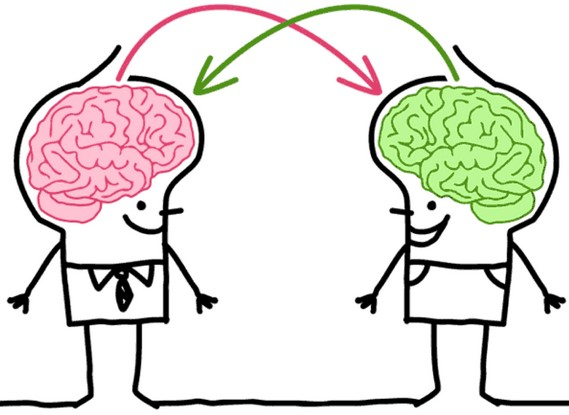
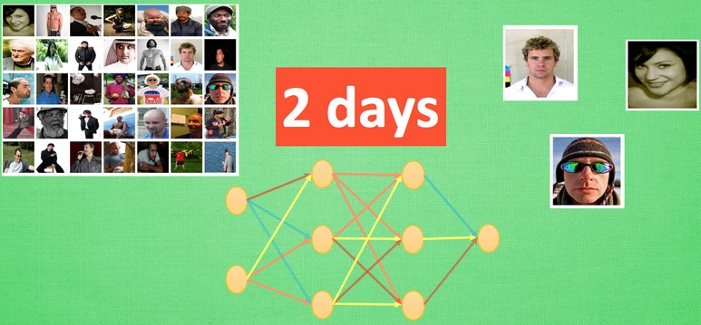
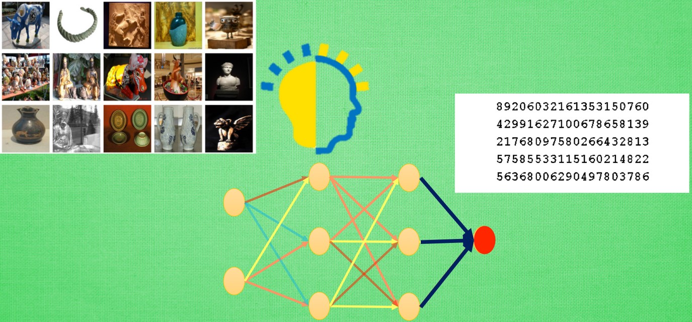

### 迁移学习

&emsp;&emsp;一个人的成功往往取决于先辈们累积的知识，如果把这句话放在机器学习中，这就是迁移学习(`transfer learning`)。<!--more-->

### 怎么迁移

&emsp;&emsp;迁移学习这就好比`KFC`和麦当劳的关系，同一类型的事业不用自己完全从头做，借鉴对方的经验往往能节省很多时间。有这样的思路，我们也能偷偷懒，不用花时间重新训练一个无比庞大的神经网络，借鉴借鉴一个已经训练好的神经网络就行。
&emsp;&emsp;比如这样的一个神经网络，我花了两天训练完之后，它已经能正确区分图片中具体描述的是男人、女人还是眼镜，说明这个神经网络已经具备对图片信息一定的理解能力，这些理解能力就以参数的形式存放在每一个神经节点中。

&emsp;&emsp;不巧的是，领导下达了一个紧急任务，要求今天之内训练出来一个预测图片里实物价值的模型。我想这下可完蛋了，上一个图片模型都要花两天，如果要再搭个模型重新训练，今天肯定出不来呀，于是迁移学习来拯救我了。因为这个训练好的模型中已经有了一些对图片的理解能力，而模型最后输出层的作用是分类之前的图片，对于现在计算价值的任务是用不到的。所以将最后一层替换掉，变为服务于现在这个任务的输出层。接着只训练新加的输出层，让理解力保持始终不变，前面的神经层庞大的参数不用再训练，节省了很多时间。

&emsp;&emsp;但并不是所有的情况都需要用到迁移学习，比如训练小的神经网络并不需要特别多的时间，我们完全可以直接重头开始训练，从头开始训练也是有好处的。如果固定住之前的理解力，或者使用更小的学习率来更新借鉴来的模型，就变得有点像认识一个人时的第一印象。如果迁移前的数据和迁移后的数据差距很大，或者说我对于这个人的第一印象和后续印象差距很大，我还不如不要管我的第一印象。同理，这时迁移来的模型并不会起多大作用，还可能干扰我后续的决策。